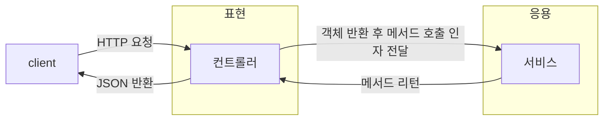
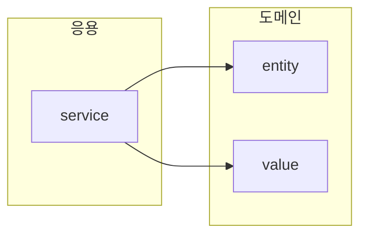

#DDD #최범균DDD 

### 네 개의 영역
---

>[!info]
>당연하게 client는 웹 browser일 수 도 있고 rest api call 일 수 도 있음.

##### 표현 영역
---
1. HTTP 요청 또는 Client 가 전달하는 요청을 응용 영역이 필요로 하는 형식으로 변환 및 전달.
2. 응용 영역의 응답을 HTTP 응답 또는 Client 가 원하는 응답으로 변환 해서 전송.

일종의 Converting Layer , 요청과 응답 사이의 데이터 형식에 대한 의존성을 분리하기 위한 레이어 로 보임.

##### 응용 영역
---

표현 영역을 통해 Client 의 요청을 전달 받은 응용 영역은 Client 에게 제공해야 할 기능을 구현 한다.

>[!warning]
>단 응용 영역은 직접 기능을 구현하지 않는다.
>도메인 모델에 로직 수행을 위임한다.

##### 도메인
---

도메인 모델은 당연히 도메인의 핵심 로직을 구현한다.

##### Infrastructure
---

구현 기술에 대한 것.

RDBMS , S3, Kafka, Redis, Mongodb 등.

>[!warning]
>논리적인 개념 보다는 실제 구현을 다루고 필요로함.
>즉 도메인, 응용, 표현 영역은 구현 기술을 사용한 코드를 직접 만들지 않으며 Infrastructure 에서 제공하는 기능을 사용해서 필요한 기능을 개발함.

ex) s3연동 기능을 통해서 s3 bucket 에 있는 image url을 가져온다.

도메인의 복잡도에 따라서 응용과 도메인의 경계가 모호해 지거나 합쳐질 수 있다.

>의존 관계 역시 표현 -> 응용 -> 도메인 -> 인프라임.
>때때로 응용 레이어에서 직접적인 인프라쪽 연동이 필요할 경우 유연하게 인프라쪽 DB 모듈과 다이렉트로 의존성이 묶이기도 함.

문제점

1. 테스트 용이성
   문제는 Infrastructure layer에 의존하기 때문에 예를들어 S3 관련된 Infrastructure 레이어 기능이 을 가져다쓰는 Image Service 라는 응용 레이어가 있다면
   Image Service를 테스트 하기위해서는 이전에 S3 관련 기능이 온전하게 동작하는 지부터 테스트 해야 한다.

2. 기능 확장의 어려움
   S3 가 아닌 다른 외부서비스를 사용하거나 S3에서 특정 코드값이나 설정값이 바뀔 경우 수정이 필요하다.

### DIP
---

