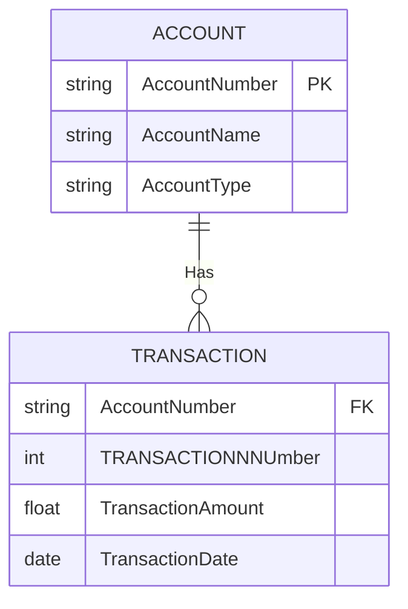
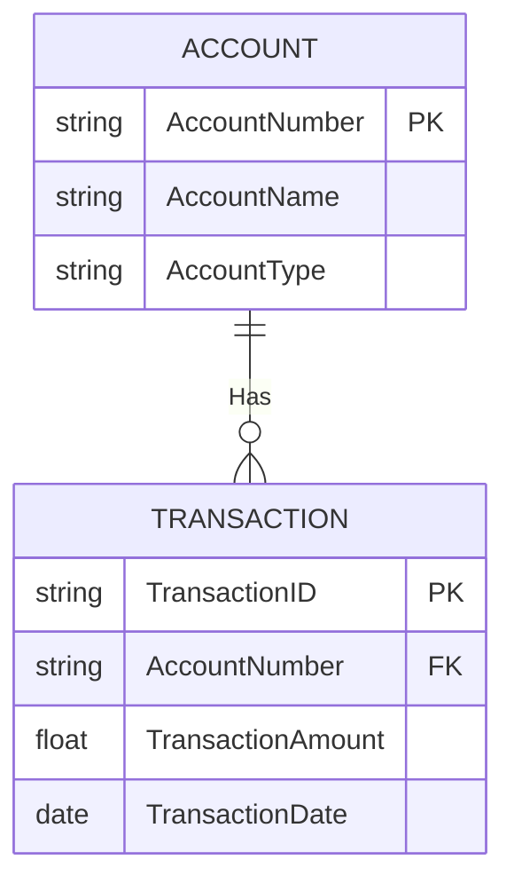
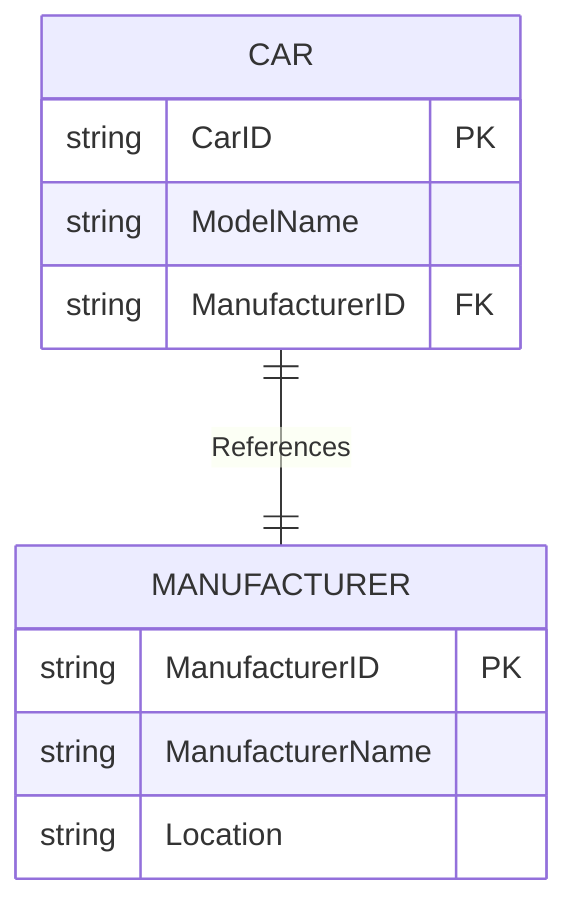

>**Note**
> 관계(Relationships). \
> 두 개 이상의 엔티티 간에 존재하는 연관성.
> 1. 종속 관계(Dpendent Relationship)
> 2. 참조 관계(Referential Relationships)

#### 종속 관계
---
부모 엔티티가 없으면 자식 엔티티가 존재할 수 없음.

AccountNumber  와 TransactionNumber를 합쳐서 주식별자로 사용 가능.

AccountNumber 와 TransactionNumber를 같이 주식별자로 활용하는건 비효율적

인조 식별자를 주식별자로 쓰고 AccountNumber 를 일반 속성으로 관리 가능.

단점은 AccountNumber 가 일반 속성으로 관리되서 업데이트가 가능해짐.

단 확장성은 좋아짐.

존재 종속 관계라 TRANSACTION 은 ACCOUNT 없이는 존재 불가.

#### 참조 관계
---
연관성이 존재해 관리하려는 관계.

CAR는 ManufacturerID 를 삭제해도 , 관계를 제거해도 존재 가능.

Car 엔티티는 참조하는 하위 엔티티고, Manufacturer 엔티티는 참조 당하는 상위 엔티티 이다.

엔티티가 자립인지, 종속인지 명확하게 결정하는 것으로부터 관계를 명확하게 하는 첫걸음이 됨.

>**Note**
> 1. 관계선은 사실상 속성이다.
> 2. 관계선은 개념만 존재할 수 있지만 DB에서는 분명한 실상이 존재한다.
> 3. 관계선은 업무 규칙을 보여준다. 
> 4. 관계선은 종속 관계를 보여준다. 
> 5. 관계선은 데이터 조회시 조인 경로를 의미하기도 한다.

관계선은 참조 무결성과 밀접한 관계가 있다.

관계는 결국 속성이나 엔터티로 보면 된다, 참조 무결성(RI)차원에서 관계가 결정돼야 한다.
