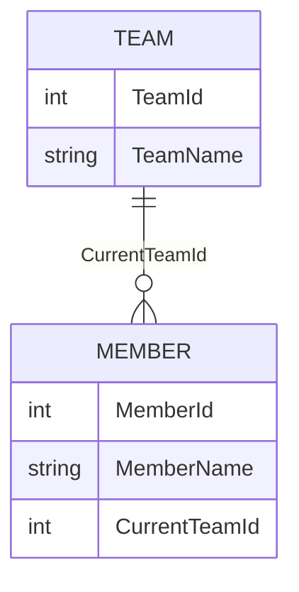
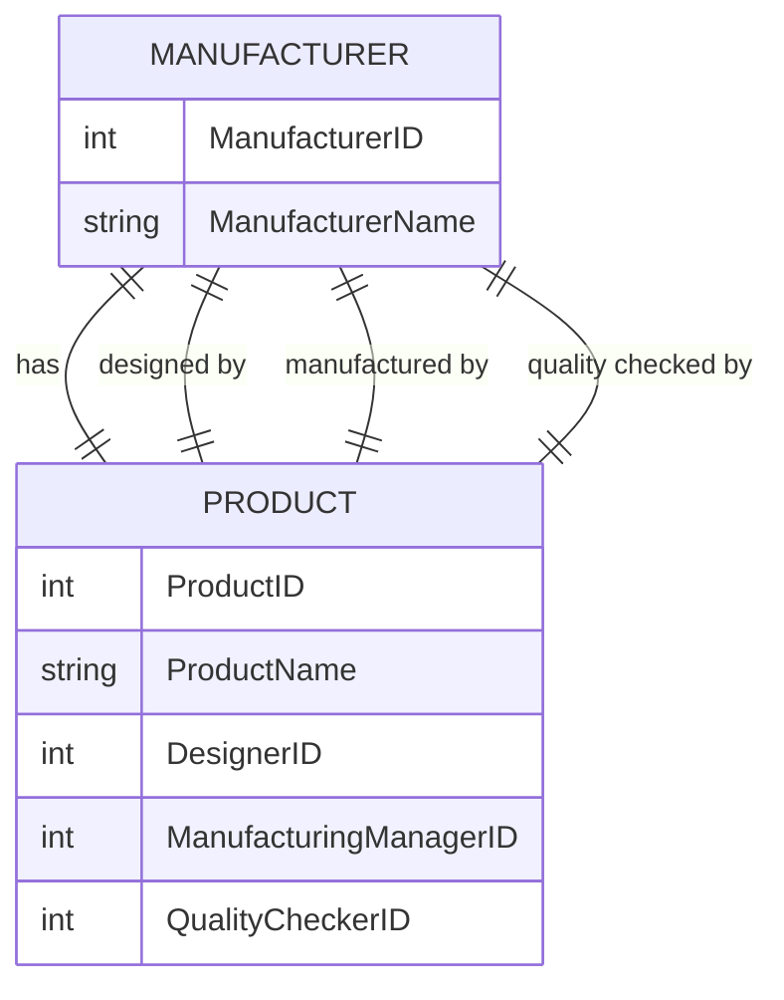
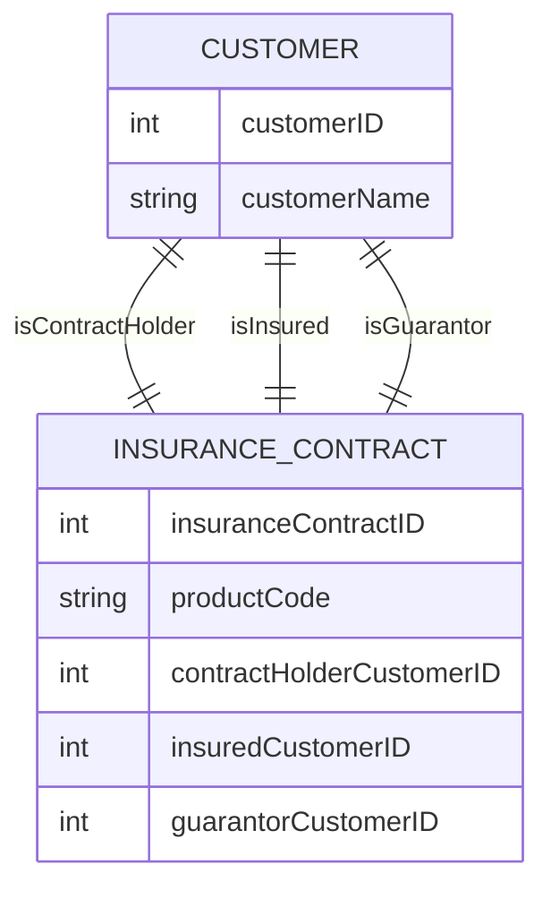
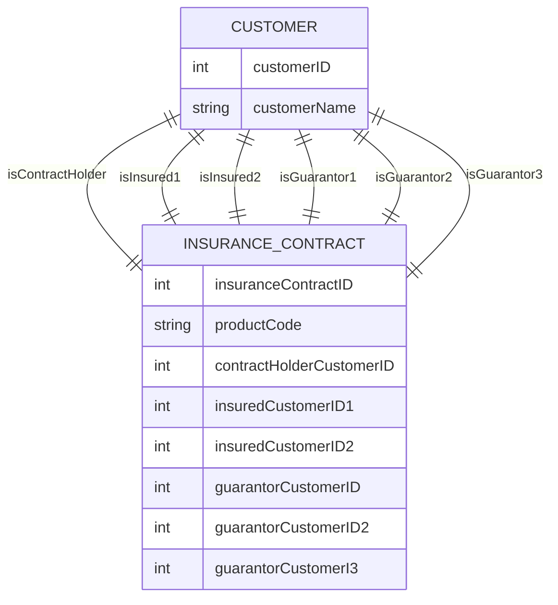
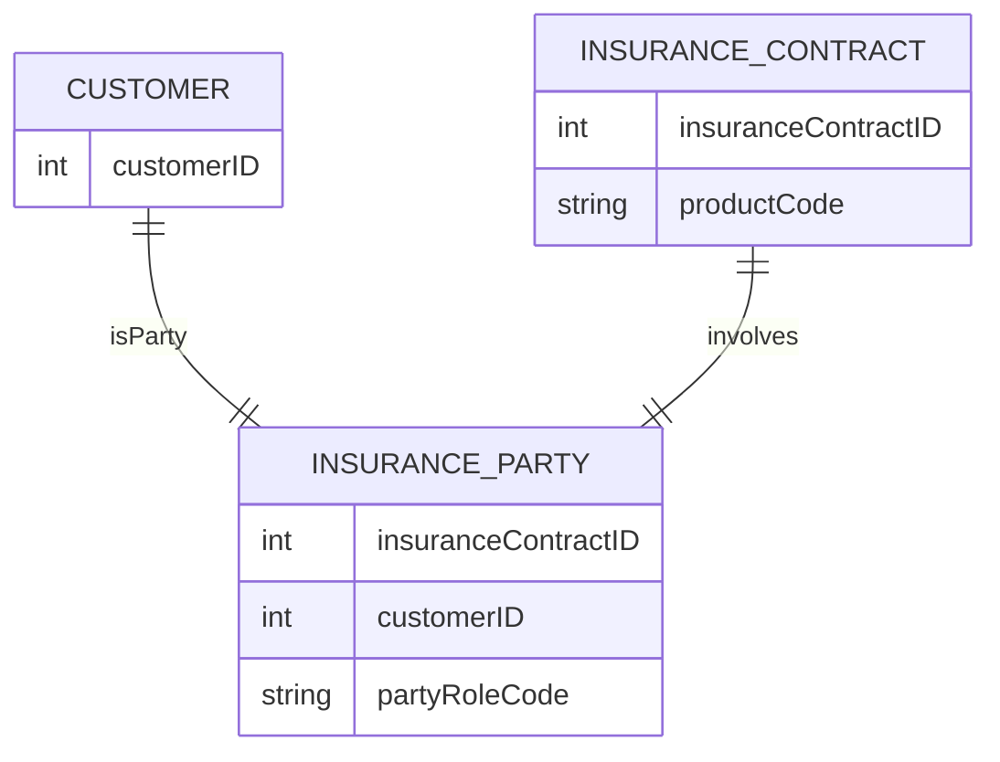
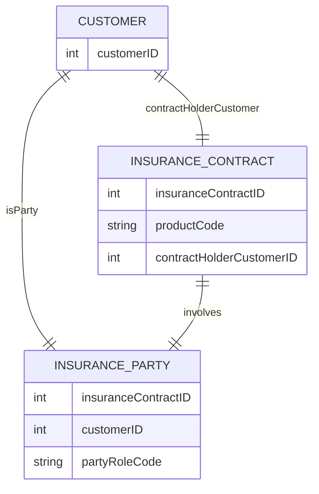
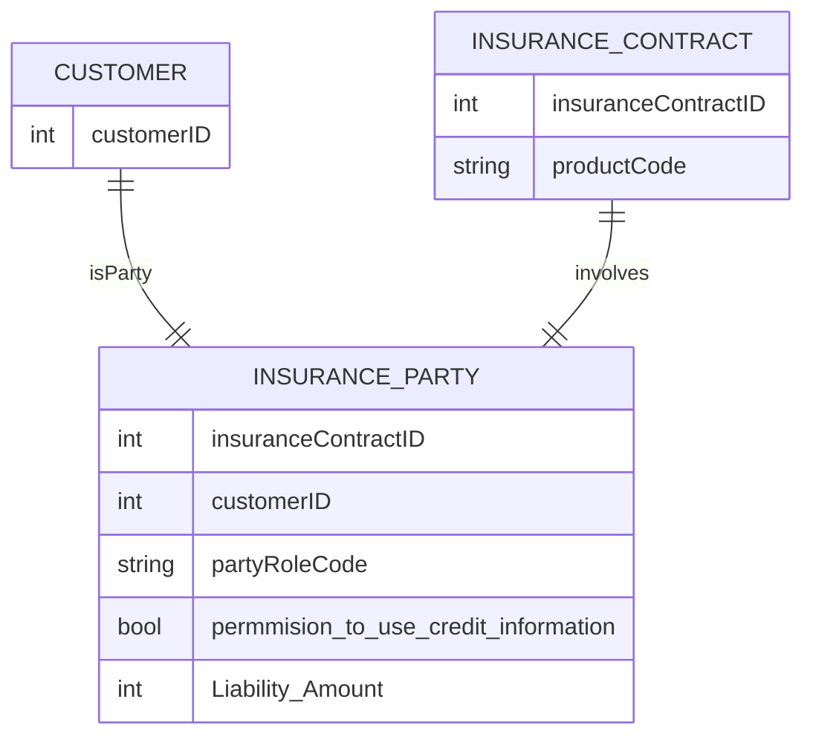
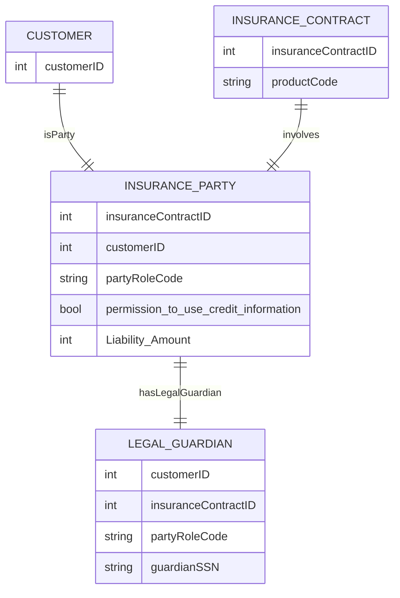

>**Note**
> 상위 엔티티의 주 식별자가 하위 엔티티의 속성으로 관리될 떄만 관계를 표시함. \
> 속성의 순서 개념이 추가된 것.

> (α) 커스텀 예제

위 예제는 참조 관계임.

Current TeanId 는 Null 값이 허용되며 데이터가 생성되는 시점에 해당 값이 정해지지 않는 다는 것을 의미.

참조 무결성을 걸어서 MEMBER 엔티티에 CurrentTeamId 값에 Team  엔티티에 없는 TeamId가 들어가지 않도록 해야함.

하지만 만약에 Member가 존재하려면 Team이 선행되어야 한다면  두 엔티티의 관계는 종속 관계이며 null 허용을 하면 안됨.

MANUFACTURER 와 PRODUCT 사이의 여려 관계가 존재하는 모델.

PRODUCT  엔티티에서 관리할 속성 중에는 디자인한 MANUFACTURER , manufactured 한 MANUFACTURER , QualityChecked 한 MANUFACTURER 속성이 존재하며 각 MANUFACTURER 는 의미에 맞도록 속성 명이 정해지며 속성 명과 연관된 관계 명이 정해지게 된다.

보험 계약에 계약자, 피보험자, 연대보증인 관리한다는 단순 요건이 존재할시 모델.

>**Note**
>피 보험자는 2명까지 생길 수 있고 연대 보증인은 3명까지 생길 수 있다면?

연관있는 속성의 갯수 만큼 관계선이 표현돼야 함.

>**Note**
>근데 이런식으로 피보험자와 연대 보증인이 계속 늘어난다면 속성으로서 관리하기 힘들어짐. \ 
>관계 엔티티를 별도로 만들어서 관리해버리자.

code 에는 계약자, 피보험자, 연대보증인이 있다.

위와 같이 RoleCode로 따로 관리한다.

>**Note**
>만약 보험계약 당사자 중에 계약자는 모든 보험계약에서 언제나 한 명이고 다른 당사자와 함께 조회되지 않고 개별적으로 사용할 때가 빈번하다면 별도로 관리 할 수 있다.

계약자를 두곳 에서 중복으로 관리 할 수 있음, 원본 데이터는 INSURANCE_PARTY 엔티티에서 관리하며 INSURANCE_CONTRACT 엔티티의 계약자 정보는 **중복 데이터가** 됨.

>**Important**
> (α)  그렇다면 관계 엔티티를 쓰는 기준은 무엇일까? \
> 첫번째는 지속적으로 늘어날 가능성이 있는지 없는지가 가장 중요함. \
> 관계 엔티티에는 엄격한 정규형을 적용하는 것이 좋은데 그 이유는 자주 사용되는 속성이기 때문에 수정하기 어렵기 때문. \
> 관계 엔티티만 있다면 추가 속성을 넣고 코드값만 추가해주면 끝임. \
> 두번째는 조회 요건임. \
> 화면 구성에 따라서 달라 질 수 있음. \
> 상세 화면 에서 하나하나 보여주는지 아니면 나열식으로 보여주는지에 따라서 활용 가능.

원 예제 자체만으로 이력 관리가 가능하지만 유효 기간을 추가해서 이력 데이터까지 관리가 가능하다.

신용정보 활용 동의 데이터를 보험 계약별로 관리할 수 있으며 연대 보증인에 대해서는 책임 금액을 관리할 수 도 있음 

즉 고유 속성을 갖게 될 수 있으며 그렇게 되면 **부가 데이터를 관리하기 수월**해짐.

위와 같이 하위 엔티티를 생성해서 관리도 가능하다.

>**Warning**
>다수 속성으로 관계를 관리하면 인덱스 숫자가 늘어나는 단점도 존재함. \
>관계 엔티티를 사용하면 인스턴스 수가 많이 증가 하는 것이 단점 임. \
>인스턴스 수에 민감하면 파티션등을 고려해야 함.

관계를 여러 개로 둬서 반복 속성으로 관리할지 정규형 관계 엔티티로 관리 할 지에 대한 표

| 구분       | 반복 속성 방식 (컬럼 관리 방식)       | 정규형 엔티티 방식 (로우 방식)  |
|------------|-------------------------------------|--------------------------------|
| 선택 기준  | 1. 반복 속성의 개수가 적음   2. 업무 변경으로 속성의 변경 가능성이 적음 | 1. 업무 변경으로 속성의 변경 가능성이 조금이라도 존재함   2. 속성에 대한 하위 엔티티 관리가 필요함   3. 속성의 이력관리가 필요함  |
| 특징       | 1. 속성으로 늘어남   2. 업무 변화에 유연하지 않음   3. 인덱스가 반복 속성 숫자 이상으로 증가함   4. 조회 SQL이 복잡하고 비효율적임   5. 속성에 대한 하위 엔티티가 관리가 힘듬   6. 이력 관리가 비효율적이고 복잡해짐 | 1. 엔티티가 추가됨   2. 업무의 변화에 유연하고 확장성이 좋음   3. 인덱스가 하나만 필요함   4. 조회 SQL이 단순하고 효율적임   5. 속성에 대한 하위 엔티티를 관리할 수 있음   6. 인스턴스 수가 증가함   7. 이력관리가 효율적임 |

