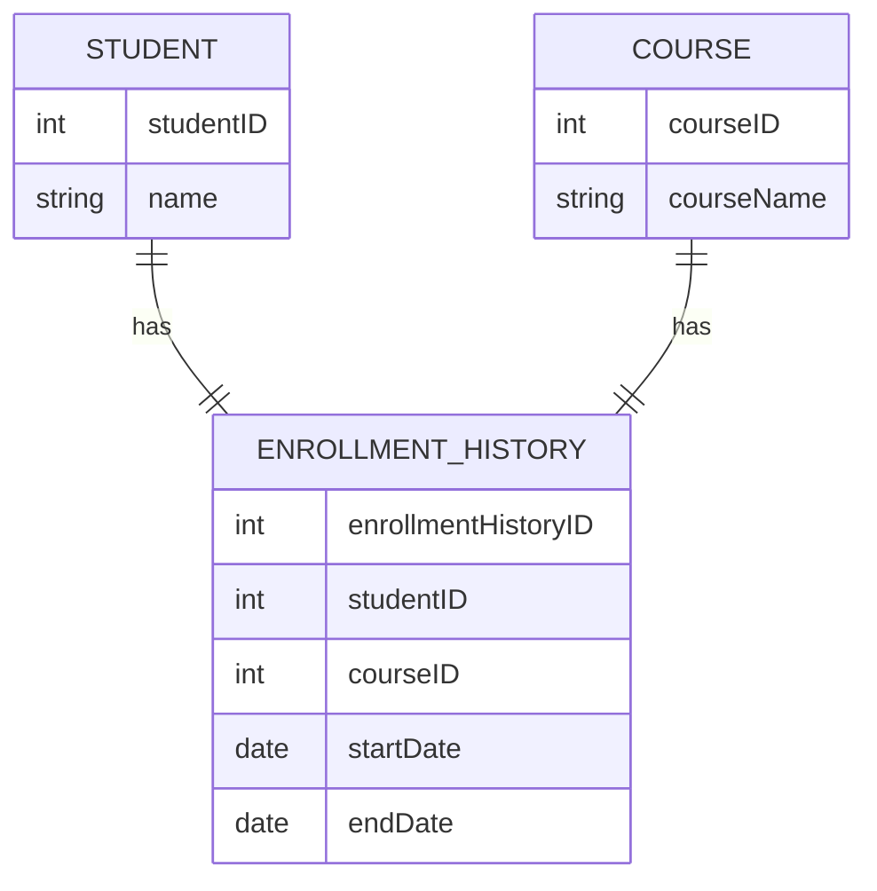
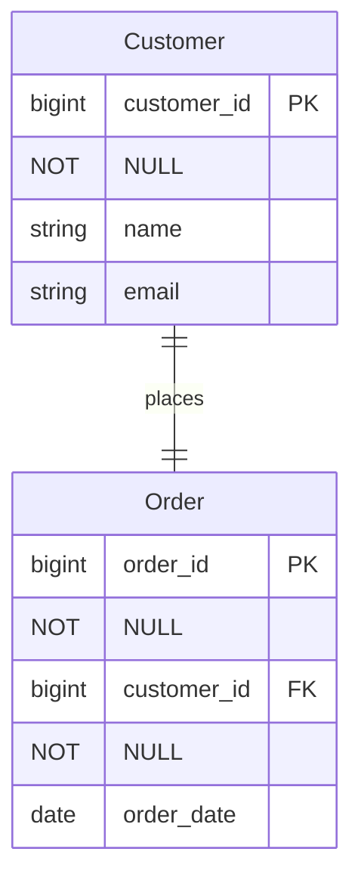
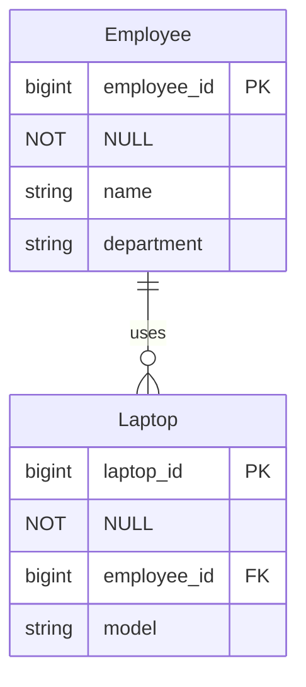
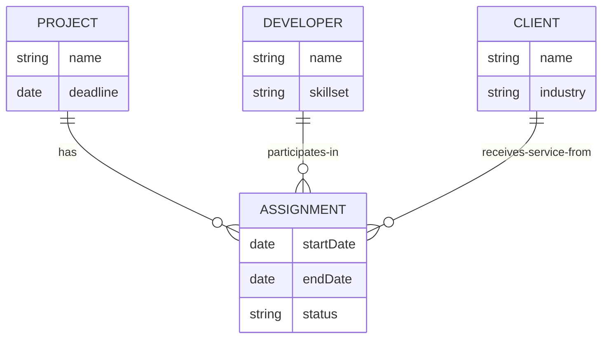

>  관계선은 크게 세 가지 요소로 구성된다.
>  1. 카디널리티
>  2. 옵셔널리티
>  3. 디그리

### 카디널리티
---
>**Note**
> 상위 엔티티의 인스턴스 하나가 하위 엔티티의 인스턴스 몇 개와 관련이 있는지를 나타내는 일종의 제약임. \
> 변동적이기 때문에 일대일, 일대다, 다대다 와 같이 개념적으로 표현함. \
> 제약이 있다면 최대 수를 표현 할 수 있으며(한번에 가입할 수 있는 보험 최대치 5개) 그럴 경우 관계선에 숫자를 넣을 수 있음.

>**Note**
>이력 데이터는 시간이 추가되기 때문에 항상 카디널리티에 영향을 미침. \
>이력 데이터를 관리하면 카디널리티는 상향 조정됨. \
>일대일 -> 일대다, 일대 다 -> 다대다, 다대다 -> 교차 엔티티에 주 식별자가 추가됨

>**Note**
> (α) 커스텀 예제

다대다 에서 교차 엔티티에 주식별자가 추가된 케이스에 한해서 예제로 확인해 보겠음.

`EnrollmentHistory` 라는 이력 엔터티가 추가되었음.

여기에 주 식별자인 `enrollmentHistoryID`가 추가되었는데, 이는 같은 학생이 같은 과목을 여러 번 수강할 수 있으므로, 이력을 구별하기 위해 필요함.

>**Note**
>다대다 관계는 최종 물리 모델에서는 구현될 수 없음. \
>위와 같이 이력 교차엔티티를 쓰거나 별도의 수강이라는 교차 엔티티를 써서 두개의 1대 다 관계로 풀어야 함.

카디널리티는 최대의 수 와 최소의 수를 분석하는 것이 중요함.

### 옵셔널리티
---
>**Note**
> 상관되는 관계 값의 존재 여부를 의미. \
> 하위 엔티티의 값과 연관되는 상위 엔티티의 값이 반드시 존재하는지 존재하지 않아도 되는지를 의미함. \
> 카디널리티의 일부로 볼 수 있으며 카디널리티의 최소 개수가 0이라면 관계 인스턴스가 존재하지 않아도 되는 선택 관계. \
> 최소 개수가 1이라면 관계 인스턴스가 반드시 존재해야 하는 필수 관계.

옵셔널리티를 구분하는 이유는 두 엔티티간 관계가 존재하는지 판단하는 여부이기 때문.

상위 엔티티의 입장과 하위 엔티티의 입장에서 판별해야 함.

>**Note**
> (α) 커스텀 예제

Mandatory 관계

Order가 반드시 한명의 Customer 에 속해야 함.

>**Note**
>상위 엔티티의 인스턴스에 데이터가 생성되는 시점이 기준이 아니고 언젠가는 발생하게 되는 미래 시점을 기준으로 판단해야됨. \
>언젠가 반드시 존재 하면 필수 관계임.

Optional 관계 

Laptop은 Employee에 속해 있을 수도 있고 아닐 수도 있음.

양쪽 옵셔널리티가 선택인 관계선은 관계가 없는거나 마찬가지이지만 관계선을 삭제하는 것은 바람직 하지 않음.

상위 엔터티 쪽의 옵셔널러티를 필수(Mandatory)가 될 수 있도록 만들어 주는 것이 좋으며 고객 엔터티의 관계선을 필수(Mandarory)로 만틀지 못하더라도(예를 들어 고객과 통장은 연관관계가존재하므로) 관계선을 삭제하는 것은 좋지 않다.

>**Warning**
>값이 임의로 사용되어 데이터 무결성의 문제가 생길수도 있거니와 별도의 값을 관리해야 될수도 있기 때문에 업무적 선택 제약이 었더라도 상위 엔티티쪽 옵셔널리티가 선택이 되지 않도록 하는것이 좋다. \
>RDB의 장점을 활용하기 위해서라도 업무 규칙을 물리적 차원에서 무결성 규칙을 반영하는 것이 바람직함. \
>위의 재고 상태의 통장과 고객간의 선택적 상태를 예로 들면 고객에게 발급된 통장 엔티티를 별도로 두어서 관리하면 된다.

양 방향 옵셔널러티가 선택(Optional)인 관계는 서브타입으로 표현 가능 하다.

### 디그리
---
> 관계 디그리는 관계와 연관된 엔티티의 개 수를 말한다.

>**Note**
>관계는 세 개 이상의 엔티티 사이에서도 발생할 수 있다. 

1. 재귀 관계 or 1개체 관계

하나의 엔티티에서 발생하는 관계

2. 일반적으로 두 가지 이상 엔티티에서 발생하는 관계

3. 세 개의 엔티티가 연관된 관계는 3개체 관계 라고 한다.
   2개체 관계로 충분히 관계를 설명 못하는 경우 사용

n 개체 관계중 비교적 많이 보이는게 3개체 관계임.

예제

하나의 프로젝트(Project)에 여러 개발자(Developer)가 참여하고, 이 프로젝트는 여러 클라이언트(Client)에게 서비스를 제공한다고 가정 한다면

각 개발자는 특정 클라이언트의 요구  사항을 처리할 수 있고, 그 반대의 경우도 있음.

다대다와 마찬가지로 3개체 관계도 결국 관계를 표현하려면 새로운 엔티티가 필요해진다.

**함수 종속**

프로젝트 별로 시작/종료일이 다른 경우에서 함수 종속
(Project ID, Developer ID, Client ID) -> (startDate, endDate) 

**카디널리티**

1. **Project와 Assignment의 관계**: 하나의 프로젝트는 여러 할당을 가질 수 있음 (1:N)
2. **Developer와 Assignment의 관계**: 하나의 개발자는 여러 할당에 참여할 수 있음. (1:N)
3. **Client와 Assignment의 관계**: 하나의 클라이언트는 여러 할당을 받을 수 있음. (1:N)

ASSIGNMENT 엔티티를 활용할 수 있다.

3개체 관계를 세 개의 2개체 관계로 도출하면 데이터를 관리하는데 문제가 없어서 3개체 관계를 사용하지 말것을 권유하기도 한다. 

하지만 요건만 제대로 반영됐다면 3개체 관계가 오히려 효율적이므로 3개체관계를 사용하는것이 바람직 하다.

