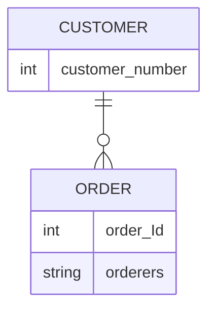
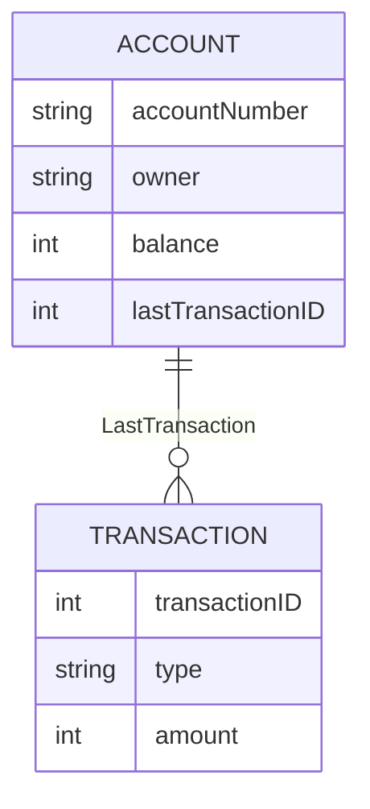

#### 관계명

관계 명은 필요한 떄만 명사로 표현하는 것을 원칙으로 한다.

모델의 가독성을 높이는게 목적이며 모든 관계선에 관계명을 붙이지 않는다.

관계선 양쪽에 관계 동사 형식으로 표현하는 것은 **좋지 않다.**

양쪽의 엔티티 명을 활용해서 관계 명을 정하는 것이 좋다.

계좌사고 -- 계좌사고부서 --> 부서

계좌사고 -- 계좌사고(관리)부서 --> 부서 : 수식어를 붙이는 경우도 있음.

단 수식어를 붙일 경우 계좌사고 엔티티에 fk는 수식어를 붙인 명으로 fk가됨
ex) 계좌사고접수부서코드(FK), 

처리 부서도 관리해야 한다면
계좌사고처리부서코드(FK) 도 속성으로 추가해서 관계선을 두개를 두면 된다. 

>**Note**
>위와 같이 관계가 여러개 존재한다면 관계명이 있는 경우가 가독성을 높여준다. \
>관계명을 관리하다 엔티티 명이 이상한 경우 엔티티 명을 다듬는 경우도 종종 있음.

위와 같이 관계 속성 만으로는 어떤 엔티티와 관계가 있는지를 명확하게 나타내지 못하므로 관계 속성에 Role이름을 사용할 때는 상위 엔티티의 주 식별자 속성명을 차용해서 사용하는 것이 좋다.

>**Warning**
>하지만 orderers 는 상위 엔티티와 주 식별자 속성명과 전혀 다르기 때문에 혼란이 올 수 있으므로 되도록 이면 사용하지 않는 게 좋다.

**관계명이 필요 없는 경우**

1. 주문 --> 주문 상품 과 같은 **일대다 관계로 종속되는 관계**는 관계 명이 필요 없다.

**본질적으로 같은 성격의 데이터**이므로 상세 관계에 대해서 굳이 부가적인 설명이 필요하지 않다.

2. 고객 --> 개인고객상세 와 같은 1대1 관계 즉 **성능이나 관리 차원에서 엔티티를 분해해서 관리하는 1대1 관계**는 사실상 하나의 엔티티이므로 관계 명이 필요 없다.

**추출 관계**

한 엔터티가 다른 엔터티로부터 특정 정보를 추출하여 그 정보를 속성으로 저장하는 추출 관계의 경우 관계명은 필요함

---

관계 명은 주로 실체 엔티티 사이나 실체 엔티티와 행위 엔티티 사이에서 필요함.

행위 엔티티간에는 일반적으로 관계 명이 없어도 됨.

>**Warning**
>프로세스, 발생 규칙, 설명을 적는 것은 올바른 방법이 아님.

### 관계선
---

