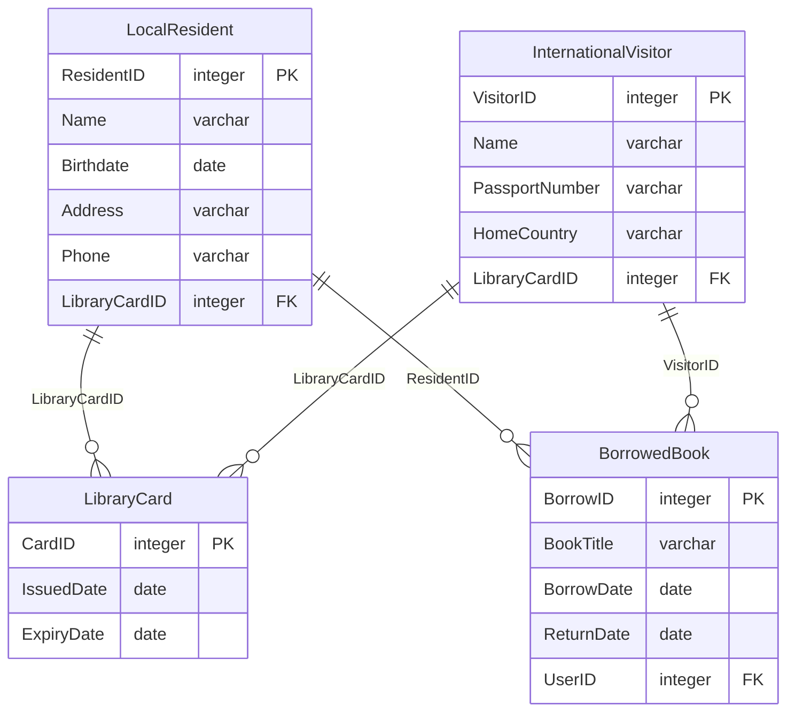
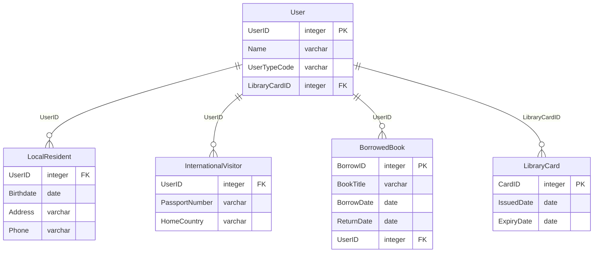
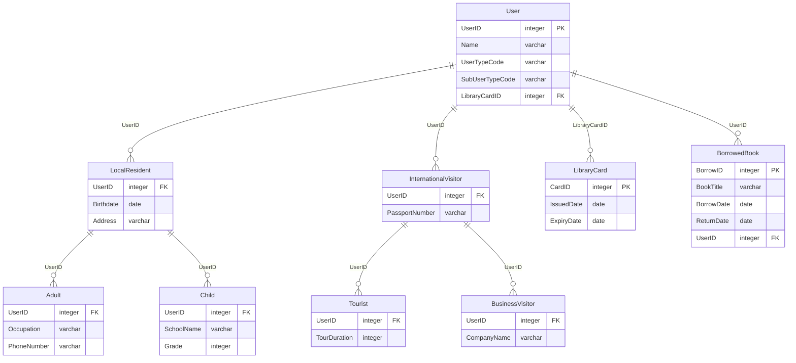

> 여러 엔티티에 존재하는 중복(공통) 속성은 슈퍼타입에서 관리하고 엔티티 별 고유한 개별 속성은 엔티티에 남아서 서브타입이 된다.

### 특성
---

1. 관계 속성을 포함한 슈퍼 타입의 모든 속성은 서브 타입에 속하게 됨.
   
2. 슈퍼 타입과 서브 타입 간에는 `상속`이 가능하다. 즉 `속성이 서브 타입에 상속` 된다.
   
3. 서브 타입의 `고유 속성`이나 `관계`도 슈퍼 타입에 속한다.(슈퍼 타입+서브 타입 = 완전한 인스턴스)
   
4. 서브 타입 엔티티 간의 관계는 일반적으로 `상호 배타적`이지만 `간혹 포함적`일 수 있다.
   
5. 서브 타입 인스턴스는 반드시 그에 해당하는 슈퍼 타입 인스턴스가 존재해야 하지만 `슈퍼 타입 인스턴스에 해당하는 서브 타입 인스턴스는 존재하지 않을 수 있다.`
   
6. 서브 타입은 슈퍼 타입의 하위 개념이(부모 자식 관계) 아니며 `부분 집합`이다.
   
7. 배타 관계를 발생 시키는 `엔티티는 통합(일반화)해 슈퍼 타입을 도출`해야 한다.
   
8. 직관적이고 이해하기 쉬우며 이후 물리 모델링 단계에서 성능 효율을 고려해 엔티티 구조 구현 방법이 결정된다.

### 예제
---

> 슈퍼 타입은 전체 집합이고 서브 타입은 부분 집합이며 슈퍼 타입 속성과 서브 타입 속성을 합쳐야 전체 속성이 됨.

예제는 책의 예제 테이블과 속성 값과 다르게 작성합니다.

> 포인트는 서브타입을 구분할 수있는 구분자(subtype Discriminator)를 관리하는 것임.

1. 슈퍼  타입이 도출 되지 않고 복잡한 관계

엔티티를 필요할 때마다 만들어 사용해 발생하는 현상이며 엔티티 통합에 대한 두려움도 한 원인

같은 속성이 여러번 사용되며(이름과 ,도서관 카드 아이디) LibraryCard와 BorrowedBook 두개의 엔티티와 상호 배타적 관계를 가짐

2. 슈퍼 타입을 도출한 뒤 서브 타입 구분자를 관리하는 형식으로 수정

User 엔티티로 좀더 단순하게 표현됨. 

3. 서브 타입 안에 중첩 서브 타입을 두는 케이스

