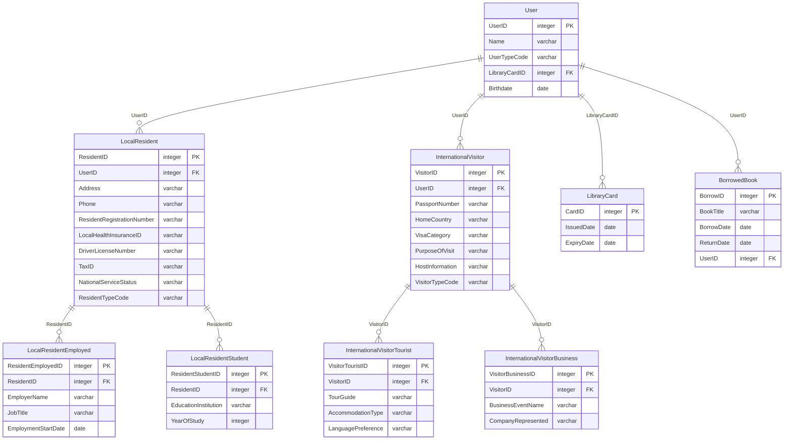

> 여러 엔티티에 존재하는 중복(공통) 속성은 슈퍼타입에서 관리하고 엔티티 별 고유한 개별 속성은 엔티티에 남아서 서브타입이 된다.

### 특성
---

1. 관계 속성을 포함한 슈퍼 타입의 모든 속성은 서브 타입에 속하게 됨.
   
2. 슈퍼 타입과 서브 타입 간에는 `상속`이 가능하다. 즉 `속성이 서브 타입에 상속` 된다.
   
3. 서브 타입의 `고유 속성`이나 `관계`도 슈퍼 타입에 속한다.(슈퍼 타입+서브 타입 = 완전한 인스턴스)
   
4. 서브 타입 엔티티 간의 관계는 일반적으로 `상호 배타적(Excludisve)`이지만 `간혹 포함적(Inclusive)`일 수 있다.
   만약 상호 배타적일 때는 서브 타입 집합(인스턴스 갯수)을 모두 합하면 슈퍼 타입(인스턴스 갯수) 집합이 된다
   
5. 서브 타입 인스턴스는 반드시 그에 해당하는 슈퍼 타입 인스턴스가 존재해야 하지만 `슈퍼 타입 인스턴스에 해당하는 서브 타입 인스턴스는 존재하지 않을 수 있다.`
   
6. 서브 타입은 슈퍼 타입의 하위 개념이(부모 자식 관계) 아니며 `부분 집합`이다.
   
7. 배타 관계를 발생 시키는 `엔티티는 통합(일반화)해 슈퍼 타입을 도출`해야 한다.
   
8. 직관적이고 이해하기 쉬우며 이후 물리 모델링 단계에서 성능 효율을 고려해 엔티티 구조 구현 방법이 결정된다.

### 상호 배타적 관계 (Mutually _Exclusive Arc_ Relationship)
---

그렇다면 상호 배타적 관계란 무엇일까?

>**Note**
>(α) **배타적 논리합**(排他的論理合, exclusive or)? \
> [수리 논리학](https://ko.wikipedia.org/wiki/%EC%88%98%EB%A6%AC_%EB%85%BC%EB%A6%AC%ED%95%99 "수리 논리학")에서 주어진 `2개의 명제` 가운데 `1개만 참`일 경우.

>**Important**
>(α) 상호 배타적 관계란? \
>두 개 이상의 부모(상위) 엔티티와 관계가 있으면서 그 관계가 상호 배타적일 때의 관계를 말함.
>1. **선택의 제약** : 한 엔티티는 동시에 여러 상호 배타적 관계 중 하나만 선택할 수 있음.
>2. **exclusive arc** : 주엔티티가 둘 이상의 참조 엔티티와 관계를 맺을 수 있지만, 한 시점에는 오직 하나의 참조 엔티티와만 관계를 맺을 수 있음.
>3. **이유** : 데이터베이스와는 다르게` 현실 세계에서 도메인에 대한 논리적인 제약들이 존재`하기 때문.
>4. **관리법** :  `배타 관계가 발생한 엔티티`에서는 일반적으로 해당 데이터가 `어느 부모(상위) 엔터티와 관계`를 갖는지를 보여주는 `구분자 속성`을 둬 관리.

(α) **예제**1 

한 대학에서 학생은 학위 과정을 선택할 때, 풀타임 과정과 파트타임 과정 중에서 선택할 수 있다.

그러나 한 학기 동안 학생은 풀타임과 파트타임 과정 중 하나만을 선택할 수 있다.

따라서 `풀타임과 파트타임 간의 관계는 배타적`입니다.

(α) **예제2**

한 회사에서 상품 배송에 사용하는 트럭을 추적하는 애플리케이션을 생각해 보자.

현실 세계에서 `트럭`은 `직원과 함께` 있거나, `주차장`에 있거나, `정비소에 있는 세 곳 중 한 곳에만 동시에 있을 수 있음.

>**Note**
>트럭이 갈 수 있는 위치를 서브 타입으로 두고 LocationType 이라는 식별키를 두어서 관리 할 수 있음. 

### 그때 그때 만들어 단편 적으로 사용해 중복 속성을 사용 하게되는 예제
---

> 슈퍼 타입은 전체 집합이고 서브 타입은 부분 집합이며 슈퍼 타입 속성과 서브 타입 속성을 합쳐야 전체 속성이 됨.

>**Note**
>예제는 책의 예제 테이블과 속성 값과 다르게 작성합니다.

> 포인트는 여기 서도 서브 타입을 구분 할 수 있는 **구분자(subtype Discriminator)**를 관리하는 것임.

1. 슈퍼  타입이 도출 되지 않고 복잡한 관계

`엔티티를 필요할 때마다 만들어 사용해 발생하는 현상`이며 엔티티 통합에 대한 두려움도 한 원인

같은 속성이 여러번 사용되며(이름과 ,도서관 카드 아이디, 출생일)

한 사람이 동시에 지역 주민과 국제 방문자가 될 수 없기 때문에, `LibraryCard`와 `LocalResident` 및 `InternationalVisitor` 사이의 관계가 상호 배타적임.

2. 슈퍼 타입을 도출한 뒤 서브 타입 구분자를 관리하는 형식으로 수정

User 엔티티로 좀더 단순하게 표현됨. 

3. 서브 타입 안에 중첩 서브 타입을 두는 케이스

`LocalResident` 의 개념을 `Employed`, `Student` 로 

`InternationalVisitor`  의 개념을 `Tourist`  와 `BusinessVisitor`  의 개념으로 확장했다. 

중첩된 서브 타입은 하나 이상의 구분자가 필요해진다.

서브 타입은 전체 집합을 부분 집합으로 나누는 것이므로 작은 범위로 나누어진 세분화된 부분 집합은 전체 집합보다 이해하기 쉬워 진다.

### 출처
---
예제 출처

[What is exclusive arc in database and why it's evil? - Software Engineering Stack Exchange](https://softwareengineering.stackexchange.com/questions/267652/what-is-exclusive-arc-in-database-and-why-its-evil)

