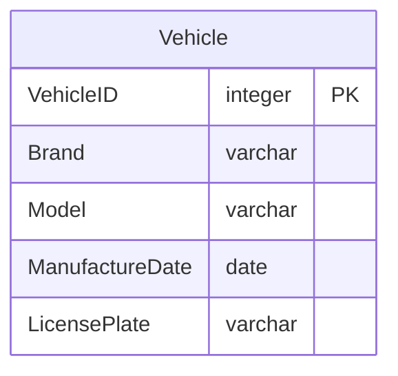
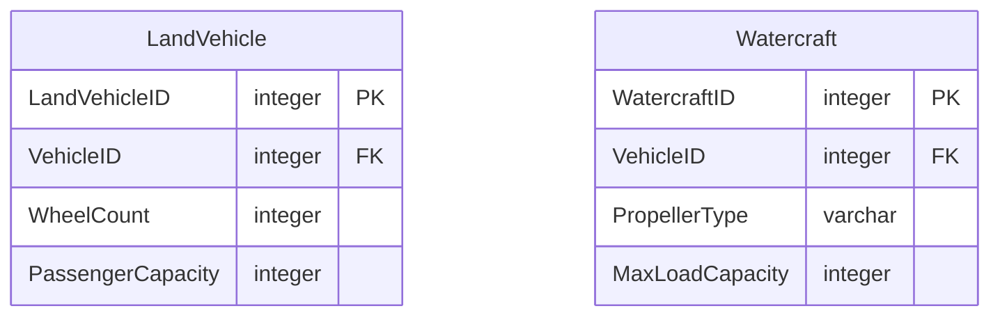
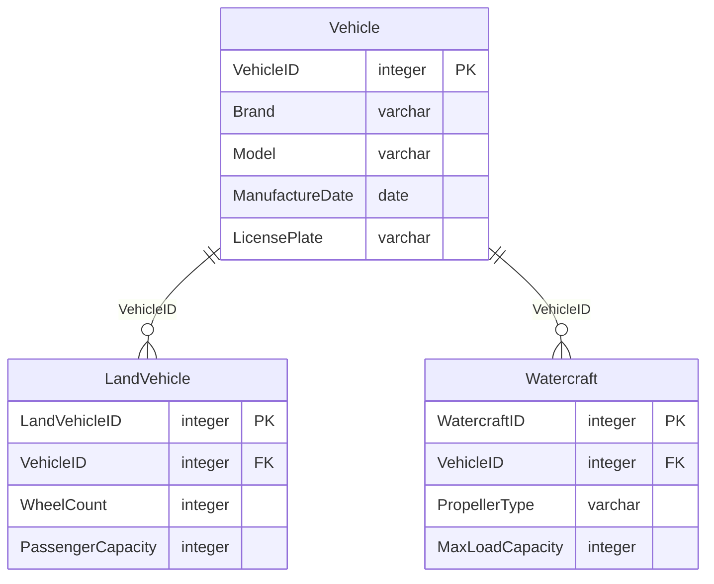
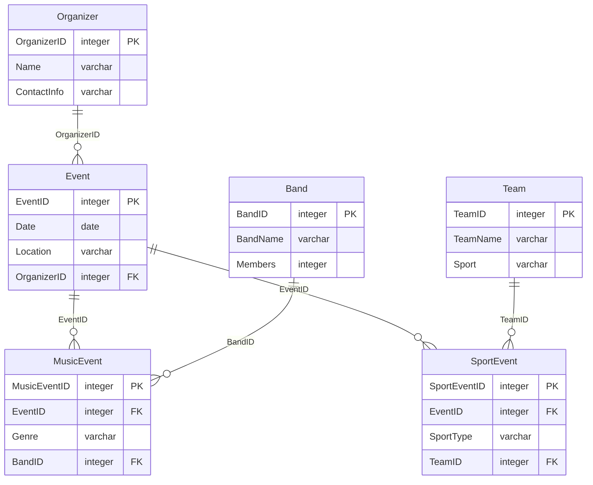
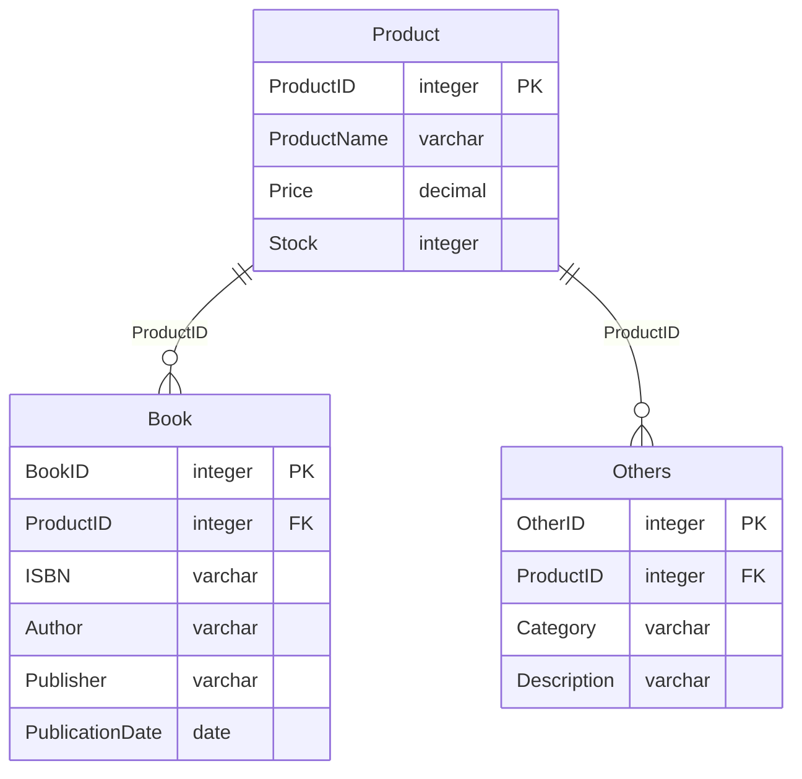
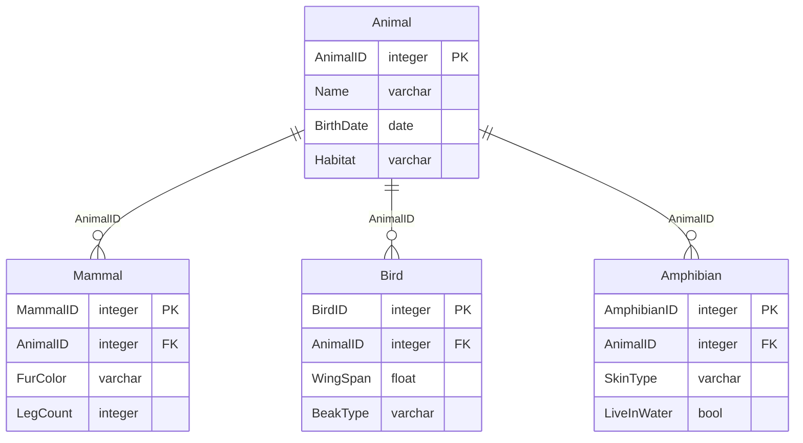
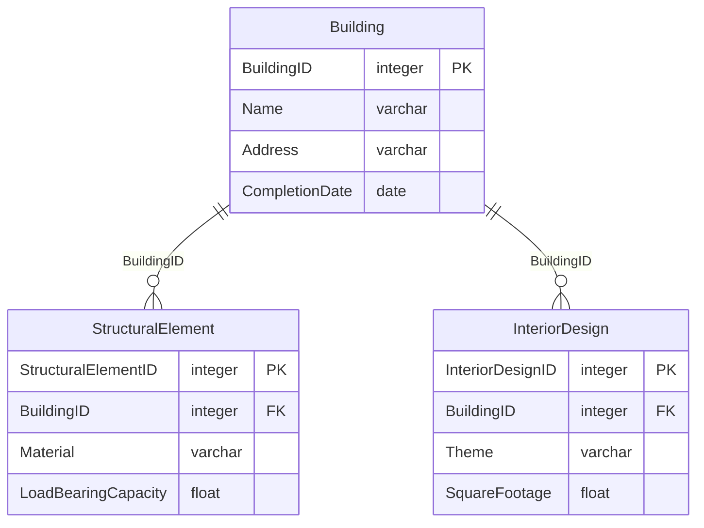
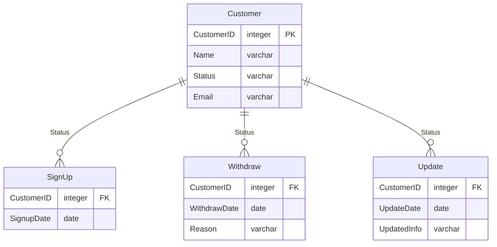

>정의한 집합이 어떤 종류로 이루어 졌는지를 한눈에 알 수 있도록 표현한 것이 서브 타입을 사용하는 가장 커다란 의미. \
>정의한 집합이 어떤 종류의 집합으로 이루어 졌는지를 입체적으로 보여주는 것이 서브 타입임.

>**Note**
>(α) 해당 페이지에 나온 모든 예제는 별도로 구성한 개별적인 예제임.

### 서브 타입이 없는 모델의 단점
---

**알 수 없는 Vehicle 의 종류**

위 모델을 보면 설명을 보거나 듣지 않고는 어떤 종류의 Vehicle인지 알 수 없다.

한번 들어서 알고 있다 하더라도 모델링 과정에 정의가 바뀌면 혼란이 생길 수 있다.

**변동 사항에 따른 혼란**

위 모델의 경우 Vehicle이 LandVehicle과 Watercraft 두 가지 가 있다고 추측을 할 수 있다. 

하지만 추측할 뿐 확신할 수는 없다 두 개 이외의 엔티티가 주변이나 다른 영역에 존재한다면 그에 대한 해석은 하기가 힘들다.

### 서브 타입 있는 모델의 장점
---

>**Important**
>위 예제와 같이 일반화 과정을 거쳐 엔티티가 통합돼 있어야 **추측**하지 않고, Vehicle의 **종류**에는 Land와 water가 있다는 것을 **명확하게 알 수 있다**.

위와 같이 서로 다른 엔티티와 관계를 맺고 있는 상황에도 서브 타입을 두는게 좋다.

업무 규칙과 이해력이 높아진다.

위에 경우에는 `Event의 서브 타입`으로 `MusicEvent`  와 `SportEvent` 를 만듦으로써 가독성과 이해력을 높일 수 있다.

### 확장성을 고려한 서브타입
---

쇼핑몰에 서적만 취급하면 서적 엔티티를 만들 수 있지만 DVD나 의류가 추가될 걸 대비해 확장을 고려해서 서브 타입을 도출할 수 있음.

확장을 생각해서 일반적인 Product 라는 이름으로 테이블을 정의했다.

테이블이 가변적이지 않고 고정적인 경우 Book으로 정해도 된다.

### 일반화된 서브타입
---

서브타입은 집합을 일반화, 상세화할 때 도출된다. 

동물/포유류/조류/양서류 등을 동물이라는 엔티티로 일반화 할 떄 서브 타입이 도출된다. 

이렇게 데이터를 일반화하면 부분 집합은 전체 집합이다 is-a 의 관계가 성립한다. 

조류는 동물이다 라는 관계가 성립한다.

### 구성 요소로서의 서브타입
---

건축물은 구조적인 요소와 내부 설계도로 이루어진다고 가정을 하면.

건축물은 구조적인 요소와 내부 설계도의 결합으로 완전한 형태가 됨. 

`구조적 요소`와 `내부 설계도`는 `각각 다른 특성과 속성`을 가지고 있을 것이다.

즉 서브 타입 간에는 공통된 속성이 존재하지 않고 고유한 속성만이 존재한다.

구조적 요소는 빌딩이다 의 이다 관계가 성립하지 않고 구조적 요소는 빌딩의 구성 요소 라는 Part-OF 관계가 성립한다.

즉 `구조적 요소`와 `내부 설계도` `두 가지가 합쳐`져야 `온전한 건축물`이 된다 는 것을 의미 한다.

>**Warning**
>구조적 요소와 내부 설계 속성을 합쳐서 하나의 건축물로 만들면 그만 이다. \
>서브 타입을 이렇게 구성 요소로 표현하는 경우는 흔치 않으며, 상위 개념 모델에서 가독성을 높이고 이해를 쉽게 하기 위해서 사용할 수 있다. \
>논리 모델에서 위와 같이 표현하는 것은 잘못 설계한 것이므로 주의해야 한다. 

### 코드성 데이터를 표현하는 서브 타입
---

`Status` 값이 `01`이면 해당 고객은 `SignUp` 서브 타입에 속하며, 가입 날짜를 볼 수 있음.

`Status` 값이 `02`이면 `Withdraw` 서브 타입에 속하게 됨.

이 경우, 고객의 탈퇴 날짜와 탈퇴한 이유를 확인할 수 있음.

`Status` 값이 `03`인 경우, 고객이 자신의 정보를 업데이트했다는 것을 의미하며, `Update` 서브타입에서 업데이트된 정보와 업데이트 날짜를 볼 수 있음.

한 엔티티에 코드 속성은 많기 때문에 전부 표현하면 가독성이 떨어지니 핵심적인 코드만 표현하는게 좋음.