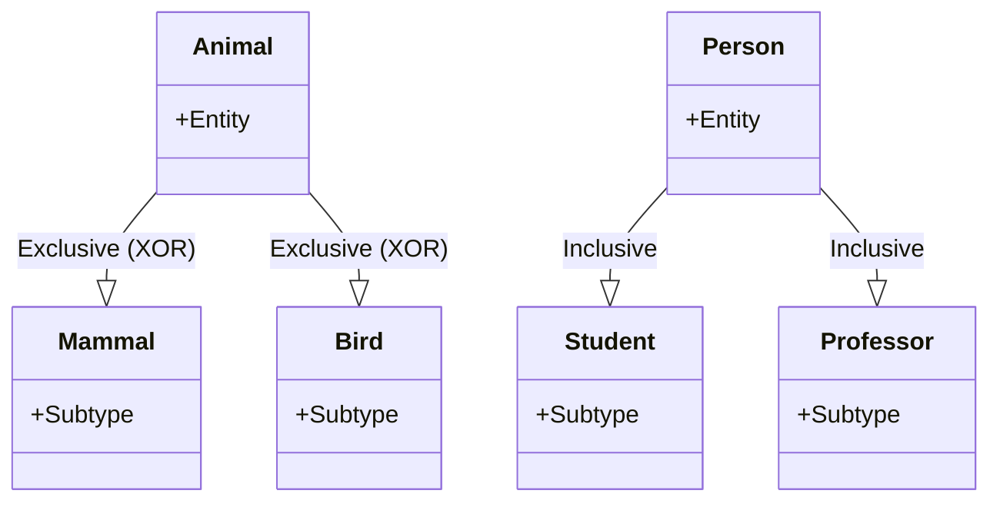
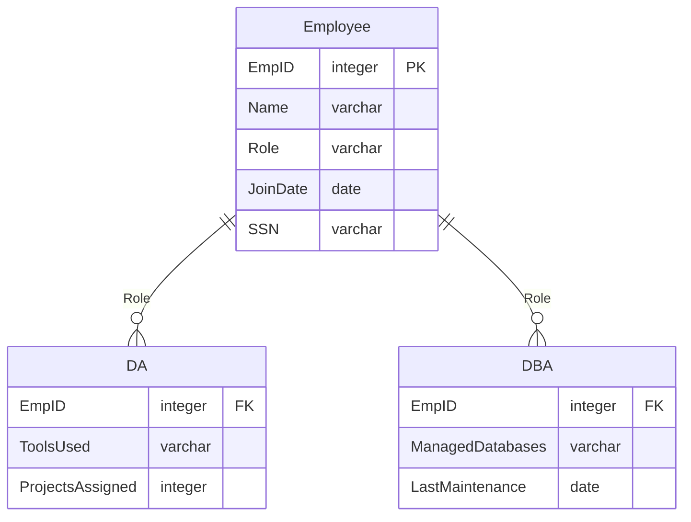

> 서브 타입은 Exclusive 와 Inclusive 서브 타입으로 분류 할 수 있다.

>Exclusive or Disjoint 서브 타입은 부분 집합 간에 공통 부분을 갖지 않는 서브 타입. \
>Inclusive or Overlapping 서브 타입은 겹쳐지는 부분이 존재하는 서브 타입을 말함. 

>**Note**
>(α) 추가 설명. \
>**Disjoint (or Exclusive) Subtypes** \
>슈퍼타입에 속한 엔티티는 오직 하나의 서브 타입에만 속할 수 있음. \
> 예를 들어, 동물은 포유류 또는 조류 중 하나가 될 수 있지만 둘 다 될 수는 없음. \
>**Overlapping (or Inclusive) Subtypes** \
>슈퍼타입에 속한 엔티티는 두 개 이상의 서브타입에 속할 수 있음. \
>예를 들어, 한 사람은 학생 이면서도 교수일 수 있음.

1. Exclusive 한 서브 타입은 일반화 수행 이후 서브 타입을 도출하는게 문제이지 도출 후엔 데이터 관리가 어렵지 않다.
2. Inclusive 한 서브 타입은 데이터를 관리 하는 방법이 혼란스러울 수 있음.

### 중복 서브 타입 모델에서 데이터 관리 방법
---

>**Note**
>커스텀 예제.
>한 기업에서 IT 부서의 직원은 Data Analyst (DA)나 Database Administrator (DBA)로 규정되어 있고, 처음 입사한 직원은 DA로 시작하지만, 특별한 교육과정을 거쳐 DBA로 승진될 수 있다. \
>이 경우, 해당 직원은 DA와 DBA 두 부분에 모두 속하게 됨.

**Case 1**

**Employee**

|EmpID|Name|Role|JoinDate|SSN|
|---|---|---|---|---|
|1|John|DA|2023-01-01|850101-1234567|
|2|Johe|DBA|2023-04-01|850101-1234567|
|3|Robert|DA|2023-05-15|851001-1234567|
|4|Alice|DA/DBA|2022-10-01|840901-1234567|

**DA**

|EmpID|ToolsUsed|ProjectsAssigned|
|---|---|---|
|1|Tableau|3|
|3|Python|5|
|4|Tableau, Python|4|

**DBA**

|EmpID|ManagedDatabases|LastMaintenance|
|---|---|---|
|2|MySQL|2023-06-01|
|4|MySQL, PostgreSQL|2023-06-10|

위 관계에서 보면 john 이 DA와 DBA 에 두 번 등장한다.

즉 같은 인물에 대한 다른 EmpID 로 두 인스턴스가 존재함.

슈퍼 타입 릴레이션과 서브 타입 릴레이션 관계는 일대일(1:1)이다.

**장점**

서브 타입의 인스턴스 총 개수는 슈퍼 타입의 인스턴스 갯수 와 같음.

직관적이고 사용하기 편함.

**단점**

Employee 엔티티에 같은 사람이 두번 존재하는 것이 단점이 될 수 있음.

주민등록 번호는 같지만 고객번호는 달라짐.

>**Note**
>이렇게 되면 Employee는 Employee의 실체를 관리하는 것이 아니라 역할을 관리하는 엔티티가 됨.

**Case2**

