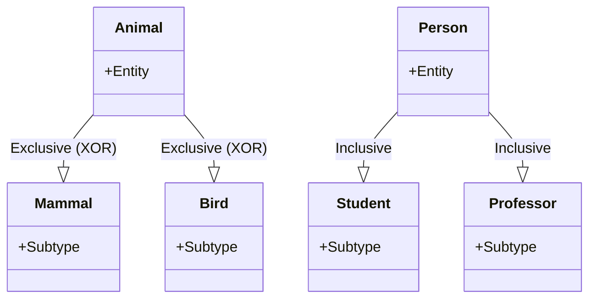
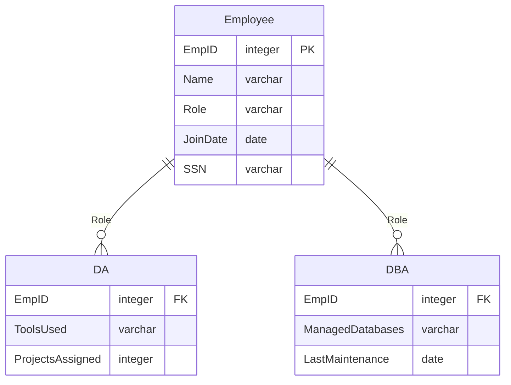

> 서브 타입은 Exclusive 와 Inclusive 서브 타입으로 분류 할 수 있다.

>Exclusive or Disjoint 서브 타입은 부분 집합 간에 공통 부분을 갖지 않는 서브 타입. \
>Inclusive or Overlapping 서브 타입은 겹쳐지는 부분이 존재하는 서브 타입을 말함. 

>**Note**
>(α) 추가 설명. \
>**Disjoint (or Exclusive) Subtypes** \
>슈퍼타입에 속한 엔티티는 오직 하나의 서브 타입에만 속할 수 있음. \
> 예를 들어, 동물은 포유류 또는 조류 중 하나가 될 수 있지만 둘 다 될 수는 없음. \
>**Overlapping (or Inclusive) Subtypes** \
>슈퍼타입에 속한 엔티티는 두 개 이상의 서브타입에 속할 수 있음. \
>예를 들어, 한 사람은 학생 이면서도 교수일 수 있음.

1. Exclusive 한 서브 타입은 일반화 수행 이후 서브 타입을 도출하는게 문제이지 도출 후엔 데이터 관리가 어렵지 않다.
2. Inclusive 한 서브 타입은 데이터를 관리 하는 방법이 혼란스러울 수 있음.

### 중복 서브 타입 모델에서 데이터 관리 방법
---

>**Note**
>커스텀 예제.
>한 기업에서 IT 부서의 직원은 Data Analyst (DA)나 Database Administrator (DBA)로 규정되어 있고, 처음 입사한 직원은 DA로 시작하지만, 특별한 교육과정을 거쳐 DBA로 승진될 수 있다. \
>이 경우, 해당 직원은 DA와 DBA 두 부분에 모두 속하게 됨.

**Case 1**

**Employee**

|EmpID|Name|Role|JoinDate|SSN|
|---|---|---|---|---|
|1|John|DA|2023-01-01|850101-1234567|
|2|Johe|DBA|2023-04-01|850101-1234567|
|3|Robert|DA|2023-05-15|851001-1234567|
|4|Alice|DA|2022-10-01|840901-1234567|
|5|Alice|DBA|2022-10-01|840901-1234567|

**DA**

|EmpID|ToolsUsed|ProjectsAssigned|
|---|---|---|
|1|Tableau|3|
|3|Python|5|
|4|Tableau, Python|4|

**DBA**

|EmpID|ManagedDatabases|LastMaintenance|
|---|---|---|
|2|MySQL|2023-06-01|
|5|MySQL, PostgreSQL|2023-06-10|

위 관계에서 보면 john 이 DA와 DBA 에 두 번 등장한다.

즉 같은 인물에 대한 다른 EmpID 로 두 인스턴스가 존재함.

중첩 서브 타입의 데이터를 관리하는 첫번째 방법은 슈퍼 타입에 서브 타입의 인스턴스를 각각 두는 방법으로 슈퍼 타입과 서브 타입의 인스턴스의 카디널리티를 1대1로 잡는 것.

**장점**

서브 타입의 인스턴스 총 개수는 슈퍼 타입의 인스턴스 갯수 와 같음.

직관적이고 사용하기 편함.

**단점**

Employee 엔티티에 같은 사람이 두번 존재하는 것이 단점이 될 수 있음.

주민등록 번호는 같지만 고객번호는 달라짐.

>**Note**
>이렇게 되면 Employee는 Employee의 실체를 관리하는 것이 아니라 역할을 관리하는 엔티티가 됨.

**Case2**

중첩 서브 타입 데이터를 관리하는 또 다른 방법은 슈퍼 타입 Employee에 하나의 인스턴스만 존재하는 것임.

>**Note**
>구분자 속성값의 코드값이 추가됨. \
>구분자 속성 값에는 da, dba, da/dba 의 형태가 됨. \
>이 릴레이션에서는 슈퍼 타입과 서브 타입 사이의 관계 카디널리티가 1대 다임. \
>Employee  와 DA/DBA 엔티티는 1대1 임.

**Role**

|RoleID|Description|
|---|---|
|1|DA|
|2|DBA|
|3|DA/DBA|

**Employee**

|EmpID|Name|RoleID|JoinDate|SSN|
|---|---|---|---|---|
|1|John|1|2023-01-01|850101-1234567|
|2|Johe|2|2023-04-01|850101-1234567|
|3|Robert|1|2023-05-15|851001-1234567|
|4|Alice|3|2022-10-01|840901-1234567|

**DA**

|EmpID|ToolsUsed|ProjectsAssigned|
|---|---|---|
|1|Tableau|3|
|3|Python|5|
|4|Tableau, Python|4|

**DBA**

|EmpID|ManagedDatabases|LastMaintenance|
|---|---|---|
|2|MySQL|2023-06-01|
|4|MySQL, PostgreSQL|2023-06-10|

**장점**

SSN 즉 주민등록번호 하나에 고객번호 하나가 돼 통합 고객에 대한 손선도 없고 데이터 중복도 없음.

**단점**

만약 DA, DBA 2종류가 아닌 5종류라면?

코드값이 많이 늘어날 것이며 서브타입이 추가되면 엄청난 코드 값이 필요할 것임.

중복 속성은 없으나 코드값이 늘어나는 것은 커다란 단점임.

>**Warning**
>서브 타입의 합이 슈퍼 타입 인스턴스의 합과 같지 않게 됨. \
>Exclusive 한 서브 타입이리도 슈퍼 타입의 인스턴스가 서브 타입의 모든 인스턴스를 합한 것과 같지 않을 수 있음. \
>슈퍼 타입에만 존재하고 서브 타입에 존재하지 않는 인스턴스가 있을 수 있음.

**case3**

코드값으로 관리하는 서브 타입을 여부 속성으로 관리하는 법.

**Employee**

|EmpID|Name|IsDA|IsDBA|JoinDate|SSN|
|---|---|---|---|---|---|
|1|John|Yes|No|2023-01-01|850101-1234567|
|2|Johe|No|Yes|2023-04-01|850101-1234567|
|3|Robert|Yes|No|2023-05-15|851001-1234567|
|4|Alice|Yes|Yes|2022-10-01|840901-1234567|

**DA**

|EmpID|ToolsUsed|ProjectsAssigned|
|---|---|---|
|1|Tableau|3|
|3|Python|5|
|4|Tableau, Python|4|

**DBA**

|EmpID|ManagedDatabases|LastMaintenance|
|---|---|---|
|2|MySQL|2023-06-01|
|4|MySQL, PostgreSQL|2023-06-10|

코드값을 관리하는 방법 보다는 편안하지만, 변화에 취약하며 모델상으로는 서브 타입 개념이 명확하게 보이지 않음.

### Complete , Incomplete
---

[[완전(Complete), 불완전(Incomplete) 서브 타입]]

[완전, 불완전 서브타입 링크](https://github.com/christopher3810/DevBookStudies/blob/master/Database/%EA%B4%80%EA%B3%84%ED%98%95%20%EB%8D%B0%EC%9D%B4%ED%84%B0%20%EB%AA%A8%EB%8D%B8%EB%A7%81%20%ED%95%B5%EC%8B%AC%20%EA%B0%80%EC%9D%B4%EB%93%9C/6%ED%9A%8C%EC%B0%A8%20%EC%8A%88%ED%8D%BC%ED%83%80%EC%9E%85%20%EA%B3%BC%20%EC%84%9C%EB%B8%8C%ED%83%80%EC%9E%85/%EC%99%84%EC%A0%84(Complete)%2C%20%EB%B6%88%EC%99%84%EC%A0%84(Incomplete)%20%EC%84%9C%EB%B8%8C%20%ED%83%80%EC%9E%85.md) 해당 링크를 참조해서 확인 하자.

