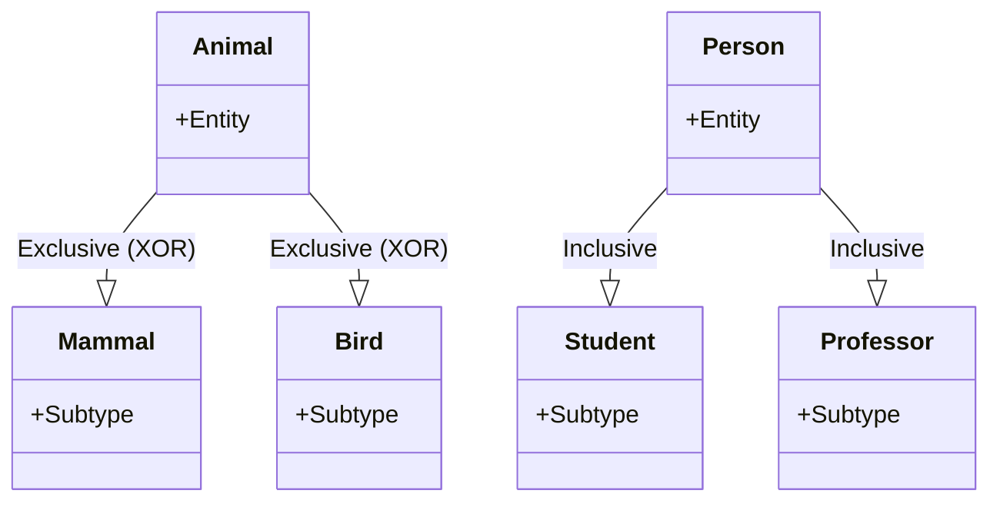

> 서브 타입은 Exclusive 와 Inclusive 서브 타입으로 분류 할 수 있다.

>Exclusive or Disjoint 서브 타입은 부분 집합 간에 공통 부분을 갖지 않는 서브 타입. \
>Inclusive or Overlapping 서브 타입은 겹쳐지는 부분이 존재하는 서브 타입을 말함. 

>**Note**
>(α) 추가 설명. \
>**Disjoint (or Exclusive) Subtypes** \
>슈퍼타입에 속한 엔티티는 오직 하나의 서브 타입에만 속할 수 있음. \
> 예를 들어, 동물은 포유류 또는 조류 중 하나가 될 수 있지만 둘 다 될 수는 없음. \
>**Overlapping (or Inclusive) Subtypes** \
>슈퍼타입에 속한 엔티티는 두 개 이상의 서브타입에 속할 수 있음. \
>예를 들어, 한 사람은 학생 이면서도 교수일 수 있음.

1. Exclusive 한 서브 타입은 일반화 수행 이후 서브 타입을 도출하는게 문제이지 도출 후엔 데이터 관리가 어렵지 않다.
2. Inclusive 한 서브 타입은 데이터를 관리 하는 방법이 혼란스러울 수 있음.

### 중복 서브 타입 모델에서 데이터 관리 방법
---

슈퍼 타입 하나의 인스턴스가 하나의 서브 타입과 관계가 존재 하는 경우

슈퍼 타입 하나의 인스턴스가 여러개의 서브 타입과 관계가 존재 하는 경우