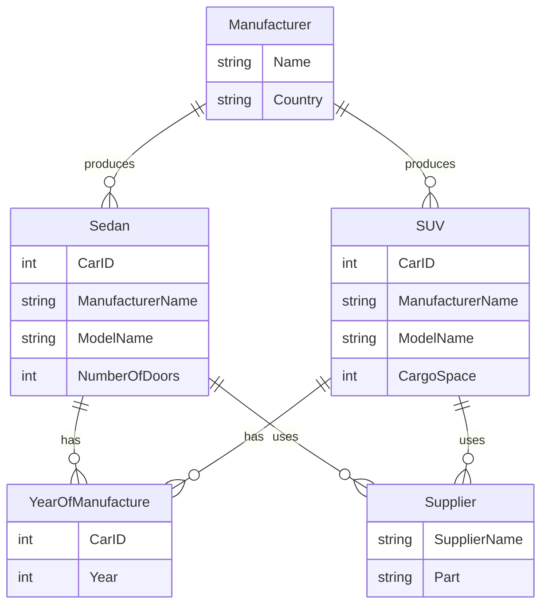
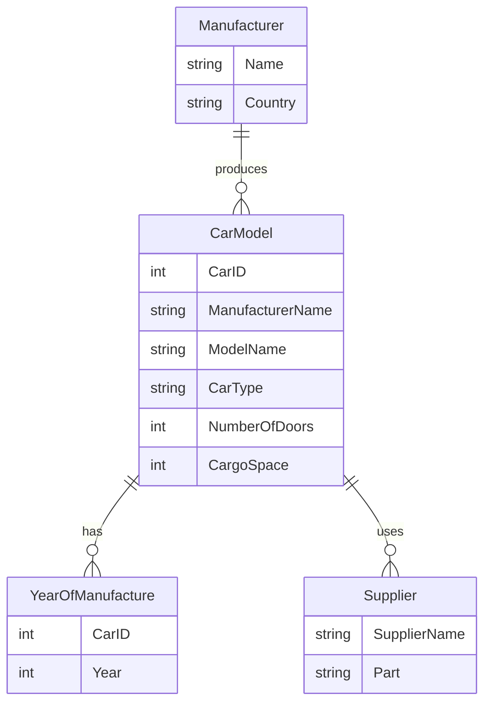
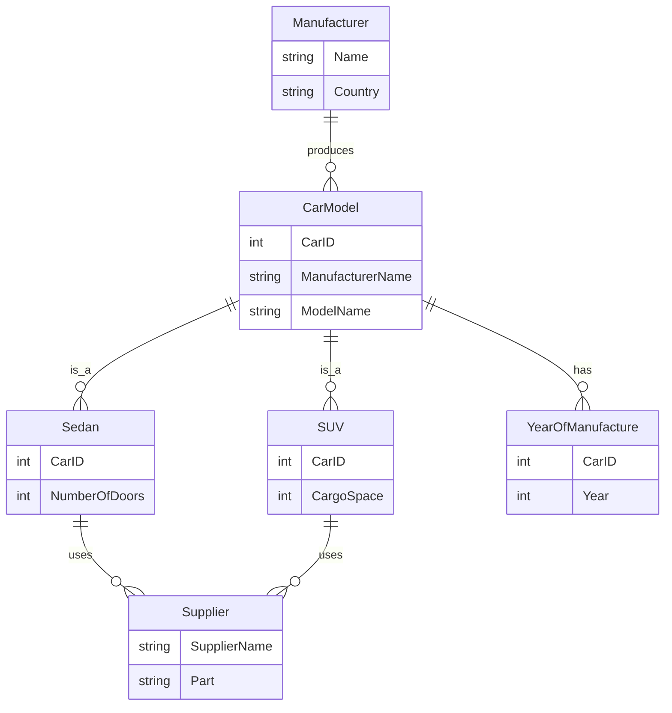

### 변환 방법
---
크게 세가지임.

|타입|기준|
|---|---|
|타입1-분할|서브타입별 업무가 서로 `독립적`일 때<br>서브타입별 속성이 많이 다를 때<br>서브타입별 관계가 많이 다를 때<br>모든 서브타입을 동시에 조회하는 경우가 드물 때<br>서브타입별 주 식별자가 `상호 배타적이 아닐 때`<br>서브타입이 업무적으로 서로 `약 결합(Loosely Coupled)` 관계일 때|
|타입2-통합|`서브타입별 고유 속성이 적을 때`<br>속성이 지속적으로 늘어날 가능성이 작을 때<br>하나의 서브타입은 속성도 많고 업무도 중요하며 `나머지 서브타입은 덜 중요할 때`<br>`서브타입 전체를 대상으로 하는 업무가 빈번`할 때<br>데이터 건수가 많지 않을 때<br>업무가 중요하지 않을 때<br>서브타입이 서로 `포함(Included) 관계`일 때<br>서브타입이 업무적으로 서로 `강 결합(Tightly Coupled) 관계`일 때|
|타입3-혼합|서브타입별 `공통 속성을 대상으로 하는 업무가 빈번`할 때<br>통합(타입2)하면 `속성 개수가 너무 많아`질 때<br>업무의 변화가 빈번해 속성이 자주 추가될 때<br>서브타입별 고유 속성이 많을 때<br>`트랜잭션의 락(Lock)을 방지하기 위해 엔티티를 분리`해야 할 때<br>공통 업무와 고유 업무가 다양하게 존재할 때<br>`중요 속성`과 `참고 속성`으로 `분리될 수 있을 때`<br>슈퍼타입의 조회가 빈번하고 조회 범위가 넓을 때<br>서브타입이 업무적으로 서로 강 결합(Tightly Coupled) 관계일 때|

>**Note**
>(α) Type 1,2,3 별 커스텀 예제 들.

### Type 1 구체 테이블 상속 전략 (Concrete Table Inheritance Strategy)
---



각 서브타입이 자체 테이블을 갖습니다. 공통 속성은 각 테이블에 중복으로 저장.

>**Important**
>CarId가 중복될 수 있기 때문에 중복되는 것을 체크하기 위한 로직이 필요함. \
>애플리 케이션에서 체크할 수 있지만, 데이터베이스에서 원천적으로 체크하는 것이 바람직함.

>**Warning**
>양쪽 엔티티에 데이터가 전부 발생할 수 있기 때문에 주의 요망. \
>저자는 비슷한 유형의 엔티티를 통합된 데이터로 관리하기 위해 일반화한것인데 다시 별도의 엔티티로 돌아가기 때문에 회의적인 입장.

**상대적  장점**

|항목|설명|
|---|---|
|엔티티 명확성|각 엔티티의 속성이 근본적으로 구분되므로 데이터 구조를 명확하게 인식하고, 관리할 수 있다.<br> 이로 인해 데이터베이스의 품질이 향상되며, 오류가 줄어든다.|
|쿼리 최적화|개별 서브타입에 대한 쿼리가 빠르다.<br> 조인이 필요 없이 해당 테이블만 조회하기 때문에 성능 최적화가 가능하다. 이를 통해 데이터베이스의 처리 속도와 응답 시간이 향상된다.|
|독립성|각 엔티티에 해당하는 업무는 상호 영향을 미치지 않는다.<br> 예를 들어, Sedan 엔티티의 변경이 SUV 엔티티에 영향을 주지 않는다. 이로 인해 개발의 유연성과 데이터베이스의 안정성이 증가한다.|
|데이터 크기 및 성능 최적화|각 엔티티의 데이터 크기가 줄어들고, 슈퍼타입과 서브타입 간의 조인이 필요 없다.<br> 따라서 UNION 구문이 불필요하게 되어 성능 최적화에 기여한다.|
|NULL 최소화|중복된 속성을 각각의 테이블에서 정의하는 방식으로 인해 NULL 값을 갖는 속성이 줄어든다.<br> 이로 인해 데이터의 품질이 향상되고, 쿼리의 복잡성이 줄어든다.|

**단점**

|항목|설명|
|---|---|
|쿼리 복잡성|여러 서브타입을 동시에 조회하는 경우, UNION 또는 복잡한 JOIN이 필요하다.<br> 이로 인해 쿼리 작성이 복잡해지고, 데이터베이스의 성능에 부정적인 영향을 줄 수 있다.|
|데이터 일관성|각 서브타입 테이블에서 공통 속성이 중복되어 저장되므로, 데이터의 일관성을 유지하기 어렵다.<br> 이로 인해 데이터베이스의 품질 문제나 오류 발생 가능성이 증가한다.|
|1정규형 위반|서브타입 테이블에서 공통 속성이 중복 저장되므로, 넓은 의미에서 1정규형을 만족시키지 않는다.<br> 이는 데이터베이스 설계 원칙을 위반하는 것으로, 데이터의 무결성 문제를 초래할 수 있다.|

### Type 2 단일 테이블 전략 (Single Table Strategy)
---



모든 서브 타입들이 단일 테이블에 저장됨. 

각 서브타입별로 컬럼이 추가되며, 특정 서브타입에 해당하지 않는 엔티티에는 NULL 값이 들어감.

>**Note**
>저자의 의견은 데이터를 가능한 통합하는 것이 원칙으로 핵심적인 엔티티가 아니라면 이처럼 하나의 엔티티로 통합함. \
>어플리케이션에서 빈번히 사용되는 중요한 엔티티라면 서브타입별 고유 속성이 많이 존재하며 지속적으로 늘어날 가능성이 있는지등의 기준으로 타입을 결정한다.


**장점**

|항목|설명|
|---|---|
|SQL 단순화|슈퍼타입과 서브타입 간의 조인이 발생하지 않아, 조회 SQL이 단순화되며, 이로 인해 데이터베이스 성능이 향상될 가능성이 크다.|
|관리 용이성|단일 테이블로 모든 서브타입을 관리하므로, 엔티티의 수가 줄어들어 전반적인 데이터 관리가 용이하다.|
|모델의 단순화|복잡한 관계와 여러 테이블 대신 단일 테이블로 모든 것을 관리하므로 ERD가 단순해지고, 이를 관리하고 이해하기가 더 쉽다.|
|주식별자 관리|서브타입 간에 주 식별자의 일관성을 유지하는 것이 더 쉽다.|
|전체 조회 효율|전체 서브타입을 한 번에 검색할 때 별도의 UNION 구문 없이 단일 테이블에서 조회 가능하여, 성능 면에서 효율적이다.|

**단점**

|항목|설명|
|---|---|
|테이블 크기 증가|단일 테이블에서 모든 속성을 관리하므로, 속성의 개수와 인덱스가 많아져서 테이블의 크기가 증가한다.<br> 이로 인해 테이블 관리 및 백업, 복원 등의 작업이 복잡해질 수 있다.|
|NULL 값 증가|특정 서브타입에만 해당하는 속성에 대해서는 다른 서브타입의 데이터에서 NULL 값이 입력되기 때문에, 전체적으로 NULL 값이 많아진다. 이로 인해 데이터의 품질과 쿼리의 복잡성 문제가 발생할 수 있다.|
|영향도 증가|특정 서브타입에 대한 업무 변경이 발생하면, 단일 테이블에 큰 영향을 줄 수 있으며, 이로 인해 연관된 어플리케이션의 수정 범위가 확대될 수 있다.|
|업무 규칙 표현 제약|단일 테이블에서 여러 서브타입을 관리하기 때문에, 각 서브타입에 대한 업무 규칙을 모델에 명확하게 표현하기 어렵다.|
|성능 저하 위험|특정 서브타입의 데이터만을 대상으로 하는 쿼리의 경우, 불필요한 데이터까지 읽혀 IO 작업이 증가하며, 성능 저하의 위험이 있다.|
|엔티티 정체성 희석|여러 서브타입의 속성이 하나의 테이블에 통합되어 관리되므로, 각 서브타입의 독특한 정체성이 희석될 수 있다.|
|NOT NULL 제약 제한|서브타입별로 특정 속성에 NOT NULL 제약을 설정하는 것이 불가능하다. 따라서 데이터 무결성 유지가 어려울 수 있다.|

모델만으로는 업무규칙을 알 수 없는 경우 제약을 추가해 관리하는 것이 바람직함.
업무 규칙을 반영한 CHECK 제약조건이 필요

>**Important**
>(α) CHECK 제약 조건 예시

**CarType 제약조건**

만약 `CarType`이 `Sedan`, `SUV`, `Truck` 등의 특정 값만 허용되어야 한다면, 다음과 같은 `CHECK` 제약조건을 사용할 수 있음.

```sql
ALTER TABLE CarModel ADD CONSTRAINT CHK_CAR_TYPE CHECK (CarType IN ('Sedan', 'SUV', 'Truck'));
```


**NumberOfDoors 제약조건**

대부분의 세단 자동차는 4개의 문을 가지고 있습니다. 이를 반영하기 위해 `CarType`이 `Sedan`일 경우 `NumberOfDoors`는 4개여야 한다는 제약조건을 추가할 수 있음.

```sql
ALTER TABLE CarModel ADD CONSTRAINT CHK_SEDAN_DOORS CHECK ((CarType = 'Sedan' AND NumberOfDoors = 4) OR CarType <> 'Sedan');
```


이런 방식으로, 실제 업무 규칙에 따라 여러 `CHECK` 제약조건을 추가할 수 있음.

### Type 3 클래스 테이블 상속 전략 (Class Table Inheritance Strategy)
---



각 서브타입에 대한 별도의 테이블이 생성됨. 

슈퍼타입에 관한 정보는 공통 테이블에 저장되며, 서브타입의 특정 정보는 해당 서브타입의 테이블에 저장.

**장점**

데이터 무결성 유지가 쉬움.
NULL 값을 최소화.

**단점**

쿼리 성능 저하 가능성 (다수의 조인 필요)

복잡한 구조.

