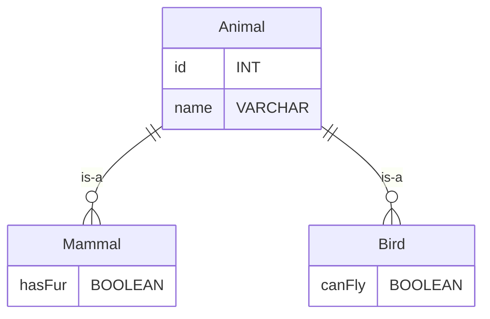
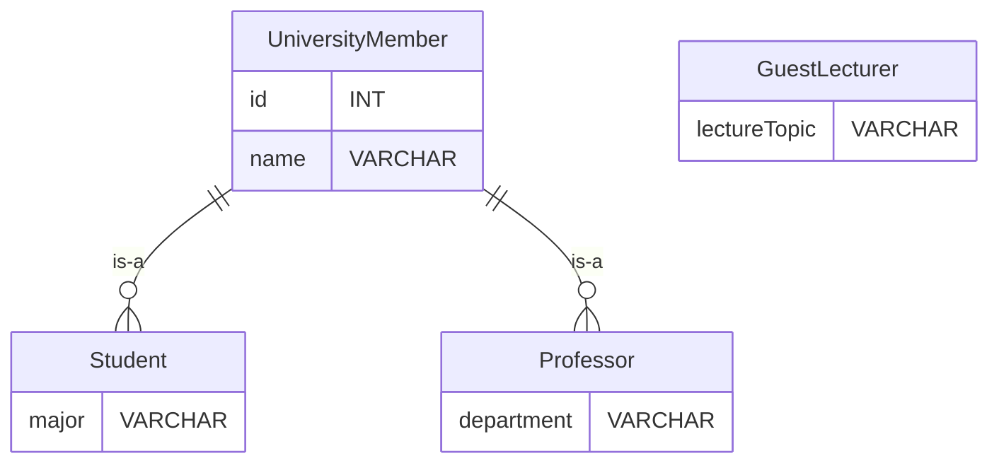

### Complete , Incomplete
---

서브 타입은 제약에 따라 Complete, Incomplete로 구분할 수 있음.

>**Note**
>(α) 해당 내용은 추가적인 정보를 포함 합니다.

### **완전 서브타입 (Complete Subtype)**

슈퍼타입에 속하는 모든 엔티티 인스턴스가 반드시 하나 이상의 서브타입에도 속하게 되는 경우.

**예시**

동물을 슈퍼타입으로 가정했을 때, 모든 동물은 반드시 포유류, 조류, 어류 등의 서브타입 중 하나에 속하게 됨.

### **불완전 서브타입 (Incomplete Subtype)**

슈퍼 타입에 속하는 일부 엔티티 인스턴스만 특정 서브타입에 속하는 경우.

**예시**

대학교에서 교수, 학생, 그리고 간담회에만 참여하는 강사들이 있음. 

여기서 교수와 학생은 대학교 구성원의 서브 타입임. 

그러나 모든 구성원이 교수나 학생으로 분류되지는 않음.

>**Note**
>(α) 간담회에만 참여하는 강사는 대학교 구성원이지만 교수나 학생의 카테고리에는 속하지 않음.

물리 모델로 변환시.
### UniversityMember

|id|name|role|
|---|---|---|
|1|John|Student|
|2|Alice|Professor|
|3|Robert|GuestLecturer|
|4|Maria|Student|
|5|Steve|Professor|

### Student

|id|major|
|---|---|
|1|Computer Science|
|4|Mathematics|

### Professor

|id|department|
|---|---|
|2|Physics|
|5|Chemistry|

GuestLecturer 인 Robert는 슈퍼 타입인 UniversityMember 에는 존재하나 서브 타입에는 존재하지 않으 므로 Incomplete subtype 이다.

초기 설계 단계 에서 명확하게 서브 타입이 도출되지 않을 경우 기타 라는 서브 타입을 활용 하는 것이 좋다.

>**Important**
>슈퍼 타입에 인스턴스가 생성될 때 서브 타입에도 인스턴스가 생성되면 완전 서브 타입이며 그렇지 않으면 불완전 서브 타입 임. \
>한 개의 서브 타입 인스턴스만 생성되면 exclusive 한 서브 타입이며 하나 이상의 서브 타입에 인스턴스가 생성되면 중복 서브 타입.

| **Relationship**                        | **Description**                                                               |
|----------------------------------------|-------------------------------------------------------------------------------|
| **Exclusive 서브타입 & Complete 서브타입**   | 1. 슈퍼타입의 한 인스턴스는 하나의 서브타입 인스턴스와 관계가 존재할 수 있다.   2. 슈퍼타입의 모든 인스턴스는 관계가 존재하는 서브타입의 인스턴스가 존재한다.   3. 가장 일반적인 종류의 서브타입이다.                               |
| **Exclusive 서브타입 & Incomplete 서브타입** | 1. 슈퍼타입의 한 인스턴스는 하나의 서브타입 인스턴스와 관계가 존재할 수 있다.   2. 슈퍼타입의 어떤 인스턴스는 서브타입의 인스턴스와 관계가 존재하지 않을 수 있다.                                                     |
| **Inclusive 서브타입 & Complete 서브타입**   | 1. 슈퍼타입의 한 인스턴스가 두 개 이상의 서브타입 인스턴스와 관계가 존재할 수 있다.   2. 슈퍼타입의 모든 인스턴스는 관계가 존재하는 서브타입의 인스턴스가 존재한다.                                                   |
| **Inclusive 서브타입 & Incomplete 서브타입** | 1. 슈퍼타입의 한 인스턴스가 두 개 이상의 서브타입 인스턴스와 관계가 존재할 수 있다.   2. 슈퍼타입의 어떤 인스턴스는 서브타입의 인스턴스와 관계가 존재하지 않을 수 있다.                                                     |
