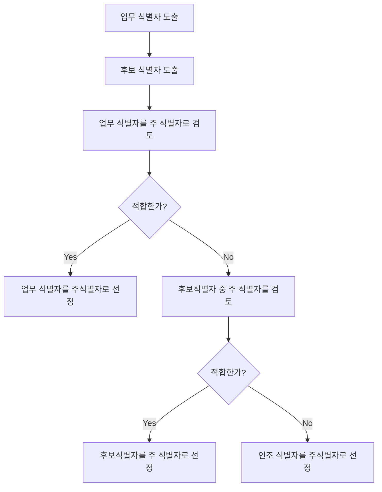

<table>
  <thead>
    <tr>
      <th rowspan="3">엔티티 유형</th>
      <th rowspan="2">관계 유형</th>
      <th>주 식별자</th>
    </tr>
  </thead>
  <tbody>
    <tr>
      <td rowspan="1">해당없음</td>
      <td>자체 엔티티 PK</td>
    </tr>
    <tr>
      <td rowspan="2">종속엔티티</td>
      <td>1대1</td>
      <td>상위 A엔티티 PK</td>
    </tr>
    <tr>
      <td>1대다</td>
      <td>상위 A엔티티 PK + 자체 엔티티 속성</td>
    </tr>
    <tr>
      <td rowspan="3">교차엔티티</td>
      <td>1대1</td>
      <td>상위 A엔티티 PK or 상위 B엔티티 PK</td>
    </tr>
    <tr>
      <td>1대다</td>
      <td>상위 A엔티티 PK + 상위 B엔티티 PK</td>
    </tr>
    <tr>
      <td>다대다</td>
      <td>상위 A엔티티 PK + 상위 B엔티티 PK + 자체 엔티티 속성</td>
    </tr>
    <tr>
      <td rowspan="1">이력 엔티티</td>
      <td>1대다</td>
      <td>상위 A엔티티 PK + 일자</td>
    </tr>
  </tbody>
</table>
