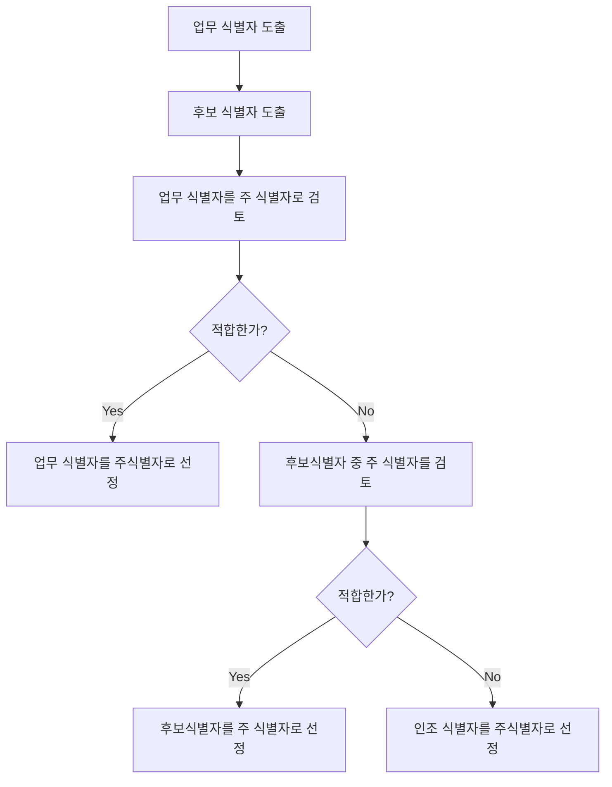

### 1. 업무 식별자 도출

업무 식별자 도출 후에 그 중 하나를 주 식별자로 선정.

업무 식별자는 엔티티 정의 단계에서 규명 되어야 함.

### 2. 후보 식별자 도출

인스턴스 유일성 보장하는 가능한 많은 식별자 도출.

후보 식별자를 모두 도출 후 업무 식별자를 도출 할 수도 있지만(2-1번 순) 권고하지 않음.

업무 식별자를 제외한 후보 식별자는 실무에 크게 많지 않으며.

업무 식별자가 존재 한다면 후보 식별자의 유니크 인덱스는 생략해도 큰 지장이 없다.

업무 식별자가 올바르게 도출 되었는지 다시 한번 검토하는 차원에서 후보 식별자 도출하는 것이 좋다.

### 3. 주 식별자 도출

가능한 업무 식별자를 주 식별자로 사용.

불가능 할 시 후보 식별자를 주 식별자로 사용.

불가능 할 시 인조 식별자 사용.

엔티티 종류/카디널리티에 따른 주 식별자 구성의 일반적인 예는 아래 표와 같음.

<table>
  <thead>
    <tr>
      <th rowspan="3" style="text-align:center">엔티티 유형</th>
      <th rowspan="2" style="text-align:center">관계 유형</th>
      <th style="text-align:center">주 식별자 구성</th>
    </tr>
  </thead>
  <tbody>
    <tr>
      <td rowspan="1" style="text-align:center">자립 엔티티</td>
      <td style="text-align:center">해당 없음</td>
      <td style="text-align:center">자체 엔티티 PK</td>
    </tr>
    <tr>
      <td rowspan="2" style="text-align:center">종속엔티티</td>
      <td style="text-align:center">1대1</td>
      <td style="text-align:center">상위 A엔티티 PK</td>
    </tr>
    <tr>
      <td style="text-align:center">1대다</td>
      <td style="text-align:center">상위 A엔티티 PK + 자체 엔티티 속성</td>
    </tr>
    <tr>
      <td rowspan="3" style="text-align:center">교차엔티티</td>
      <td style="text-align:center">1대1</td>
      <td style="text-align:center">상위 A엔티티 PK or 상위 B엔티티 PK</td>
    </tr>
    <tr>
      <td style="text-align:center">1대다</td>
      <td style="text-align:center">상위 A엔티티 PK + 상위 B엔티티 PK</td>
    </tr>
    <tr>
      <td style="text-align:center">다대다</td>
      <td style="text-align:center">상위 A엔티티 PK + 상위 B엔티티 PK + 자체 엔티티 속성</td>
    </tr>
    <tr>
      <td rowspan="1" style="text-align:center">이력 엔티티</td>
      <td style="text-align:center">1대다</td>
      <td style="text-align:center">상위 A엔티티 PK + 일자</td>
    </tr>
  </tbody>
</table>

### 4. 주 식별자 속성 순서 정하기

속성의 순서는 조회 성능에 많은 영향을 미치므로 중요하다

순서를 모델링 단계에서 Fix 하는것은 어렵다

조회 요건을 검토할 수 있을 때는 모델링 이후 개발 단계에서 SQL 이 나올 시기이다

이로인해 개발 후 테스트 단계에서 성능 문제로 인한 주 식별자 속성 순서 변경 문제가 발생할 수 있다

자주 사용되는 조건을 논의해 파악하거나 주요 화면을 확인 해 순서를 논의 하며 추 후 SQL 을 분석해서 최종 순서 결정해야 한다

### 5. 성능을 고려 한 주 식별자 정하는 방법

주 식별자를 물리적인 주 키로 생성하면 유니크 인덱스가 생성되는데 유니크 인덱스의 첫 번째 속성이 해당 엔티티를 조회하는 조건절에 자주 사용되도록 하는 것이 핵심임. 

자주 사용하는 속성의 분포도를 고려해 검색 대상을 초기에 줄여줄 수 있는 속성을 주 식별자의 첫번째 에 오게 해야 함.

>**Note**
>주 식별자의 첫 번째 속성으로 카디널리티가 높은 속성을 선택하면 인덱스 검색 성능이 향상됨. \
>왜냐하면 카디널리티가 높은 속성은 다양한 값이 있으므로 검색 대상을 초기에 줄일 수 있기 때문. \
>여기서 카디널리티는 상위 엔티티의 값과 관계 있는 하위 엔티티의 인스턴스 개수를 의미. \
>WHERE 조건절의 데이터 분포즉 카디널리티가 적은 속성이 선행. \
>WHERE 조건에서 = 나 Between 등이 사용되는 속성이 인덱스에 선행되어야 한다.

### 6. 주 식별자로 인조 식별자 선택 시 특성 및 주의사항

데이터를 일반화 할 수록 인조 식별자를 사용하게 되는 경향이 있다

인조 식별자는 확장성이 좋으므로 통합(일반화) 모델 엔티티에서 자주 사용된다

실체/자립 엔티티에서도 인조 식별자가 주로 사용된다

업무 식별자(후보 식별자)는 대체 식별자가 되므로 반드시 유니크 인덱스를 생성해야 한다

인스턴스 중복을 방지 목적

데이터 발생의 기준이 되는 업무 식별자는 특히 유니크 인덱스 설정이 필수적이다