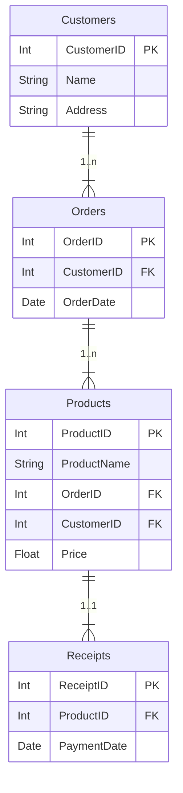
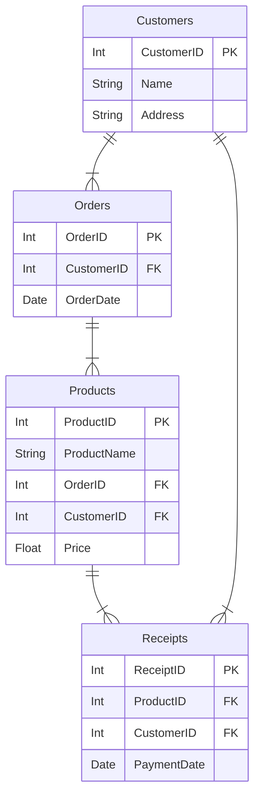

>**Note**
> 상위 엔티티의 주 식별자를 하위 엔티티의 식별자로서 상속 or 속성으로 상속. \
> 종속 관계 일때는 부모 엔티티의 주 식별자를 자신 엔티티의 식별자로서 상속하는 것이 일반적. \
> 하위 엔티티가 상위 엔티티에 존재 종속 되지 않다면, 일반 속성으로 상속 하는 것이 일반적. \
> 하지만 종속 관계 여도 속성으로 상속하는 예외 상황은 존재.

>**Important**
>하위 엔티티가 상위 엔티티에 업무적으로 종속되는지, 하위 엔티티에서 단지 상위 엔티티를 참조만 하려는 목적인지에 따라 식별자를 상속하면 대개 문제가 없음.

>**Warning**
>가장 좋지 않은 결정은 무의식적으로 상위 엔티티의 주 식별자를 하위 엔티티의 주 식별자로 상속 해야 하는것. \
>때때로 하위 엔티티에서 상위 엔티티의 속성을 조회하려 할 때 액세스가 복잡해질 수 있으며 성능 이슈가 발생하기도 함.(이때는 주식별자를 상속해야 함.)

#### 예제
---

>**Note**
> (α) 주문 커스텀 예제로 책과 다름. \
> A 엔티티는 고객을 나타내고, B 엔티티는 고객의 주문을 나타냄. \
> C 엔티티는 주문에 포함된 제품을 나타내고, D 엔티티는 제품의 리뷰를 나타냄.

#### **A Customers**

|CustomerID|Name|Address|
|---|---|---|
|1|Alice|123 Main St|
|2|Bob|456 Park Ave|
|3|Charlie|789 Broadway|

#### **B Orders**

|OrderID|CustomerID|OrderDate|
|---|---|---|
|101|1|2023-08-01|
|102|2|2023-08-02|
|103|3|2023-08-03|

#### **C Products**

|ProductID|ProductName|OrderID|CustomerID|Price|
|---|---|---|---|---|
|201|Apple|101|1|1.00|
|202|Banana|102|2|0.50|
|203|Cherry|103|3|0.75|

#### **D Receipts**

|ReceiptID|ProductID|PaymentDate|
|---|---|---|
|301|201|2023-08-04|
|302|202|2023-08-05|
|303|203|2023-08-06|




원칙 적으로 고객과 주문은 종속관계 이므로 주 식별자를 상속.

Products 는 Order과 종속 관계가 아닌 참조 관계이며 orders의 상속 받은 식별자 customerId와 orderId를 속성으로 상속 받음.

Receipts 는 Product와 종속관계 이기 때문에 주 식별자를 상속 받음.

>**Important**
>Receipts에서 Customers의 속성을 참조해야 하는 요건이 있으면 그 조회 요건의 속도가 이슈가 될 수 도 있으며 성능을 만족시키기 위한 전략을 세워야 한다. \
>위와 같은 예제에서는 Product와 Reveipts를 Join 하고 다시 Customer를 Join 해야 원하는 속성을 참조 할 수 있으므로 쿼리가 복잡해지며 성능에 악영향을 끼친다.

>**Note**
> (α) 아래 시나리오와 SQL관련 된 것은 커스텀 예제.(본문에 설명 없음.)
> 그렇다면 현재 Reveipts에서 참조하는 시나리오는 무었이 있을만 할까?.
> 1. 특정 고객의 모든 영수증을 조회하는 경우.
> 2. 특정 고객이 특정 날짜에 어떤 상품을 구매했는지 확인하는 경우.
> 3. 특정 고객이 특정 상품을 구매했는지 확인하는 경우.


Case 1. 특정 고객의 모든 영수증을 조회하는 경우.

```sql
SELECT r.*
FROM Receipts r
JOIN Products p ON r.ProductID = p.ProductID
JOIN Customers c ON p.CustomerID = c.CustomerID
WHERE c.CustomerID = ?
```

Case 2. 특정 고객이 특정 날짜에 어떤 상품을 구매했는지 확인하는 경우.

```sql
SELECT r.*
FROM Receipts r
JOIN Products p ON r.ProductID = p.ProductID
JOIN Customers c ON p.CustomerID = c.CustomerID
WHERE c.CustomerID = ? AND r.PaymentDate = ?
```

Case 3. 특정 고객이 특정 상품을 구매했는지 확인하는 경우.

```sql
SELECT r.*
FROM Receipts r
JOIN Products p ON r.ProductID = p.ProductID
JOIN Customers c ON p.CustomerID = c.CustomerID
WHERE c.CustomerID = ? AND p.ProductName = ?
```

#### D Receipts

|ReceiptID (PK)|ProductID (FK)|CustomerID (FK)|OrderID (FK)|PaymentDate|
|---|---|---|---|---|
|201|1001|1|101|2023-01-03|
|202|1002|2|102|2023-01-04|

C에 B의 주식별자를 상속 시키고 C와 D가 종속 관계 이기 때문에 주식별자를 상속받는 방법을 사용한다.

즉 B와 C가 종속관계가 아니나 성능 요건을 위해 식별자로 상속하는 앞에 Warnning 에서 말한 성능 때문에 주식별자를 상속하는 케이스가 여기에서 나온다.

위처럼 되면 D에서 A에 바로 Join 을 걸수 있게 되서 엑세스 단계가 줄게 되서 성능 향상을 할 수 있음.

```sql
SELECT r.*, c.*
FROM Receipts r
JOIN Customers c ON r.CustomerID = c.CustomerID
WHERE r.ReceiptID = ?;
```

>**Warning**
>벤치 마크 후 성능 이슈 없을땐 하지 말자.




|ReceiptID (PK)|ProductID (FK)|CustomerID (FK)|PaymentDate|
|---|---|---|---|
|201|1001|1|2023-01-03|
|202|1002|2|2023-01-04|

D인 Receipts에 A엔티티의 주 식별자를 속성으로 상속해 D에서 A를 바로 참조 가능.

위와 같이 중복(추출) 관계를 사용하는 비정규형을 채택 할 수도 있음.

종속 관계를 최대한 살리고 성능 이슈같이 특정 요건이 있으면 중복 관계 채택하는 것은 유용하게 사용 할 수 있음.

OrderId를 전부 상속 받는 것보다 바람직한 모델.

### 상속 관계가 지나치게 복잡 해 질 경우
---


초기 모델 처럼 C 엔티티에 인조 식별자(ProductID )를 주 식별자로 생성하고 상속 받은 속성을 일반 속성으로 관리 가능.

