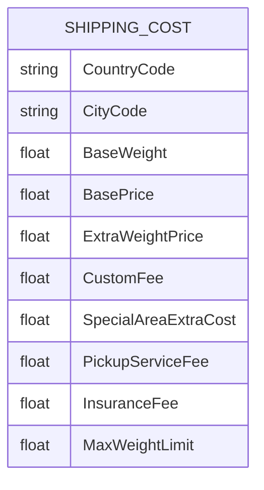
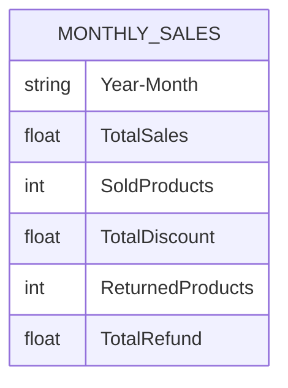
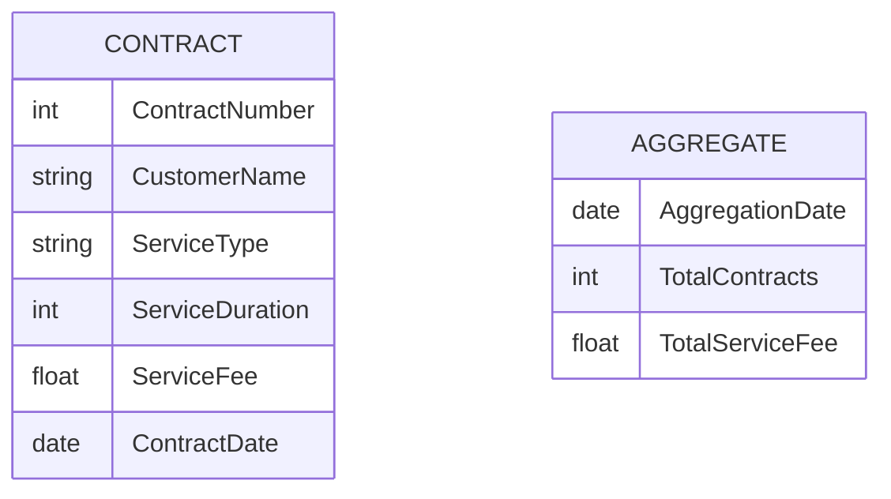
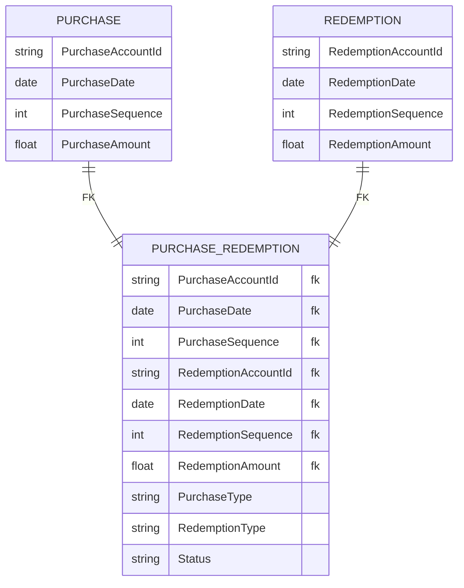
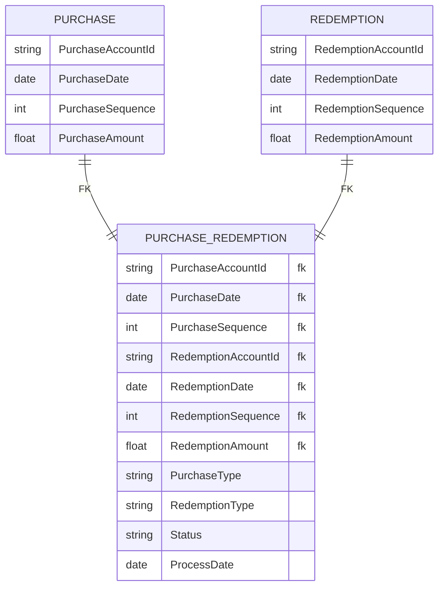
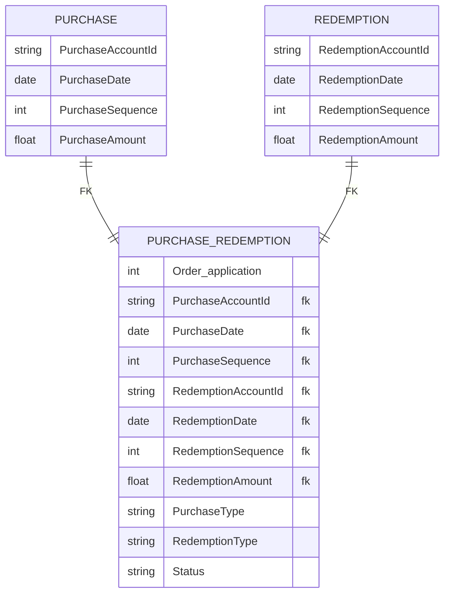
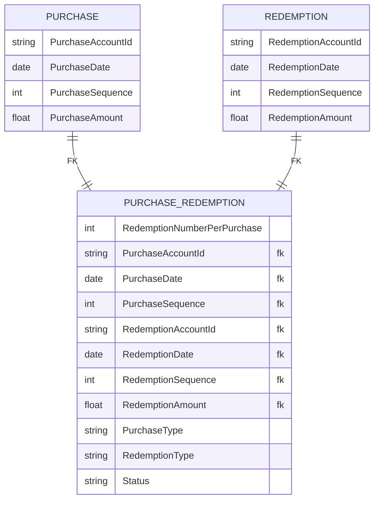
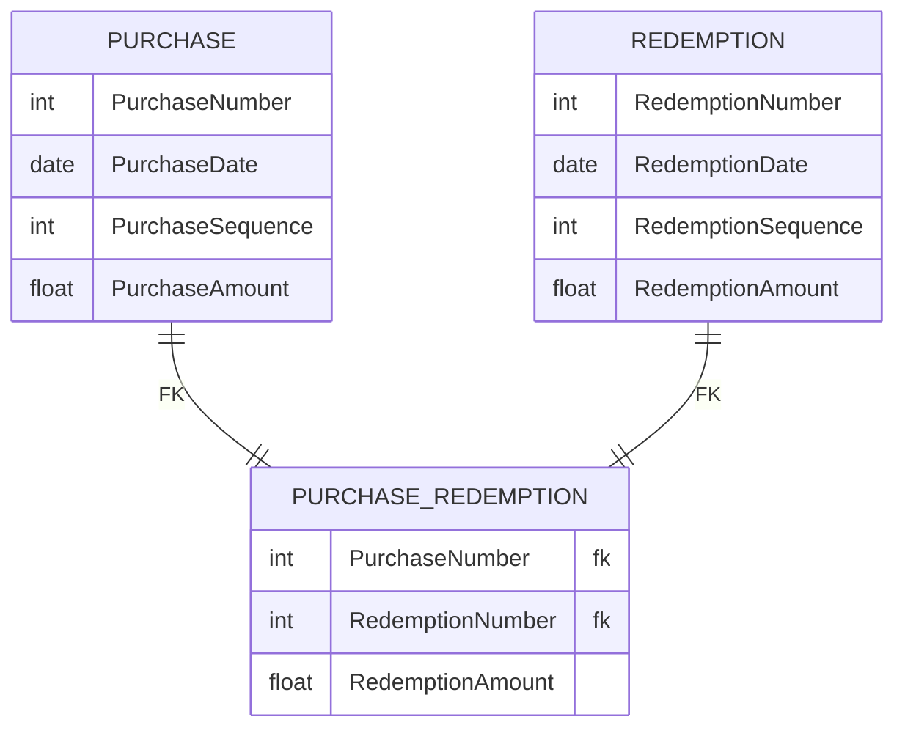

#### 기본 원칙

주식별자 구성하는 속성 5개 이내가 좋고 많더라도 일곱개를 넘어선 안됨.

\업무식별자가 주식별자가 되는 것은 가장 기본적인 원칙

많은 엔터티에서 참조되지 않으면 주 식별자가 복잡한 것은 문제되지 않는다.

#### 유형

#### 기준 데이터를 관리할 때

>**Note**
> (α) 책과 다른 커스텀 예제. \
> 운송비용 테이블 예제.

기준 정보를 관리하는 엔티티 전체 속성이 주 식별자로 정의됨.

이러한 기준 엔터티는 보통 하위 엔터티가 존재하지 않음.

그러므로 주식별자가 복잡해지는 것은 문제가 되지 않음.

#### 집계 데이터를 관리할 때

>**Note**
> (α) 책과 다른 커스텀 예제. \
> 월별 판매액 테이블 예제.

디멘션이 복잡한 집계 엔티티

이러한 집계 엔터티는 보통 하위 엔티티가 없고 주 식별자가 복잡한 것이 문제가 되지 않음.
#### 인스턴스를 생성하는 기준이 복잡할 때

>**Note**
> (α) 책과 다른 커스텀 예제. \
> 거래 내역별 상세 잔고와 집계 잔고 예제.

거래 내역별 상세 잔고와 집계 잔고

계약한 고객 별로 관리할지, 계약 별로 관리할지, 계약한 내역을 집계 한것을 기준으로 관리할지 에 따라 데이터를 얼마나 쌓는 지에 따라 주 식별자가 달라짐.

>**Note**
> (α) 추가 정보
>  **계약 기반**
>  각 계약이 별도이며 개별적인 주의가 필요한 경우 `ContractNumber`를 기본 키로 사용할 수 있음.
>   이 식별자를 사용하면 고유한 계약 번호를 기준으로 데이터 검색, 삽입 및 업데이트가 간단해짐. 
>  **고객 기반**
>  계약이 고객별로 그룹화되어 관리되는 경우 `ContractNumber`와 `CustomerName`의 조합을 복합 기본 키로 사용할 수 있음.
>   이 접근 방식은 고객별로 데이터를 구성하고 특정 고객에 대한 데이터를 집계하는 데 도움이 됨.
>  **집계된 데이터**
>  개별 계약이나 고객보다 집계된 데이터에 중점을 둘 경우 `AggregationDate`를 `AGGREGATE` 테이블의 기본 키로 사용할 수 있음.
>  이 접근 방식은 보고서나 분석 목적에 유용함.

#### 교차 엔터티일 때

다대다 관계에서 교차엔티티 인경우 상당히 또 복잡해짐.

양쪽 엔티티의 주식별자를 상속받기 때문에 교차 엔티티의 주식별자는 더욱 복잡해짐.

주 식별자만 상속 받는게 아닌 속성을 상속 받아 변경일자 까지 추가될 수도 있음.

위 와 같이 환매 기준으로 인스턴스 관리 차원에서 순번 속성을 주 식별자에 추가할 수 있음.

만약 교차 엔티티에 하위 엔티티가 많이 존재 한다면?

매입별 환매 번호라는 인조 식별자를 활용 할 수있음.

매입과 환매 릴레이션이 인조식별자를 채택하면 교차 엔티티의 주 식별자는 자연스럽게 단순해짐.

슈퍼식별자의 경우 [식별자 종류](https://github.com/christopher3810/DevBookStudies/blob/master/Database/%EA%B4%80%EA%B3%84%ED%98%95%20%EB%8D%B0%EC%9D%B4%ED%84%B0%20%EB%AA%A8%EB%8D%B8%EB%A7%81%20%ED%95%B5%EC%8B%AC%20%EA%B0%80%EC%9D%B4%EB%93%9C/8%ED%9A%8C%EC%B0%A8%20%EC%8B%9D%EB%B3%84%EC%9E%90/Ch8-2%20%EC%8B%9D%EB%B3%84%EC%9E%90(UID)%EC%99%80%20%ED%82%A4(PK)%20%EC%A2%85%EB%A5%98.md) 해당 예제를 참조하고 유일한 식별자를 선정하는 방식으로 변경하자.

[식별자 상속](https://github.com/christopher3810/DevBookStudies/blob/master/Database/%EA%B4%80%EA%B3%84%ED%98%95%20%EB%8D%B0%EC%9D%B4%ED%84%B0%20%EB%AA%A8%EB%8D%B8%EB%A7%81%20%ED%95%B5%EC%8B%AC%20%EA%B0%80%EC%9D%B4%EB%93%9C/8%ED%9A%8C%EC%B0%A8%20%EC%8B%9D%EB%B3%84%EC%9E%90/Ch8-5%20%EC%A3%BC%20%EC%8B%9D%EB%B3%84%EC%9E%90%20%EC%83%81%EC%86%8D.md) 에서 적잘하게 단절이 이루지지 않으면 주식별자가 복잡해 질 수 있음.

업무 식별자가 복잡하지만 하위 엔티티가 존재하지 않으면 복잡한 주식별자를 그대로 사용하는 것이 바람직함.