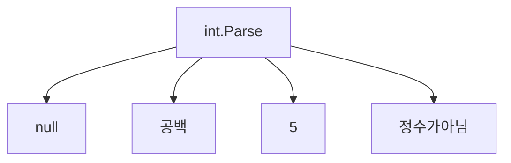

단위 테스트는 테스트를 작성하는 것보다 더큰 범주.

단위 테스트의 시간을 투자할 때는 항상 노력을 가능한 줄이고 그에 따르는 이득을 최대화 해야 함.

>[!NOTE]
> 코드 조각을 단위 테스트 하는것은 훌륭한 리트머스 시험이지만 한방향으로만 동작함.
> 이는 괜찮은 부정 지표 이며 비교적 높은 정확도로 저품질 코드를 가려냄.
> 즉 단위 테스트 하기 어렵다면 코드 개선이 반드시 필요하다는 것을 의미.
> 강결합에서 저품질이 나타나며 제품 코드가 서로 충분히 분리되지 않아 따로 테스트 하기 힘듬.
> 물론 단위 테스트를 할 수 있다고해서 코드가 반드시 고품질인 것은 아님.

>[!IMPORTANT]
>단위 테스트의 목표는 프로젝트의 지속 가능한 성장을 가능하게 하는 것이며.
>지속 가능하게 하는 것이 핵심이다.

엔트로피는 소프트웨어 에서도 적용 할 수 있고 점점 진척하고 운영하는 기간이 길어질 수록 변경을 필요할 때마다 엔트로피도 증가함.

회귀 테스트가 안전망 역할을 하며 보험을 제공 할 수 있음.

1. 기반 코드를 리팩터링시 테스트도 리팩터링 해야함.
2. 각 코드 변경시 테스트 실행하는게 좋음
3. 테스트가 잘못된 경고를 발생시킬 경우 처리해야 함
4. 기반 코드가 어떻게 동작하는지 이해하려고 할 때는 테스트 읽는데 시간을 투자해야함.

>[!IMPORTANT]
>코드는 자산이 아니라 책임이다.
>더많아 질수록 잠재적 버그에 노출되는 표면적이 넓어지고 유지비가 증가함.
>가능한 적은 코드로 문제를 해결하는게 베스트. (테스트도 역시 코드임)


**코드 커버리지**

코드 커버리지(테스트 커버리지) = 제품 코드 라인수 / 전체 라인수

>**Note**
> 커버리지 숫자에 대해 장난을 쉽게 칠 수 있는데 코드가 작을수록 커버리지 지표는 좋아진다.

**분기 커버리지**

분기 커버리지 = 통과 분기/전체 분기 수

>[!IMPORTANT]
>분기 커버리지로 코드 커버리지보다 더 나은 결과를 얻을 수 있지만, TestSuit의 품질을 결정하는데 어떤 커버리지 지표도 의존할 수 없는 이유는 다음과 같음.
>1. 테스트 대상 시스템의 모든 가능한 결과를 검증한다고 보장 할 수 없음.
>2. 외부 라이브러리의 코드 경로를 고려할 수 있는 커버리지 지표는 없음.

```java
public void test(){

	bool result 1 = IsStringLong("abc");
	bool result 2 = IsStringLong("abcde");
	//Assert 부재
}
```

위와 같이 검증을 아에 안해도 테스트 함수의 구조에 따라서 분기와 코드커버리지는 둘다 100일 수 있음.

```java
public void Test(){
	int result = int.Parse("5");
	Assert.Equal(5,result);
}
```



위 와 같이 외부 라이브러리에 숨겨진 부분이 존재 할 수 있으며 커버리지 지표와 테스트 수행여부를 알 수 없음.

주요 포인트는 해당 지표로는 단위 테스트가 좋은지 안좋은지를 판단할 수 없다는 것.

시스템 핵심 부분은 커버리지를 높게 두는 것이 좋지만 이 높은 수준을 요구 사항으로 삼는 것은 좋지 않음.


