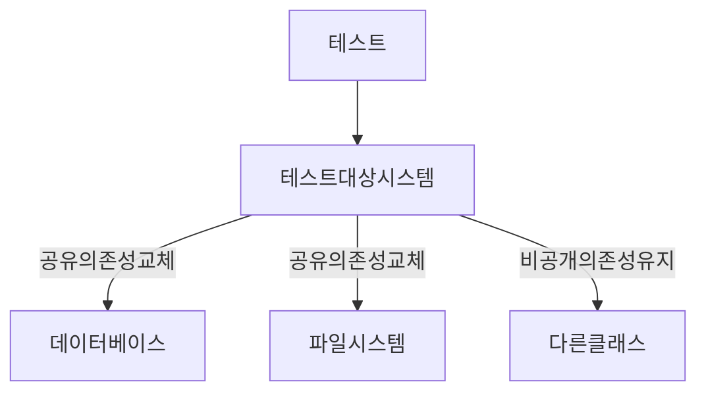
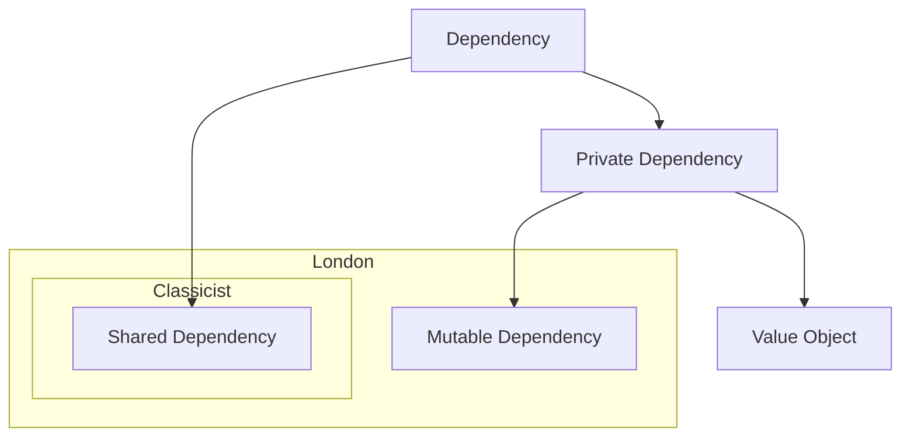
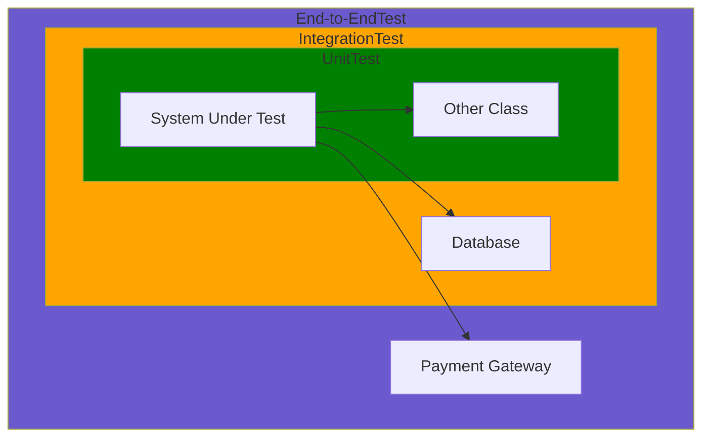

단위 테스트에 대해 접근하는 두가지 뚜렷한 견해 고전파와 런던파.

고전파 : 단위 테스트와 테스트 주도 개발에 원론적으로 접근하는 방식이기 떄문에 고전 이라고 함

켄트 백 테스트 주도 개발

런던파 : 런던의 프로그래밍 커뮤니티에서 시작되서 런던파. (Mock 추종자)

스티브 프리먼, 냇 프라이스 Growing Object-Oriented Software, Guided By Tests

>**Important**
>단위 테스트는 세가지 중요한 속성이 있다. \
>1. 작은 코드 조각을 검증.
>2. 빠르게 수행
>3. 격리된 방식으로 처리하는 자동화 된 테스트

#### 격리 문제에 대한 런던파의 접근
---
코드 조각을 격리된 방식으로 검증한 다는 것은 무었을 의미할까?

테스트 대상 시스템을 협력자에게서 격리하는 것을 말함.

하나의 클래스가 다른 클래스, 여러 클래스에 의존시 모든 의존성을 테스트 대역으로 대체함.

의존성과 별개로 테스트 코드를 실행 가능.

테스트가 실패하면 코드베이스의 어느 부분이 고장 났는지 확실하게 알 수 있음.

즉 확실히 테스트 대상 시스템이 고장 난것임.

**예제**

>**Note**
>(α) Spring 예제로 커스텀화.

**고전 스타일**

```java
@SpringBootTest
public class StoreTest {
    @Autowired
    private Store store;
    @Autowired
    private Customer customer;

    @Test
    public void testSuccessfulPurchase() {
        // 준비(Setup)
        store.addProduct("apple", 5);

        // 실행(Exercise)
        boolean result = customer.buy(store, "apple", 3);

        // 검증(Verify)
        assertTrue(result);
        assertEquals(2, store.getProduct("apple").getStock());
    }

    @Test
    public void testUnsuccessfulPurchase() {
        // 준비(Setup)
        store.addProduct("banana", 2);

        // 실행(Exercise)
        boolean result = customer.buy(store, "banana", 3);

        // 검증(Verify)
        assertFalse(result);
        assertEquals(2, store.getProduct("banana").getStock());
    }
}
```

준비 단계에서는 SUT(System Under Test)와 하나의 협력자를 준비함.

>**Note**
>MUT(Method Under Test)는 테스트에서 호출한 SUT의 메서드. \
>SUT는 클래스 전체를 가르킴.

여기서는 고객이 SUT, 상점이 협력자에 해당함.

1. 테스트 대상 메서드를 컴파일 하려면 customer.buy가 store 인스턴스를 필요로함.
2. 검증 단계에서 customer.by의 결과중 하나로 상점 제품 수량이 감소할 수 있기 때문.

위 두가지 이유로 협력자가 필요함.

>**Note**
>위와 같은 스타일이 고전 스타일로 협력자 즉 Store 클래스를 대체하지 않고 운영용 인스턴스를 사용함. \
>Customer 와 Store 둘 다를 효과적으로 검증함. \
>Customer 와 Store 가 격리되어 있지 않아 Customer에 영향을 미치는 Store 내부에 버그가 있다면 단위 테스트에 실패 할 수 도있음.

**런던 스타일**

Store 인스턴스는 테스트 대역 Mock으로 교체 해 본다.

> Mock은 테스트 대역의 부분 집합임. \ 
> 테스트 대역은 실행과 관련 없이 모든 종류의 가짜 의존성을 설명 하는 포괄적 용어. \
> 목은 그러한 의존성의 한 종류에 불과.

```java
@SpringBootTest
public class StoreTest {
    @Mock
    private Store store;
    @InjectMocks
    private Customer customer;

    @Before
    public void setUp() {
        MockitoAnnotations.initMocks(this);
    }

    @Test
    public void testSuccessfulPurchase() {
        // 준비(Setup)
        Product mockProduct = new Product("apple", 5);
        when(store.getProduct("apple")).thenReturn(mockProduct);

        // 실행(Exercise)
        boolean result = customer.buy(store, "apple", 3);

        // 검증(Verify)
        assertTrue(result);
        verify(store, times(1)).getProduct("apple");
    }

    @Test
    public void testUnsuccessfulPurchase() {
        // 준비(Setup)
        when(store.getProduct("banana")).thenReturn(null);

        // 실행(Exercise)
        boolean result = customer.buy(store, "banana", 3);

        // 검증(Verify)
        assertFalse(result);
        verify(store, never()).getProduct("banana");
    }
}
```

1. 실제 인스턴스를 생성하지 않음.
2. 어떻게 응답할 것인지 Mock 에서 정의.
3. Store의 실제 상태와 관계 없이 테스트가 요구하는 방식으로 요청에 응답.
4. @Mock 한 Store는 interface이며 지금은 협력자에서 격리된 테스트 대상 시스템에는 인터페이스가 필요하다는 정도만 기록.


이전에는 상태를 검증했고 지금은 Customer와 Store 간의 상호 작용을 검사함.

즉 고객이 상점에서 호출을 올바르게 했는지 확인함.

getProduct를 호출하는 횟수까지 검증 가능함.

>**Note**
>즉 런던 스타일은 테스트 대역으로 테스트 대상 코드 조각을 분리해서 격리 요구사항에 대가감. \
>런던 파는 클래스 단위의 격리로 보고, 고전파는 코드를 반드시 격리하는 방식으로 테스트 하지 않으며 대산 단위 테스트는 서로 격리해서 실행함.(병렬로 돌려도 영향을 안주도록) . \
>데이터 베이스, 파일 시스템 과 같은 외부 의존성이 공유 상태의 대표적인 예임.

공유 의존성 : 테스트간에 공유되고 서로의 결과에 영향을 미칠 수 있는 수단.(정적 가변 필드)

비공개 의존성 : 공유하지 않는 의존성

데이터 베이스는 프로세스 외부이면서 공유 의존성임.



단위 테스트를 서로 격리하는건 테스트 대상 클래스에서 공유 의존성만 격리하는 것을 의미.

>**Note**
>휘발성 의존성 .\
>개발자 머신에 기본 설치된 환경외 런타임 환경의 설정 및 구성을 요구함. \
>데이터 베이스 API와 같이 추가 설정이 필요하며 시스템에 기본으로 설치되 있지 않음. \
>비결정적 동작을 포함. 예를 들어 난수 생성기 와 같이 호출에 대해 다른 결과 제공.

데이터 베이스 : 공유 의존성이자 휘발성 의존성

파일 시스템 : 공유 의존성.

난수 시스템 : 휘발성 의존성이나 각테스트에 별도의 인스턴스를 제공할 수 있으므로 공유 의존성이 아님.

공유 의존성을 대체하는 이유는 테스트 실행 속도를 높이는데 있음.

단위 테스트가 반드시 클래스에 국한적일 필요가 없으며 공유 의존성이 없는한 여러 클래스를 묶어서 단위 테스트를 할 수도 있음.

### 단위 테스트의 런던파 고전파
---

주요 세가지 주제에 차이가 있음

1. 격리 요구 사항
2. 테스트 대상 코드 조각 의 구성 요소
3. 의존성 처리

| |격리 주체 | 단위의 크기 | 테스트 대역 사용 대상 |
| --- | --- | --- | --- |
| 런던파 | 단위 |단일 클래스|불변 의존성 외 모든 의존성|
| 고전파 | 단위 테스트|단일 클래스 또는 클래스 세트|공유 의존성|

Enum 과 같은 값 객체 의 주요 특징은 정체성이 없다는 것.

즉 내용에 의해서만 식별됨.

즉 이런 인스턴스는 서로 바꿔 사용할수도 있고 서로 대신해서 쓸 수도 있음. 

테스트 코드 내에서 재사용하거나 몇개를 선언해도 아무런 차이점이 없음.

결국 비공개 의존성은 변경 가능하거나 불변 일수 있음.



고전파에서는 공유 의존성을 테스트 대역으로 교체

런던파에서는 변경 가능한 비공개 의존성도 테스트 대역으로 교체 가능.

>**Note**
>협력자는 공유하거나 변경 가능한 의존성임. \
>데이터베이스는 공유 의존성이므로 데이터베이스 접근 권한을 제공하는 클래스는 협력자임. \
>일반 적인 클래스는 두가지 유형의 의존성으로 동작하는데 협력자 이거나 값임. 

```java
customer.buy(store, Product.Shampoo, 5)
```
store 는 협력자, enum 과 매직넘버는 아님.

api의 경우 특정 로직을 노출하지 않는 이상 공유 의존성이 아님.

테스트가 반환하는 데이터에 영향을 미칠 수 없기 때문에 공유가 아님.

테스트 범주에 포함하지 않고 대부분 속도를 높이기 위해서 대역으로 교체함.

이 책에서는 공유 의존성과 프로세스 외부 의존성은 서로 바꿀 수 있게 사용.

실제 프로젝트에서 프로세스 외부가 아닌 공유 의존성은 거의 없음.

### 고전파와 런던파 비교
---

**런던파 장점**

1. 입자성이 좋음, 테스트가 세밀해서 한번에 한클래스만 확인함.
2. 서로 연결된 클래스의 그래프가 커져도 테스트하기 쉬운게 모든 협력자는 테스트 대역으로 대체됨.
3. 테스트가 실패하면 어떤 기능이 실패했는지 확실히 알 수 있음. \
   클래스의 협력자가 없으면 테스트 대상 클래스 외에 다른것을 의심할 여지가 없음.

런던파는 클래스를 단위로 간주함.

>**Important**
>테스트는 코드의 단위를 검증해서는 안됨. \
>동작의 단위 즉 문제 영역에 의미가 있는것 , 이상적으로는 비즈니스 담당자가 유용하다고 인식할 수 있는 것을 검증 해야함. \
>동작의 단위를 구현하는 데 클래스가 얼마나 필요한지는 상관 없음. 

>**Warning**
>좋은 코드 입자성을 목표로 하는 것은 도움이 되지 않음.\
>단일 동작 단위를 검증하는 한 좋은 테스트임.


#### 상호 연결된 클래스의 큰 그래프를 단위 테스트 하기.

여러 계층에 걸쳐 의존성 그래프가 복잡하게 있는 경우 목을 사용하면 쉽게 테스트 가능.

대역을 쓰면 클래스의 직저적인 의존성을 대체해 그래프를 나눌수 있으며 단위 테스트에서 준비해야 할 작업량을 크게 줄일 수 있음.

>**Warning**
>상호 연결된 클래스의 크고 복잡한 그래프를 테스트할 방법을 찾는 대신 이런 클래스 그래프를 갖지 않도록 집중해야 함.

#### 버그 위치 정확히 찾아 내기

런던 스타일은 버그가 생기면 보통 SUT에 버그가 포함된 테스트만 실패함.

고전방식 이면 오작동 하는 클래스를 참조하는 클라이언트를 대상으로 하는 테스트도 실패 가능.

즉 하나의 버그가 테스트 전체의 파급 효과를 갖을 수 있음.

테스트를 정기적으로 실행하면 버그의 원인을 알아 낼 수 있으며 마지막으로 한 수정이 무엇인지 알기 때문에 문제를 찾기 어렵지 않음.

>**Note**
> 테스트 에서 계단식으로 실패하는데 가치가 있음. \
> 버그가 테스트 하나 뿐만 아니라 많은 테스트에서 결함으로 이어지면 해당 코드 조각이 큰 가치가 있다는 것을 보여줌. \
> 즉 전체 시스템이 해당 코드에 의존함.

#### 남아있는 두가지 차이점

1. TDD를 통한 시스템 설계 방식.
2. 과도한 명세 문제.

런던 스타일의 단위 테스트는 하향식 TDD로 이어짐.

목을 사용해 예상 결과를 달성하고자 시스템이 통신해야 하는 협력자를 지정함.

모든 클래스를 구현할 때까지 클래스 그래프를 다져나감.

고전파는 테스트에서 실제 객체를 다뤄야 하기 때문에 상향식으로 감.

도메인 모델을 시작으로 최종 사용자가 소프트웨어를 사용할 수 있을 때까지 계층을 그 위에 더둠.

>**Note**
> 가장 중요한 차이점은 과도한 명세 문제. \
> 테스트가 SUT의 구현 세부사항에 결합되는 것. \
> 런던 스타일은 고전보다 테스트가 구현에 더 자주 결합되며, 목을 전반적으로 아무대나 쓰는것에 대해 주로 이의가 제기됨.

#### 통합 테스트에 대한 견해 차이

런던파는 실제 협력자 객체를 사용하는 모든 테스트를 통합 테스트로 간주.

고전파는 작성된 대부분의 테스트는 런던파 에게는 통합 테스트.

고전파에게 단위 테스트는 

1. 단일 동작 단위를 검증.
2. 빠르게 수행
3. 다른 테스트와 별도로 처리.

위 세가지며 통합 테스트는 이러한 기준 중 하나를 충족하지 않는 테스트.

1. 공유 의존성에 접근하는 테스트는 다른 테스트와 분리해 실행할 수 없음,.
2. 둘 이상의 동작 단위를 검증할 때의 테스트는 통합 테스트.

>**Note**
> 통합 테스트는 공유 의존성, 프로세스 외부 의존성 뿐 아니라 다른팀이 개발한 코드 등과 통합해 작동하는지도 검증하는 테스트임. \
> 엔드 투 엔드 테스트 라는 개념도 따로 있음. \
> 엔드 투 엔드 테스트는 통합 테스트의 일부임.

일반적으로 통합 테스트는 프로세스 외부 의존성을 한두 개만 갖고 작동함.

엔드 투 엔드 테스트는 프로세스 외부 의존성을 전부 또는 대다수 갖고 작동함.

모든 애플리케이션을 포함해 시스템을 최종 사용자의 관점에서 검증하는 것을 의미.


>**Important**
>엔드 투 엔드 테스트는 비용이 많이 들기 때문에 모든 단위 테스트와 통합 테스트를 통과한 후 빌드 프로세스 후반에 실행하는 것이 좋음.

