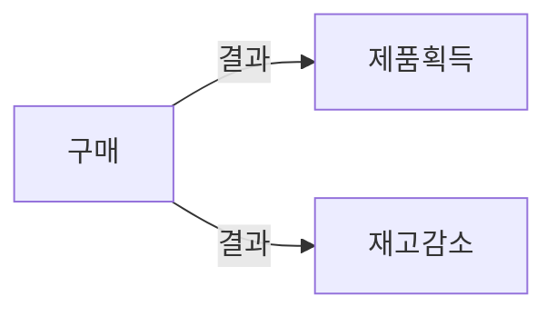
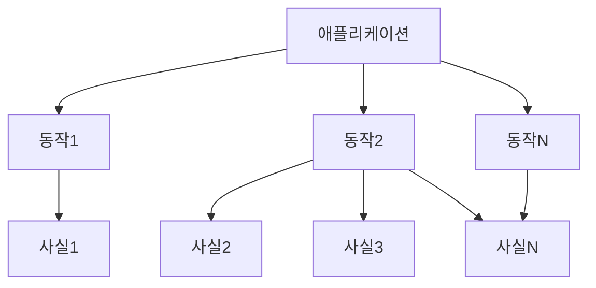

### AAA 패턴 사용(Arrange, Act, Assert)
---

```java
@Service
public class CalculatorService {
    public int add(int a, int b) {
        return a + b;
    }
}
```

```java
@SpringBootTest
public class CalculatorServiceTest {
    @Autowired
    private CalculatorService calculatorService;

    @Test
    public void testAddition() {
        // Arrange
        int a = 5;
        int b = 3;

        // Act
        int result = calculatorService.add(a, b);

        // Assert
        assertEquals(8, result);
    }
}
```

일관성이 이 패턴의 가장 큰 장점중 하나.

**준비**

테스트 대상 시스템(System Under Test)과 해당 의존성을 원하는 상태로 만듬

**실행**

SUT에서 메서드 호출하고 준비된 의존성을 전달(출력이 있으면) 출력 값을 캡처함.

**검증**

결과를 검증함.

Given When Then 패턴과 차이점은 없음 단 비기술자들에게 잘 읽히는 편이니 비기술자들과 공유 하기 위해서는 Given When Then 을 활용 하자.

#### 여러 개의 준비, 실행, 검증 구절 피하기
---


여러개의 검증, 준비 구절로 구분된 여러 개의 실행 구절을 보면 여러 개의 동작 단위를 검증하는 테스트를 뜻함.

이러한 테스트는 더이상 단위 테스트가 아니라 통합 테스트임.

이러한 테스트 구조는 피하는게 좋음.

>**Note**
>일련의 실행과 검증이 포함된 테스트를 보면 각 동작을 고유의 테스트로 도출해야 함. \
>속도를 높이는 한 가지 방법은 여러 개의 통합 테스트를 어려 실행과 검증이 있는 단일한 테스트로 묶는것. \
>이 최적화 기법은 이미 느리고 더 느려지게 하고 싶지않은 테스트에 한해서 적용 가능. \
>항상 다단계 단위 테스트를 여러 개의 테스트로 나누는게 좋음.

#### 테스트 내 if 문 피하기
---

>**Warning**
>if 문이 있는 단위 테스트를 만날 수 있다. \
>이것도 안티 패턴임. \
>분기가 없는 간단한 일련의 단계 여야 함. \
>if 문은 테스트가 한 번에 너무 많은 것을 검증한다는 표시가 가 되며 해당 테스트틑 여러개로 나눠야 할 필요가 있다. \
>분기가 있어서 얻는 이점은 없음 단지 추가 유지비만 불어남.

#### 각 구절은 얼마나 커야 할까?
---
준비 구절이 클경우 별도의 팩토리 클래스로 도출하는게 좋음.

준비 구절에서 재사용에 도움이 되는 두 가지 패턴으로 오브젝트 마더와 테스트 데이터 빌더가 있음.

>**Note**
>(α) 오브젝트 마더와 테스트 데이터 빌더 커스텀 설명 추가.

**1. Object Mother**

오브젝트 마더 패턴은 미리 정의된 객체(주로 복잡한 객체)를 생성하여 테스트에 사용할 수 있도록 제공하는 패턴.

이 패턴을 사용하면 테스트 코드에서 반복적으로 같은 객체를 생성하는 코드를 작성하지 않아도 됨.

`Product`라는 클래스가 있다고 가정, `ProductMother`라는 클래스를 만들어 미리 정의된 `Product` 객체를 반환하는 메서드를 제공.

```java
public class ProductMother {
    public static Product createSampleProduct() {
        Product product = new Product("Sample Product", 10, 100.0);
        return product;
    }
}

@Test
public void testSomethingWithProduct() {
    Product product = ProductMother.createSampleProduct();
    // ... 테스트 코드
}
```

**2. Test Data Builder**

테스트 데이터 빌더 패턴은 복잡한 객체를 생성하는데 필요한 로직을 캡슐화하는 패턴.

이 패턴을 사용하면 각 테스트에서 필요한 속성만 변경하여 객체를 생성할 수 있음.

`Product` 클래스에 대한 `ProductBuilder` 클래스를 다음과 같이 작성.

```java
@Builder
public class Product {
    private String name;
    private int quantity;
    private double price;
}
//ㅣombok 활용
```

```java
@Test
public void testSomethingWithProduct() {
    Product product = Product.builder()
        .name("Custom Product")
        .price(150.0)
        .build();
    // ... 테스트 코드
}
```

#### 실행 구절이 한 줄 이상인 경우를 경계 하자
---

실행 구절이 2줄 이상인 경우 SUT의 공개 API에 문제가 있을 수 있다.

```java
//실행
boolean result = customer.buy(store, "apple", 3);
store.RemoveInventory(result, Product.apple, 3);
```

문제점은 작업을 수행하는데 두 개의 메서드 호출이 필요하다는 것이다.

customer 클래스의 api에 문제가 있음.

클라이언트에게 메서드 호출을 더 강요해서는 안됨.




>**Note**
>불변 위반(Invariant violation). \
>구매로 발생하는 결과는같이 만들어야 하며 **단일한 공개 메서드가 존재**해야 함. \
>그렇지 않으면 하나를 호출하고 다른 하나를 호출하지 않을때 모순이 생김(제품은 받고 재고는 안줌). \
>이런 모순을 불변 위반이라고 함.

>**Note**
>잠재적 모순으로부터 코드를 보호하는 행위를 캡슐화 라고 함.

데이터베이스에 모순이 생기면 큰 문제가 됨.

해결책은 코드 캡슐화를 항상 지키는 것.

```java
//실행
boolean result = customer.buy(store, "apple", 3);
store.RemoveInventory(result, Product.apple, 3);
```

위 예제에서는 buy 메서드의 한 부분으로 고객이 매입한 재고를 제거하고, 클아이언트 코드에 의존하지 않아야 했음.

> 단 유틸리티나 인프라 코드는 덜 적용됨.

>**Note**
>(α) 여기서 말하는 클라이언트 코드는 무엇일까?.
>클라이언트 코드는 특정 클래스 또는 메서드의 소비자인 코드를 나타냄. \
>예제에서 클라이언트 코드는 `buy` 및 `RemoveInventory` 메서드를 호출하는 코드. \
>클라이언트 코드에 의존한다는 것은 해당 메서드의 동작이 클라이언트 코드의 특정 순서나 방식에 의존한다는 것을 의미 .\
>`buy` 메서드를 호출한 다음 `RemoveInventory` 메서드를 호출해야 함. \
>이렇게 하지 않으면 재고가 제대로 감소하지 않을 수 있음. \ 

 `buy` 메서드가 내부적으로 `RemoveInventory`를 호출하도록 변경하면, 클라이언트 코드는 단순히 `buy` 메서드만 호출하면 됨.
 
이렇게 하면 메서드는 클라이언트 코드에 의존하지 않게 되며, 재고 감소는 구매 메서드의 일부로 자동으로 처리

#### 검증 구절에는 검증문이 얼마나 있어야 할까?
---

단위 테스트는 단위 동작의 단위이지 코드의 단위가 아니기 때문에 하나의 테스트당 하나의 검증일 필요는 없음.

추상화가 누락되어 검증 구절이 너무 커질수 있으므로 경계 하긴 해야함.

>**Note**
>SUT에서 반환된 객체 내에서 모든 속성을 검증하는 대신 객체 클래스 내에 적절한 equality member를 정의하는게 좋음. (equal 재정의)\
>그러면 단일 검증문으로 객체를 기대값과 비교 가능.

#### 종료 단계는 어떻게?
---

준비,실행,검증 이후에 종료로 따로 구분하기도함.

파일을 지우거나 디비 연결 종료.

종료는 통합 테스트의 영역임.

#### 테스트 대상 시스템 구별 하기
---
SUT는 호출하고자 하는 동작에 대한 진입점을 제공.

>**Important**
>진입점은 오직 하나만 존재할 수 있음.

SUT를 의존성과 구분하는게 중요함.

SUT가 꽤 많은 경우 테스트 대상을 찾는데 시간을 많이 들일 필요가 없음.

>**Note**
>테스트 내 sut 이름을 sut로 하자.

```java
public class CalculatorServiceTest {

    @Test
    public void testAddition() {
        // Arrange
        int a = 5;
        int b = 3;
        Carculator sut = new Calculator();

        // Act
        int result = sut.add(a, b);

        // Assert
        assertEquals(8, result);
    }
}
```

#### 준비, 실행, 검증 주석 제거하기
---

준비, 실행, 검증 주석을 제거하고 빈 줄로 구절을 구분하면 대부분의 단위 테스트에서 효과적이며, 간결성과 가독성 사이에서 균형을 맞출 수 있음.

대규모 테스트는 준비 단계에 빈 줄을 추가해 설정 단계를 구분 할 수도 있음.

1. AAA 패턴을 따르고 준비 및 검증 구절에 빈 줄을 추가하지 않아도 되는 테스트라면 구절 주석들을 제거.
2. 그렇지 않으면 구절 주석 유지.

#### 테스트 간 테스트 픽스처 재사용
---

[테스트 간 테스트 픽스처 재사용](https://github.com/christopher3810/DevBookStudies/blob/master/%EB%8B%A8%EC%9C%84%20%ED%85%8C%EC%8A%A4%ED%8A%B8/3%EC%9E%A5%20%ED%85%8C%EC%8A%A4%ED%8A%B8%EA%B0%84%20%ED%85%8C%EC%8A%A4%ED%8A%B8%20%ED%94%BD%EC%8A%A4%EC%B2%98%20%EC%9E%AC%EC%82%AC%EC%9A%A9.md) git link

[[3장 테스트간 테스트 픽스처 재사용]] 옵시디언 링크.

#### 단위 테스트 명명법
---

[단위 테스트 명명법](https://github.com/christopher3810/DevBookStudies/blob/master/%EB%8B%A8%EC%9C%84%20%ED%85%8C%EC%8A%A4%ED%8A%B8/3%EC%9E%A5%20%EB%8B%A8%EC%9C%84%20%ED%85%8C%EC%8A%A4%ED%8A%B8%20%EB%AA%85%EB%AA%85%EB%B2%95.md) git link

[[3장 단위 테스트 명명법]] 옵시디언 링크

#### 매개변수화된 테스트 리팩터링하기
---



매개변수화된 테스트를 사용해 유사한 테스트를 묶을 수 있는 기능을 대부분의 단위 테스트에서 제공.

유사한 사실을 단일한 테스트 메서드로 묶을 수 있음.

예시: 가장 빠른 배송일이 오늘부터 이틀 후가 되도록 작동하는 배송 기능.

지난 배송일 확인하는 테스트, 오늘 날짜, 내일 날짜, 그이후의 날짜까지 확인하는 테스트도 필요함.

```java
public void Delivery_with_a_past_date_is_invalid()
public void Delivery_for_today_is_invalid()
public void Delivery_for_tomorrow_is_invalid()
public void The_soonest_delivery_date_is_two_days_from_now()
```

테스트 코드의 양을 줄이고자 이러한 테스트를 하나로 묶는 것임.

```java
class DeliveryServiceTest {  
   private final DeliveryService deliveryService = new DeliveryService();  
  
   @ParameterizedTest  
   @MethodSource("dateData")  
   void can_detect_an_invalid_delivery_date(int daysFromNow, boolean expectedResult) {  
      LocalDateTime deliveryDate = LocalDateTime.now().plusDays(daysFromNow);  
      System.out.println("what is date : " + deliveryDate);  
      Delivery delivery = new Delivery(deliveryDate);  
      boolean result = deliveryService.IsDeliveryValid(delivery);  
      assertEquals(expectedResult, result);  
   }  
  
   private static Stream<Arguments> dateData() {  
      return Stream.of(  
         Arguments.of(-1, false),  
         Arguments.of(0, false),  
         Arguments.of(1, false),  
         Arguments.of(2, true)  
      );  
   }  
}
```

@MethodSource 등의 annotation등을 활용해서 parameter를 전달 할 수도 있지만

static 함수로 추출 할 수도 있음.

테스트 이름도 좀 더 일반적으로 변경됨.

>**Note**
>매개변수화된 테스트를 사용하면 테스트 코드의 양을 크게 줄일 수 있지만, 테스트 메서드가 나타내는 사실을 파악하기가 힘들어지는 비용이 발생한다. \
>긍정적 테스트와 부정적 테스트로 분할하여 내부에서 사용되는 bool 매개 변수를 제거 하는 방법도 있다. \
>입력 되는 매개 변수 만으로 테스트 케이스에 대한 판다이 되다면 부정적 테스트 케이스와 긍정적 테스트 케이스 모두 하나의 메서드로 두는 것이 좋다. \
>동작이 너무 복잡하면 매개변수화된 테스트를 조금도 사용하지 말고 각각 고유한 테스트 케이스로 두자.

```java
class DeliveryServiceTest {  
   private final DeliveryService deliveryService = new DeliveryService();  
  
   @ParameterizedTest  
   @MethodSource("dateData")  
   void can_detect_an_invalid_delivery_date(LocalDateTime daysFromNow, boolean expectedResult) {  
      System.out.println("what is date : " + daysFromNow);  
      Delivery delivery = new Delivery(daysFromNow);  
      boolean result = deliveryService.IsDeliveryValid(delivery);  
      assertEquals(expectedResult, result);  
   }  
  
   private static Stream<Arguments> dateData() {  
      return Stream.of(  
         Arguments.of(LocalDateTime.now().plusDays(-1), false),  
         Arguments.of(LocalDateTime.now(), false),  
         Arguments.of(LocalDateTime.now().plusDays(1), false),  
         Arguments.of(LocalDateTime.now().plusDays(2), true)  
      );  
   }  
}
```

위와 같이 매개 변수에 LocalDateTime 객체 자체를 넘길 수 도 있음.

#### 검증문 라이브러리를 사용해서 가독성 향상
---

>**Note**
>(α) 원문에는 csharp 라이브러리에 `should.be(예상값)` 을 말하지만 AssertJ 에는 should 가 없기 때문에 AssertJ를 활용한 Fluent Api 를 통해서 가독성을 향상시키는 예제로 변경 하겠음.


```java
List<String> names = Arrays.asList("Alice", "Bob", "Charlie");

assertThat(names)
    .isNotNull()
    .hasSize(3)
    .contains("Alice", atIndex(0))
    .containsSequence("Bob", "Charlie");

```

AssertJ FluentApi Chanining을 활용하여 리스트가 null이 아니고, 크기가 3이며, 인덱스 0에 "Alice"가 있고, "Bob"과 "Charlie"가 순서대로 있다는 것을 검증할 수 있음.

>**Note**
>주어 , 행동 , 목적어 순서로 더 잘 읽힘.

#### 요약
---

1. 모든 단위 테스트는 aaa 패턴(준비, 실행, 검증) 패턴을 따라야하며, 준비, 실행, 또는 검증이 여러개면 여러 동작 단위를 함번에 검증 하는 표시며 단위 테스트라면 각 동작에 하나씩 여러개의 테스트로 나눠야함.
2. 실해이 구절이 한 줄 이상이면 sut에 문제가 있다는 것, 잠재적 불변 위반으로 부터 코드를 보호하는 것을 캡슐화라고 함.
3. sut로 이름을 지정해 sut를 테스트에서 구별하자.
4. 테스트 픽스처 초기화 코드는 생성자에 두지말고 팩토리 메서드를 도입해서 재사용하여 테스트간 결합도를 낮게 유지하고 가독성을 올림.
5. 테스트 명명 정책은 엄격하게 하지말고 언더스코어를 활용하고 메서드 명을 넣지 말자.
6. 매개변수화된 테스트로 유사항 테스트를 묶자, 단점은 테스트 명이 포괄적으로 변경될수록 테스트 이름을 읽기 어렵게 한다.
7. 검증문 라이브러리를 활용하여 가독성을 높이자.

