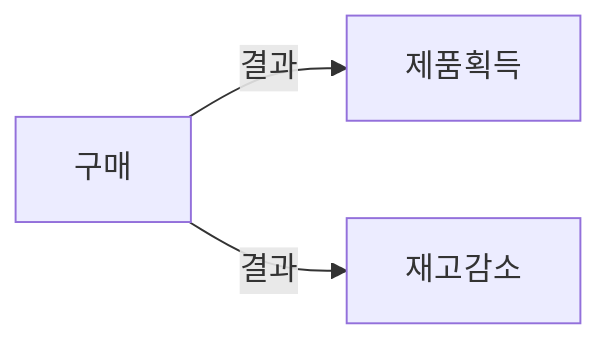

### AAA 패턴 사용(Arrange, Act, Assert)
---

```java
@Service
public class CalculatorService {
    public int add(int a, int b) {
        return a + b;
    }
}
```

```java
@SpringBootTest
public class CalculatorServiceTest {
    @Autowired
    private CalculatorService calculatorService;

    @Test
    public void testAddition() {
        // Arrange
        int a = 5;
        int b = 3;

        // Act
        int result = calculatorService.add(a, b);

        // Assert
        assertEquals(8, result);
    }
}
```

일관성이 이 패턴의 가장 큰 장점중 하나.

**준비**

테스트 대상 시스템(System Under Test)과 해당 의존성을 원하는 상태로 만듬

**실행**

SUT에서 메서드 호출하고 준비된 의존성을 전달(출력이 있으면) 출력 값을 캡처함.

**검증**

결과를 검증함.

Given When Then 패턴과 차이점은 없음 단 비기술자들에게 잘 읽히는 편이니 비기술자들과 공유 하기 위해서는 Given When Then 을 활용 하자.

#### 여러 개의 준비, 실행, 검증 구절 피하기
---


여러개의 검증, 준비 구절로 구분된 여러 개의 실행 구절을 보면 여러 개의 동작 단위를 검증하는 테스트를 뜻함.

이러한 테스트는 더이상 단위 테스트가 아니라 통합 테스트임.

이러한 테스트 구조는 피하는게 좋음.

>**Note**
>일련의 실행과 검증이 포함된 테스트를 보면 각 동작을 고유의 테스트로 도출해야 함. \
>속도를 높이는 한 가지 방법은 여러 개의 통합 테스트를 어려 실행과 검증이 있는 단일한 테스트로 묶는것. \
>이 최적화 기법은 이미 느리고 더 느려지게 하고 싶지않은 테스트에 한해서 적용 가능. \
>항상 다단계 단위 테스트를 여러 개의 테스트로 나누는게 좋음.

#### 테스트 내 if 문 피하기
---

>**Warning**
>if 문이 있는 단위 테스트를 만날 수 있다. \
>이것도 안티 패턴임. \
>분기가 없는 간단한 일련의 단계 여야 함. \
>if 문은 테스트가 한 번에 너무 많은 것을 검증한다는 표시가 가 되며 해당 테스트틑 여러개로 나눠야 할 필요가 있다. \
>분기가 있어서 얻는 이점은 없음 단지 추가 유지비만 불어남.

#### 각 구절은 얼마나 커야 할까?
---
준비 구절이 클경우 별도의 팩토리 클래스로 도출하는게 좋음.

준비 구절에서 재사용에 도움이 되는 두 가지 패턴으로 오브젝트 마더와 테스트 데이터 빌더가 있음.

>**Note**
>(α) 오브젝트 마더와 테스트 데이터 빌더 커스텀 설명 추가.

**1. Object Mother**

오브젝트 마더 패턴은 미리 정의된 객체(주로 복잡한 객체)를 생성하여 테스트에 사용할 수 있도록 제공하는 패턴.

이 패턴을 사용하면 테스트 코드에서 반복적으로 같은 객체를 생성하는 코드를 작성하지 않아도 됨.

`Product`라는 클래스가 있다고 가정, `ProductMother`라는 클래스를 만들어 미리 정의된 `Product` 객체를 반환하는 메서드를 제공.

```java
public class ProductMother {
    public static Product createSampleProduct() {
        Product product = new Product("Sample Product", 10, 100.0);
        return product;
    }
}

@Test
public void testSomethingWithProduct() {
    Product product = ProductMother.createSampleProduct();
    // ... 테스트 코드
}
```

**2. Test Data Builder**

테스트 데이터 빌더 패턴은 복잡한 객체를 생성하는데 필요한 로직을 캡슐화하는 패턴.

이 패턴을 사용하면 각 테스트에서 필요한 속성만 변경하여 객체를 생성할 수 있음.

`Product` 클래스에 대한 `ProductBuilder` 클래스를 다음과 같이 작성.

```java
@Builder
public class Product {
    private String name;
    private int quantity;
    private double price;
}
//ㅣombok 활용
```

```java
@Test
public void testSomethingWithProduct() {
    Product product = Product.builder()
        .name("Custom Product")
        .price(150.0)
        .build();
    // ... 테스트 코드
}
```

#### 실행 구절이 한 줄 이상인 경우를 경계 하자
---

실행 구절이 2줄 이상인 경우 SUT의 공개 API에 문제가 있을 수 있다.

```java
//실행
boolean result = customer.buy(store, "apple", 3);
store.RemoveInventory(result, Product.apple, 3);
```

문제점은 작업을 수행하는데 두 개의 메서드 호출이 필요하다는 것이다.

customer 클래스의 api에 문제가 있음.

클라이언트에게 메서드 호출을 더 강요해서는 안됨.




>**Note**
>불변 위반(Invariant violation). \
>구매로 발생하는 결과는같이 만들어야 하며 **단일한 공개 메서드가 존재**해야 함. \
>그렇지 않으면 하나를 호출하고 다른 하나를 호출하지 않을때 모순이 생김(제품은 받고 재고는 안줌). \
>이런 모순을 불변 위반이라고 함.

>**Note**
>잠재적 모순으로부터 코드를 보호하는 행위를 캡슐화 라고 함.

데이터베이스에 모순이 생기면 큰 문제가 됨.

해결책은 코드 캡슐화를 항상 지키는 것.

```java
//실행
boolean result = customer.buy(store, "apple", 3);
store.RemoveInventory(result, Product.apple, 3);
```

위 예제에서는 buy 메서드의 한 부분으로 고객이 매입한 재고를 제거하고, 클아이언트 코드에 의존하지 않아야 했음.

> 단 유틸리티나 인프라 코드는 덜 적용됨.

>**Note**
>(α) 여기서 말하는 클라이언트 코드는 무엇일까?.
>클라이언트 코드는 특정 클래스 또는 메서드의 소비자인 코드를 나타냄. \
>예제에서 클라이언트 코드는 `buy` 및 `RemoveInventory` 메서드를 호출하는 코드. \
>클라이언트 코드에 의존한다는 것은 해당 메서드의 동작이 클라이언트 코드의 특정 순서나 방식에 의존한다는 것을 의미 .\
>`buy` 메서드를 호출한 다음 `RemoveInventory` 메서드를 호출해야 함. \
>이렇게 하지 않으면 재고가 제대로 감소하지 않을 수 있음. \ 

 `buy` 메서드가 내부적으로 `RemoveInventory`를 호출하도록 변경하면, 클라이언트 코드는 단순히 `buy` 메서드만 호출하면 됨.
 
이렇게 하면 메서드는 클라이언트 코드에 의존하지 않게 되며, 재고 감소는 구매 메서드의 일부로 자동으로 처리

#### 검증 구절에는 검증문이 얼마나 있어야 할까?
---

단위 테스트는 단위 동작의 단위이지 코드의 단위가 아니기 때문에 하나의 테스트당 하나의 검증일 필요는 없음.

추상화가 누락되어 검증 구절이 너무 커질수 있으므로 경계 하긴 해야함.

>**Note**
>SUT에서 반환된 객체 내에서 모든 속성을 검증하는 대신 객체 클래스 내에 적절한 equality member를 정의하는게 좋음. (equal 재정의)\
>그러면 단일 검증문으로 객체를 기대값과 비교 가능.

#### 종료 단계는 어떻게?
---

준비,실행,검증 이후에 종료로 따로 구분하기도함.

파일을 지우거나 디비 연결 종료.

종료는 통합 테스트의 영역임.

#### 테스트 대상 시스템 구별 하기
---
SUT는 호출하고자 하는 동작에 대한 진입점을 제공.

>**Important**
>진입점은 오직 하나만 존재할 수 있음.

SUT를 의존성과 구분하는게 중요함.

SUT가 꽤 많은 경우 테스트 대상을 찾는데 시간을 많이 들일 필요가 없음.

>**Note**
>테스트 내 sut 이름을 sut로 하자.

```java
public class CalculatorServiceTest {

    @Test
    public void testAddition() {
        // Arrange
        int a = 5;
        int b = 3;
        Carculator sut = new Calculator();

        // Act
        int result = sut.add(a, b);

        // Assert
        assertEquals(8, result);
    }
}
```

#### 준비, 실행, 검증 주석 제거하기
---

준비, 실행, 검증 주석을 제거하고 빈 줄로 구절을 구분하면 대부분의 단위 테스트에서 효과적이며, 간결성과 가독성 사이에서 균형을 맞출 수 있음.

대규모 테스트는 준비 단계에 빈 줄을 추가해 설정 단계를 구분 할 수도 있음.

1. AAA 패턴을 따르고 준비 및 검증 구절에 빈 줄을 추가하지 않아도 되는 테스트라면 구절 주석들을 제거.
2. 그렇지 않으면 구절 주석 유지.

#### 테스트 간 테스트 픽스처 재사용
---

올바른 코드 재사용법을 알아보자.

>**Note**
>테스트 픽스처. \
>1. 테스트 픽스처란 실행 대상 객체. (SUT 로 전달되는 인수) , 테스트 실행전 고정 상태로 유지하기 때문에 동일한 결과를 생성하며 따라서 픽스처라는 단어가 나옴.
>2.  Nunit 프레임워크에서 테스트가 포함된 클래스를 표시하는 특성.

1. 테스트 생성자에서 픽스처를 초기화 하는 방법.

>**Note**
>(α) Java 예제로 전환.

```java
public class CustomerTests {

    private Store store;
    private Customer sut;

    @BeforeEach
    public void setup() {
        store = new Store();
        store.addInventory(Product.SHAMPOO, 10);
        sut = new Customer();
    }

    @Test
    public void purchaseSucceedsWhenEnoughInventory() {
        boolean success = sut.purchase(store, Product.SHAMPOO, 5);

        assertTrue(success);
        assertEquals(5, store.getInventory(Product.SHAMPOO));
    }

    @Test
    public void purchaseFailsWhenNotEnoughInventory() {
        boolean success = sut.purchase(store, Product.SHAMPOO, 15);

        assertFalse(success);
        assertEquals(10, store.getInventory(Product.SHAMPOO));
    }
}
```

준비 구절을 @BeforeEach 의 setup을 통해서 추출 하였다.

테스트 코드의 양을 크게 줄일 수 있으며 테스트 픽스처 구성을 전부 또는 대부분 제거 가능 하다.

>**Warning**
>하지만 해당 방식에 두가지 중요한 단점이 있다. \
>1. 테스트 간 결합도가 높아짐.
>2. 테스트 가독성이 떨어짐.

#### 테스트간 높은 결합도는 안티 패턴이다
---

>**Note**
>위 예제는 모든 테스트가 서로 겷합되어 있으며 테스트 준비 로직을 수정하면 클래스의 모든 테스트에 영향을 미침.

```java
 store.addInventory(Product.SHAMPOO, 10);
```

위 코드를 10 -> 15 로 수정하면 초기상태에 대한 가정을 무효화 하므로 쓸모 없이 테스트가 실패할지도 모른다.


>**Warning**
>중요 지침인 테스트를 수정해도 다른 테스트에 영향을 주어선 안된다는 중요 지침을 위반한다. \
>테스트는 서로 격리돼 실행되어야 하며 여기서는 테스트의 독립적인 수정을 말한다.


>**Important**
>테스트 클래스에 공유 상태를 두지 말아야 한다.

```java
private Store store;
private Customer sut;
```

#### 테스트 가독성을 떨어뜨리는 생성자 사용
---

> 테스트 메서드가 무슨 일을 하는지 보려면 클래스의 다른 부분도 봐야 한다. \
> 준비 로직이 별로 없더라도 테스트 메서드로 바로 옮기는 것이 좋다.

#### 더 나은 테스트 픽스처 재사용법을 법
---


