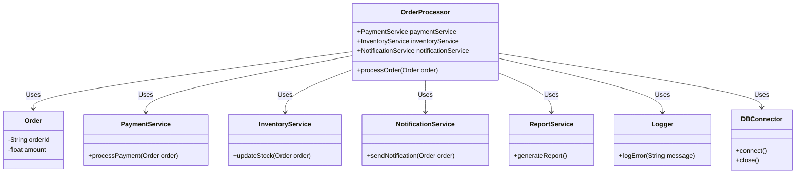

### 3장 소프트웨어 가치와 비용

유지보수 비용 낮추기

1. 객체지향 캡슐화, 다형성 활용으로 변경으로 인한 영향 범위줄이기
2. 함수형 참조 투명성을 활용하여 코드 동작 방식을 이해하기 쉽게 만들기.

유지 보수 비용에 대해서 고민 할것.

### 4장 코드의 이해

#### 코드 이해의 시간을 줄이는 방법
---

시각화, 코드출력, 스크래치, 리팩터링등

시각화 UML 활용.

1. 액티비티 다이어그램 - **코드 실행 흐름**, 논리적 단위로 묶어서 그림

2. 시퀀스 다이어 그램 - 런타임에 구성 요소가 어떻게 상호 작용하는 지 이해하는데 도움(객체간 또는 프로세스간) 

3. 클래스 다이어그램 - 코드의 정적인 구조 이해 도움.

4. 상태 다이어그램 - 모델의 상태 변화 이해 용이.

>**Note**
>시퀀스 다이어그램 - 동시성 이슈 or 문제 발생 시점에 대한 추적에 용이 .\
>클래스 다이어그램 - 도메인 모델 분석 용이. \
>다이어그램 작성시 불필요한 요소 안그리는게 중요.

5. 의존 관계 그래프 - 데이터나 함수간 의존 관계 그림,  변경이 미치는 범위를 파악할때 도움.

코드가 길다면 코드를 출력해서 보면 편함.

#### 이해하기 좋은 코드
---

책 두권 추천 :  켄트백 - 구현 패턴, 클린코드

1. 이름 잘 짓기 : 명시적으로 잘지어야하며 짧을수록 좋지만 사용범위가 넓다면  서술적인 이름을 사용하는게 좋음.
2. 중첩 if 최소화 - if문을 역으로 만들어서 else가 없어진다면 시도해보자.
3. 변수 줄이기 -  변수로 인한 인지 부하를 낮추려면 변수 자체를 줄여야함.
4. 변수 사용 범위 좁히기 - 사용되기 직전 정의, 짧은 루프 블록 안, 짧은 if 블록안, 짧은 메서드 안.
5. 값변경 최소화 - 불변 활용.

6. 알맞은 파라미터 사용

>**Note**
> (α) 예제가 책과 다름.

**bad**

```java
@Getter
@Setter
public class UserProfileDto {
    private String username;
    private String email;
    private String phoneNumber;
    private LocalDate birthdate;
    private String address;
    private String country;
    private String city;
    private String zipcode;
    private String bio;
    private String company;
    private String position;
}

@Service
public class UserProfileService {
    public void updateUserProfile(UserProfileDto userProfileDto) {
        //로직
    }

    private void sendEmailNotification(UserProfileDto userProfileDto) {
        // 이메일 알림 처리
    }

    private void updateUserInDatabase(UserProfileDto userProfileDto) {
        // 데이터베이스 업데이트 처리
    }
}

```

**good**

```java
@Getter
@Setter
public class UserProfileDto {
    private String username;
    private String email;
    private String phoneNumber;
    private LocalDate birthdate;
}

@Service
public class UserProfileService {
    public void processProfile(String username, String email, String phoneNumber, LocalDate birthdate) {
        // 로직 처리
    }

    public void updateUserProfile(UserProfileDto userProfileDto) {
        processProfile(
            userProfileDto.getUsername(),
            userProfileDto.getEmail(),
            userProfileDto.getPhoneNumber(),
            userProfileDto.getBirthdate()
        );
    }
}

```

>**Note**
> 1. dto 필드 값이 많으면 여러 군데서 쓰 있으므로 추적하기 힘듬.
> 2. dto 필드를 사용하는 특정 로직에 맞춰서 필드를 줄여서 사용 범위도 줄여야됨.
> 3. 메서드 내부에서 다른 메서드 호출시 필요한 값만 인자로 넘겨야함.

>**Warning**
>타입을 많이 만들어서 코드복잡도가 올라가는 것 보다 필드 많은 타입이 여려군대서 사용되서 코드 분석 시간이 오래 걸리는게 더 안좋음.

> 개발 생산성과 map , 초기엔 작성해야 할 코드가 줄어들음. \
> 코드 수정을 하려면 map이 사용된 코드는 어떤 속성이 사용되는지 일일히 다 찾아야됨. \
> 코드양은 줄지 몰라도 개발 생산성이 높아지는건 아님.

7. 길지 않은 코드와 메서드 추출 - 추상화 수준(코드를 읽으면서 파악할 수 있는 정보의 수준) 맞추기

### 5장 응집도와 결합도
---

응집도(Cohesion)

> 모듈 안에 있는 요소가 함꼐 모여있는 정도. \
> 한 모듈의 파트가 동일한 모듈 안에 얼마나 포함되어 있는지.

>**Note**
> (α) 높은 응집도는 해당 모듈이나 클래스의 요소들이 잘 집중되어 있음을 의미하며, 해당 모듈이나 클래스는 명확한 목적을 갖음. \
> 응집도를 높이면 소프트웨어를 유지 관리하기 더 쉬워지며, 재사용성도 향상됨. \

>**Note**
> (α) 낮은 응집도 커스텀 예제



>**Note**
> (α) `OrderProcessor`는 여러 다른 서비스 클래스에 의존하고 있음. \
> 이렇게 한 클래스가 여러 다른 클래스의 기능을 사용하는 경우 응집도가 낮음. \
> 여기서 `OrderProcessor` 클래스는 결제 처리, 재고 업데이트, 알림 발송, 보고서 생성, 오류 로깅, 데이터베이스 연결 등의 다양한 역할을 수행하고 있음. \
>이런 구조는 유지보수하기 어렵고 변화에 취약.


>**Note**
> (α) `OrderProcessor` 클래스가 `OrderService` 클래스에 의존하며, `OrderService` 클래스가 주문 처리 관련 작업을 캡슐화. \
> `OrderService`는 결제 처리, 재고 업데이트, 알림 발송 등의 역할을 수행. \
>이렇게 하나의 클래스가 특정 기능을 완전히 수행하는 경우 응집도가 높습니다. 이런 구조는 유지보수가 쉽고 변화에 덜 취약.

응집도는 역할 , 책임과 관련 있으며 응집도가 높을시 구성 요소가 역할에 따라 알맞게 분리될 가능성이 높음.

수정해야 할 때 변경 범위가 좁아짐.

응집도를 올릴려면 역할에 따라 구성 요소를 나눠야 하는데 잘 나누면 Single Responsibility Principle 즉 단일 책임원칙을 따를 가능성도 올라감.

객체 필드를 getter로 참조해서 특정 로직에 처리하는 캡슐화 되지 않은 방식을 사용하는 것보다
객체 필드를 기반으로 메서드를 작성해서 로직처리를 한뒤 메서드를 참조하는 방식으로 보다 캡슐화된 방식을 사용하는게 수정사항이 생겨도 메서드 내부만 수정할 수 있어서 효율적임.

#### 결합도
---

>**Note**
> (α) 결합도(Coupling) 결합도는 서로 다른 모듈이나 클래스 간의 상호 의존도를 나타냄. \
> 높은 결합도는 서로 다른 모듈이나 클래스 간의 연결이 많은 것을 의미하며, 한 부분의 변경이 다른 부분에도 영향을 미칠 가능성이 높아짐. \
> 결합도를 낮추면 수정 사항 발생시 다른 클래스나 모듈에 영향이 덜가기 때문에 소프트웨어를 유지 관리하고 확장하기 쉬워짐.

응집도를 올려서 역할별로 분리를 하다 보면 서로 의존하는 정도가 올라 갈 수도 있음. 

응집도가 높다고 결합도가 낮은건 아님.

상호 작용을 최소화 하려면 구현에 대한 의존을 줄이는 것이 중요함.

캡슐화 와 같이 실구현 보단 객체 내에 로직에 필요한 데이터와 실 로직을 숨겨서 구현을 줄이는게 중요함.

잘 캡슐화된 객체는 결합도를 낮춤.

>**Note**
> (α) 커스텀 예제

```java
@AllArgsConstructor
public class OrderService {

    private Connection connection;
    public void createOrder(Order order) {
        try {
            String query = "INSERT INTO orders (orderId, product, quantity) VALUES (?, ?, ?)";
            PreparedStatement stmt = connection.prepareStatement(query);
            stmt.setInt(1, order.getOrderId());
            stmt.setString(2, order.getProduct());
            stmt.setInt(3, order.getQuantity());
            stmt.executeUpdate();
            stmt.close();

            sendSmsNotification(order);
        } catch (Exception e) {
            e.printStackTrace();
        }
    }

    private void sendSmsNotification(Order order) {
        String message = "Order " + order.getOrderId() + " created";
        String query = "INSERT INTO sms_notifications (message) VALUES (?)";
        try {
            PreparedStatement stmt = connection.prepareStatement(query);
            stmt.setString(1, message);
            stmt.executeUpdate();
            stmt.close();
        } catch (Exception e) {
            e.printStackTrace();
        }
    }
}

class Order {
    private int orderId;
    private String product;
    private int quantity;

    // Constructors, getters and setters
}

```

위와 같은 경우 CreateOrder와 SendSmsNotification이 서로 의존적이여서 sendSmsNotification의 수정이 발생할 경우 CreateOrder 클래스를 수정해야 함.(메시지에 들어갈 필드가 변경된다던가, 다른방식으로 보낸다던가)

```java
@AllArgsConstructor
public class OrderService {

    private Connection connection;
    private Notifier notifier;

    public void createOrder(Order order) {
        try {
            // 동일 로직
            notifier.notifyTo(order);
        } catch (Exception e) {
            e.printStackTrace();
        }
    }
}


class Order {
    private int orderId;
    private String product;
    private int quantity;

    // Constructors, getters and setters
}

```

notifier 타입을 통해서 접근하도록 수정. 

변경된 값은 생성하는 쪽만 바꾸면되고 보내는 방식은 notifier만 변경하면됨.

한걸음 더나아 가서 event를 활용하자

```java

public class OrderService {
	//생략

    public void createOrder(Order order) {
        try {
			//생략
            OrderCreatedEvent event = new OrderCreatedEvent(this, order);
            eventPublisher.publishEvent(event);
        } catch (Exception e) {
            e.printStackTrace();
        }
    }
}

@Component
public class OrderEventListener {

    @EventListener
    public void handleOrderCreatedEvent(OrderCreatedEvent event) {
        Order order = event.getOrder();
        // 통지 처리 로직을 여기에 추가.
    }
}

```

Notifier 타입에 존재하는 코드에 더이상 의존적이지 않는다.

단지 Event 를 발생시킬 뿐 관련 코드는 존재하지 않는다.

Listner도 Event를 발생시킨 주체와 직접적인 의존관계가 없으며 그저 수신하면 통지할 뿐이다.

하지만 이벤트를 사용해서 간접적으로 연결시킨다고는 하나 실제로 listner를 찾아서 보긴 해야 함.

직접 연결된 코드에 비해 분석하는데 노력이 많이 들기 때문에 잘 따져봐야 함.

**결합유형**

1. 공통 결합 : 모듈이 동일한 글로벌 데이터에 접근.
2. 제어 결합 : 한 모듈이 다른 한 모듈에 흐름 제어할떄 발생(dto를 인자로 많은 if else를 탄다고 생각해보자)
3. 시간적 결합 : 함께 돌아야 되서 같이 묶일때 발생.
4. 논리 결합 , 변경 결합 : 모듈 간 변경 패턴이존재 할 떄. a 변경시 b 변경

### 6장 리펙터링
---

수정하기 어려운 코드는 걍 레거시임

리팩터링은 기존 동작은 그대로 유지하고 내부 구조를 바꾸는 기법.

1. 미사용 코드 삭제
2. 매직 넘버 지향, 이름+숫자로 상수값 활용 
3. 의미를 잘 내포한 이름 짓기
4. 매서드로 추출
5. 클래스로 추출하기
6. 큰 클래스 분리하기
7. 사용하지 않는 파라미터 정리
	1. 여러 메서드에서 한 타입 파라미터 사용시 메서드마다 알맞은 파라미터 타입 추가. 
8. for 에서 하는 2가지일 분리 - for 문이 여러가지 일을 하면 복잡해짐.(for 문당 1가지 일만 하기)

리팩터링 할까 or MSA로 분리할까. 고민해보기

### 7장  테스트
---
자동화된 테스트가 있으면 회귀 테스트 시간을 대폭 줄일 수 있음.

테스트 커버리지가 중요함,.

수정한 기능 외에 다른 기능에 영향이 있는지 없는지를 검증하는게 회귀 테스트 인데 자동화된 테스트 자체를 회귀 테스트로 활용 가능하며 코드 변경에 대한 스트레스를 줄여 준다.

#### 테스트 주도 개발과 회귀 테스트
---

테스트 코드를 먼저 만들고 그다음 테스트를 통과하기 위해 구현을 진행하는 TDD를 해보자.

먼저 구현할 대상에 대한 테스트 코드를 먼저 만들고 통과 시킬 만큼 구현을 진행하자.

통과하면 코드를 리팩터링 한다.

개발 완료까지 반복.

TDD 진행시 만든 테스트 코드는 자연 스럽게 회귀 테스트로 사용됨.

#### TDD와 기능 설계
---

기능 설계에 도움을 준다.

테스트 코드 작성은 설계와 밀접한 관련이 있음.


수동 테스트시 디비와 api를 직접 연동하는데 원하는 상황을 만드려면 디비에 데이터를 구성해야함.

개발 시간 -> 코드 작성시간, 테스트시간, 디버깅 시간

개발 시간은 코딩 시간 뿐만 아니라 테스트 시간과 디버깅 시간을 줄이는 걸 포함한다.

TDD를 적용하면 테스트 시간과 디버깅 시간을 줄일 수 있다.

TDD는 테스트를 코드 형태로 만들 기 때문에 자동화도 쉽다.

TDD는 리팩터링을 포함함.

구현 및 통과 : 구현 시간 감소, 즉각적 테스트로 디버깅 시간 감소
리팩터링 : 미래 코딩 시간 감소
테스트 코드 작성 : 테스트 시간 감소

#### 테스트 가능성을 높이기
---

외부 환경에 대한 의존을 줄일 수 있도록 테스트 가능성을 높여 보자.

전체가 아닌 일부만 빠르게 테스트 할 수 있게 됨.

#### 리팩터링을 위한 테스트 하기
---
코드가 복잡하게 얽혀 있어 일부 코드를 분리하기 힘든 경우

SQL과 애플리케이션에 로직이 흩어져 있는경우

이런 경우는 통합 테스트를 작성 하자.

### 8장 아키텍처
---

아키텍처를 결정하는 요인은 크게 2가지

기능 요구사항, 품질 속성(비기능 요구사항)

사용성이 크지 않은 경우에 덜컥 MSA 로 설계할 필요가 없음.

모놀리식으로 시작 -> 하드웨어 스펙 업 -> 이후 확장

빅뱅 방식으로 차세대 시스템을 도입하려 해도 실패하는 케이스도 많다.

모놀리식에서 기능단위로 분리후 점진적으로 디비를 분리하는 식으로 기능단위로 분리해보자.

점진적 아키텍처 변경을 용이하게 해줌.

또는 비동기 연결을 도입해서 시스템간 독립성을 높일 수도 있음.

본질적 복잡성과 우발적 복잡성에 대해서 생각해보자.

패턴을 읽히자.

### 9장 업무 관리
---
업무나누기, 위험관리, 요구사항 이해 및 변경, 일정 관리.


