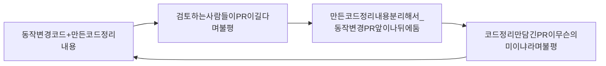
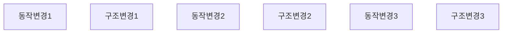
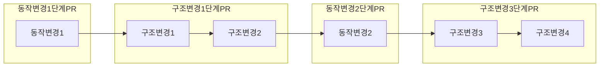

코드정리를 독자들에게 초점을 둔 소프트웨어 설계.

독자와 코드 간의 관계 궁극 적으로는 독자 자신과의 관계를 다룸.

코드 정리는 괴짜의 자기 관리.

Tidy First? 라는 책의 제목과 같이 정리법을 적용할 수 있다고 해서 반드시 코드를 정리해야 한다는 것은 아니라는 것을 강조 하고 싶다.

한 번에 조금씩 코드 정리를 통해 소프트웨어 설계에 익숙해지기를 바라며 코드 정리는 리팩터링으로 가는 관문.

Part2는 코드 정리를 개인 개발 흐름에 맞추는 방법에 대해설명
1. 코드 정리는 언제 시작할까?
2. 코드 정리는 언제 멈출까?
3. 코드의 구조를 변경하는 코드정리와, 시스템의 동작을 변경을 어떻게 결합할 수 있을까?

우선 정리가 PR 및 코드 검토와 어떻게 연관을 맺을지 논의해보자.

### 16. 코드 정리의 구분
---

PR을 통한 코드 검토 를 하고 있다고 가정한다면.

결국 코드 정리에 대한 PR은 만들어야 하고, 코드 정리는 별도의 PR로 PR당 가급적 몇개의 코드 정리만 넣자.

코드 정리를 할때 예상되는 몇개의 단계들

1. 변경을 구분하지 않은 상태에서 다수의 변경을 반영.

다양한 변경 필요성을 구분하지 않은 상태에서 변경 시도.

ex) if문 변경 도중 이름이 잘못 되면 이름을 변경한 뒤 If문으로 다시 돌아가고 변경이 변경을 낳는 케이스.

2. 동작 변경과 구조 변경

변경 대상은 프로그램 동작 변경(프로그래밍 실행하면서 찾은 것)과 프로그램 구조변경(코드를 봐야 아는)

아직 계획이 없고 바뀌는 동작간 어떤 흐름도 없음.

서로 다른 두 가지가 함께 작용하고 있다고 이제 막 인식한 케이스.

3. 순서를 부여한 동작 변경과 구조 변경

조금지나면 공통 흐름을 알고 비슷한 코드끼리 정리하면 설명하는 도우미들이 드러나고 동작 변경이 쉬워짐.

아직 큰 PR 한개에 섞여있음.

한 수씩 둘 때마다 다분히 의도적으로, 쉽게 변경하던가 또는 변경하기 쉽게 만들던가 둘 중 하나를 목표로 삼는 것이 좋음.

모든것을 하나에 모아두면 검토자들을 일단 주저하게 만듬.

별도의 PR로 생성.

순서가 있는 일련의 코드 정리는 (심지어 하나의 정리만 있어도) PR 한개로 만듬.

동작 변경 역시 별도의 PR로 만듬.

>[!Note]
>코드 정리와 동작 변경 사이를 번갈아 가면서 전환할 때마다 새 PR을 열어야 함.

>[!Note]
>크고 포괄적인 PR로 만들면 전체 그림을 보여주지만, 검토자들이 유용한 피드백을 제공하기에는 너무 큰 덩어리 일 수 있음.
>아주 소소한 PR은 소소한 패드백을 유도할 수 있지만, 잡초처럼 무시될 우려가 있음.

작은 PR은 검토 시간 단축으로 환영 받음.

초점이 분명할수록 PR은 더 빠른 검토를 장려함.

대체로 코드를 느리게 검토하면 큰 PR을 만드는 결과를 초래하며 향후 검토를 더욱 느리게 함.

### 17. 연쇄적인 정리
---

단계의 크기.

아주 작은 단계로 나누어 코드를 정리하는 방식을 고수하면서 실험해보자.

빠르게 달리는 것처럼 보이지만 지넻럼 작은 발걸음을 차례차례 내딛을 수 있게.

>[!Note]
>코드 정리는 일종의 체스게임이 되어 다음 수를 내다볼 수 있게 됨.

#### 보호구문

조건이 설명하는 도우미로 드러나거나 설명하는 변수 추출을 돕는 혜택

#### 안 쓰는 코드

제거 하고 나면 코드를 읽는 순서에 맞춰 정렬하는 방법, 응집도 높이는 배치가 보임.

#### 대칭으로 맞추기

유사한 코드들이 묶여진 순서대로 읽을 수 있음.

#### 읽는 순서

순서 정리하고 나면 너무 멀리 떨어져 있어 유사한 줄도 몰랐던 요소들이 순서 정리로 들나고 대칭을 맞출 기회가 생길 수 있음.

#### 응집도를 높이는 배치

높이는 배치로 함께 묶인 요소는 하위 요소로 추출할 후보가됨.

도우미 객체를 만드는 것은 코드 정리를 넘어서는 것이지만, 정리에 익숙해진다면 더 큰 규모로 설계 변경 가능.

#### 설명하는 변수

설명하는 변수에 할당하는 우변은 도우미 후보가 될 수 있음. (도우미로 추출시 변수가 흡수되어 사라 질 수도 있음.)

변수 이름으로 알 수 있는 설명으로 인해 불필요한 주석이 제거될 수 있음.

#### 설명하는 상수

상수 정리는 응집도를 높이는 배치를 이끔.

상수를 모아서 묶으면 나중에 변경하기도 용이함.

#### 명시적인 매개 변수

매개 변수 집합을 묶어 객체로 만들고 코드를 옮길 수 있음.

코드정리를 넘어 서는 것이지만, 새로운 추상화가 도출될 수 있는지 계속 주목하는 것이 좋음.

강력한 추상화는 대체로 실행중인 코드에서 발견되기 때문.

#### 비슷한 코드 끼리

