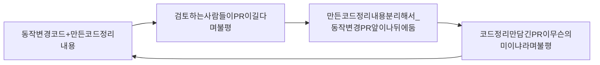
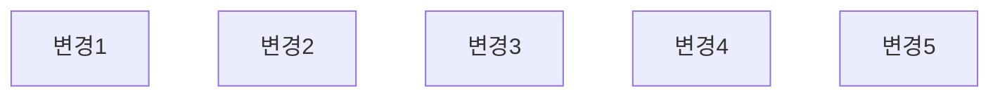
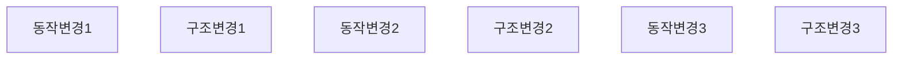
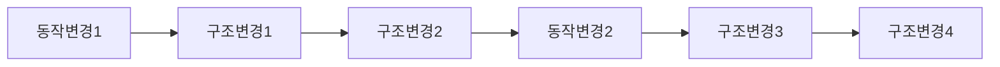
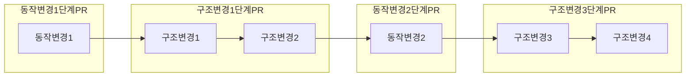

코드정리를 독자들에게 초점을 둔 소프트웨어 설계.

독자와 코드 간의 관계 궁극 적으로는 독자 자신과의 관계를 다룸.

코드 정리는 괴짜의 자기 관리.

Tidy First? 라는 책의 제목과 같이 정리법을 적용할 수 있다고 해서 반드시 코드를 정리해야 한다는 것은 아니라는 것을 강조 하고 싶다.

한 번에 조금씩 코드 정리를 통해 소프트웨어 설계에 익숙해지기를 바라며 코드 정리는 리팩터링으로 가는 관문.

Part2는 코드 정리를 개인 개발 흐름에 맞추는 방법에 대해설명
1. 코드 정리는 언제 시작할까?
2. 코드 정리는 언제 멈출까?
3. 코드의 구조를 변경하는 코드정리와, 시스템의 동작을 변경을 어떻게 결합할 수 있을까?

우선 정리가 PR 및 코드 검토와 어떻게 연관을 맺을지 논의해보자.

### 16. 코드 정리의 구분
---

PR을 통한 코드 검토 를 하고 있다고 가정한다면.

결국 코드 정리에 대한 PR은 만들어야 하고, 코드 정리는 별도의 PR로 PR당 가급적 몇개의 코드 정리만 넣자.

코드 정리를 할때 예상되는 몇개의 단계들

1. 변경을 구분하지 않은 상태에서 다수의 변경을 반영.

다양한 변경 필요성을 구분하지 않은 상태에서 변경 시도.

ex) if문 변경 도중 이름이 잘못 되면 이름을 변경한 뒤 If문으로 다시 돌아가고 변경이 변경을 낳는 케이스.

2. 동작 변경과 구조 변경

변경 대상은 프로그램 동작 변경(프로그래밍 실행하면서 찾은 것)과 프로그램 구조변경(코드를 봐야 아는)

아직 계획이 없고 바뀌는 동작간 어떤 흐름도 없음.

서로 다른 두 가지가 함께 작용하고 있다고 이제 막 인식한 케이스.

3. 순서를 부여한 동작 변경과 구조 변경

조금지나면 공통 흐름을 알고 비슷한 코드끼리 정리하면 설명하는 도우미들이 드러나고 동작 변경이 쉬워짐.

아직 큰 PR 한개에 섞여있음.

한 수씩 둘 때마다 다분히 의도적으로, 쉽게 변경하던가 또는 변경하기 쉽게 만들던가 둘 중 하나를 목표로 삼는 것이 좋음.

모든것을 하나에 모아두면 검토자들을 일단 주저하게 만듬.

별도의 PR로 생성.

순서가 있는 일련의 코드 정리는 (심지어 하나의 정리만 있어도) PR 한개로 만듬.

동작 변경 역시 별도의 PR로 만듬.

>[!Note]
>코드 정리와 동작 변경 사이를 번갈아 가면서 전환할 때마다 새 PR을 열어야 함.

>[!Note]
>크고 포괄적인 PR로 만들면 전체 그림을 보여주지만, 검토자들이 유용한 피드백을 제공하기에는 너무 큰 덩어리 일 수 있음.
>아주 소소한 PR은 소소한 패드백을 유도할 수 있지만, 잡초처럼 무시될 우려가 있음.

작은 PR은 검토 시간 단축으로 환영 받음.

초점이 분명할수록 PR은 더 빠른 검토를 장려함.

대체로 코드를 느리게 검토하면 큰 PR을 만드는 결과를 초래하며 향후 검토를 더욱 느리게 함.

### 17. 연쇄적인 정리
---

단계의 크기.

아주 작은 단계로 나누어 코드를 정리하는 방식을 고수하면서 실험해보자.

빠르게 달리는 것처럼 보이지만 지넻럼 작은 발걸음을 차례차례 내딛을 수 있게.

>[!Note]
>코드 정리는 일종의 체스게임이 되어 다음 수를 내다볼 수 있게 됨.

#### 보호구문

조건이 설명하는 도우미로 드러나거나 설명하는 변수 추출을 돕는 혜택

#### 안 쓰는 코드

제거 하고 나면 코드를 읽는 순서에 맞춰 정렬하는 방법, 응집도 높이는 배치가 보임.

#### 대칭으로 맞추기

유사한 코드들이 묶여진 순서대로 읽을 수 있음.

#### 읽는 순서

순서 정리하고 나면 너무 멀리 떨어져 있어 유사한 줄도 몰랐던 요소들이 순서 정리로 들나고 대칭을 맞출 기회가 생길 수 있음.

#### 응집도를 높이는 배치

높이는 배치로 함께 묶인 요소는 하위 요소로 추출할 후보가됨.

도우미 객체를 만드는 것은 코드 정리를 넘어서는 것이지만, 정리에 익숙해진다면 더 큰 규모로 설계 변경 가능.

#### 설명하는 변수

설명하는 변수에 할당하는 우변은 도우미 후보가 될 수 있음. (도우미로 추출시 변수가 흡수되어 사라 질 수도 있음.)

변수 이름으로 알 수 있는 설명으로 인해 불필요한 주석이 제거될 수 있음.

#### 설명하는 상수

상수 정리는 응집도를 높이는 배치를 이끔.

상수를 모아서 묶으면 나중에 변경하기도 용이함.

#### 명시적인 매개 변수

매개 변수 집합을 묶어 객체로 만들고 코드를 옮길 수 있음.

코드정리를 넘어 서는 것이지만, 새로운 추상화가 도출될 수 있는지 계속 주목하는 것이 좋음.

강력한 추상화는 대체로 실행중인 코드에서 발견되기 때문.

#### 도우미 추출

도우미 추출 후에는 보호 구문을 도입하거나 설명하는 상수, 설명하는 변수를 추출할 수도 있고, 불필요한 주석을 지울 수도 있음.

#### 하나의 더미

코드가 모여서 크고 명백하게 엉망인 경우 비슷한 코드 끼리 정리, 설명하는 주석 정리, 도우미 추출을 기대할 수 있음.

#### 설명하는 주석

주석에 있는 정보를 코드로 전환할 수 있음.

#### 불필요한 주석 지우기

절대적으로 완전히 중복된 주석만 삭제해야 함.

주석을 오직 모두 필요한 내용으로만 정리해야 함.

> 주석은 의사소통의 한 형태이긴 하지만, 코드 정리는 다른 프로그래밍 요소들의 도움을 받아, 의사소통이 어디까지 가능한지 나아갈 수 있게 해 줍니다.

작은 정리를 순차적으로 성공하는 것이 무리한 정리로 실패하는 것보다 시간을 아껴 줌.

### 18. 코드 정리의 일괄 처리량
---

>[!Note]
>통합 과 배포를 하기 전에 코드 정리는 어느 정도 크기가 적절할까?
>기본 적으로 코드 정리는 먼 미래를 바라보는 것이 아니기 때문에 즉각적인 필요를 다뤄야 함.

16장에서 코드 정리와 동작 변경을 섞지 않는것에서 모든 코드를 한번에 정리 할 것인지 아니면 모두 개별적으로, 아니면 그 중간을 할것인지 의문이 남아 있음.

판단을 할때 고려할 만한 비용은 무엇 일까요?

#### 충돌

코드 정리 작업이 많을 수록, 통합 과정에서 지연시간이 기어지고 다른 사람의 작업과의 충돌할 가능성이 커짐.

#### 상호 작용

다수 의 코드의 정리를 한번에 처리하다 우연히 동작 변경을 할 수도 있음.

**코드 정리 사이 상호작용이 있는 경우 병합 비용은 급격하게 증가함.**

#### 추측

한번에 처리하는 코드 정리가 많을 수록 자연스럽게 더 많은 코드를 정리하게되고 그로인해 예상하지 못하는 비용이 발생.

>[!important]
>평상시 간단한 코드 정리를 하는 코드 정리 개수를 늘려서 동작 변경에 소비되는 비용을 줄여 두면 
>작업당 코드 정리수가 적어도 검토하는 비용이 줄어 듭니다.
>팀과 작성자는 검토 비용을 제대로 줄일 수 있는 방법을 찾아야함.

### 19. 리듬
---

다시 동작 변경의 강행군으로 가야할까? 아니면 한도 끝도 없이 코드 정리를 하는 시간을 가져야 할까?

정리의 리듬을 관리하는 일도 있음.

동작 변경 이전에 수행한 구조 변경에 얼마나 많은 시간이 소요될까?

>[!Note]
>개인에게 영향을 미치는 소프트웨어 설계적 측면에서 분 단위를 유지하되, 한시간을 넘지 말자.
>한 시간 이상이 걸린다면 동작 변경을 위해 필요한 최소한의 구조 변경 시기를 놓쳤다는 의미 일 수도 있음.

코드가 엉망이라 코드정리를 선행해야 하고 시간이 걸린다고 해도 오래 지속될수는 없는 노릇임.

>[!Important]
>설계는 길을 닦는 일의 성격이 매우 강하다.
>한 대학에서 건물을 여러 개 지었는데 완공시에도 통행로를 어디에 만들지 정하지 못하였고, 시간을 들이면서 신중하게 추측하는 대신에 건물과 건물 사이 모든 공간에 잔디를 심었고 잔디가 닳아 없어진 부분에 통행로를 만들었다.
>동작 변경은 코드 안에서 뭉쳐서 나타나는 경향이 있고, 파레토의 법칙과 같이 80% 변경이 20% 파일에서 발생한다.
>코드 정리 내용 역시 뭉쳐서 발생하며, 코드 정리가 코드를 뭉친 결과는 정확하게 동작 변경하기에 가장 좋은 위치에 뭉쳐져 있음.

코드정리를 많이 진행 --> 정리한 코드로 동작을 변경하고 싶어하는 자신을 발견
코드정리를 많이 하면 대부분 변경작업은 코드정리를 한 코드 안에서 이루어짐.
몇분~한시간이고 때로는 더 길수도 있지만 그리 길지는 않을 것.

### 20. 얽힘 풀기
---

1. 변경 대상 동작을 모두 알아냈고.
2. 그 동작들을 쉽게 변경하려면, 어떤 코드를 정리해야 하는지 모두 알게 되었으나
3. 정리한 코드와 변경할 코드가 얽혀있다면?

세가지 선택이 있으나 매력적이진 않음.

1. 그대로 배포, pr에서 욕먹긴 하겠지만 그리고 오류가 날순 있지만 당장 처리는 가능.
2. 코드 정리와 변경사항을 별도의 하나 이상의 PR로 나누거나 하나의 PR을 열번의 커밋으로 나눌 수 있음. 단 작업횟수는 증가함
3. 진행 중인 작업을 버리고, 코드 정리를 선행하는 순서로 다시 시작. \
   작업은 더 많아지지만 이어지는 커밋과의 일관성은 분명해짐.

이미 통과한 테스트가 몇개 있는데 왜 버려야 하는가? --> 바른 수행이 흥미로운 최종 목표가 되는것은 아님.

3번째 선택지를 실험하라 권함.

### 21. 코드 정리 시점
---

코드정리 하고나서 동작변경? \
동작변경하고 난뒤 코드정리? \
이후 동작 변경에 어려움 가중을 피하기 위해 혼란스러운 부분은 skip? \
아니면 그냥 안해!

#### 아예 안 한다면
코드 동작이 앞으로 바뀌지 않는 경우. \
극히 드물지만 있긴함.

#### 나중에 정리 한다면
전제조건이 존재함. \
일을 할 시간은 충분한지 , 아니 충분한 시간이 주어진다면 어떻게 일을 할 것인지. \
만약 실제 하고 있는 일과 크게 다르다면 일할 시간이 충분하지 않다는 뜻.

정리할 목적으로 엉망인 코드 목록을 만든다면 , 다음 기능 구현때 정신없는 코드 변경으로 허우적 거리기 보다는 나중에 코드 정리할 목록을 훑어 보면서 4번 항목 부터 시작해 볼까? 라고 생각 할 수있음.

반드시 변경 될것 이라고 보장 할 정도면 그 영역을 정리하는 것만으로 향후 변경을 단순화 하는 가치가 창출됨.

변경한 동작과 연결되지 않는 코드 정리를 나중에 하면 몇 가지 다른 방식으로 가치를 창출함.

지저분함 보유세를 줄임. \
ex) 새 api로 변경, 당장 영향 받는 api 변경 완료, 하지만 반영해야 할곳이 많고 반영하기 전까지 새 api에 변경사항이 생기면 이전 api에도 반영해야 함.

코드 정리를 나중에 자신이 원할 때 하면 더 의욕적이고 기분도 좋음.

#### 동작 변경 후에 코드 정리

동작을 변경해야 하는데 코드가 지저분함.

일단 동작을 변경함 , 동작 변경해보니 변경을 더 쉽게 할 수 있는 방법을 알았음, 코드 정리를 해야 할까?

상황에 따라 다른데 같은 영역을 다시 변경하게 된다면, 동작 변경 후 코드 정리하는 일은 상당한 의미가 있음.

>[!Note]
>다시 동작 변경을 할 가능성이 높은 부분은, 코드 정리부터 먼저 하는것이 어떨까?
>지금은 맥락을 알아서 쉽게 정리할 수 있는 일이지만, 나중에는 맥락을 잊어버릴수 있기 때문.
>또다른 변경 건이 생겨 코드 정리를 하는데 훼방을 놓을 수도 있음.
>1. 방금 고친 코드를 다시 변경할 예정일 때.
>2. 지금 정리하는 것이 더 저렴할때.
>3. 코드 정리하는데 드는 시간이 동작 변경에 드는 시간과 거의 비슷한 경우.
> 동작변경이 한시간 걸렸으면 코드 정리에 한시간 정도 투자 하는 것은 합리적.
> 일주일이 걸리면 나중에 정리할 목록에 넣어두자.

#### 코드 정리 후에 동작 변경

상황에 따라 다름
1. 코드 정리후 일이 더 쉽다? 먼저하자
2. 코드 정리의 이점을 바로 얻을수 있나?, 동작 변경 안된 상태에서 정리로 이해가 더 빠르면 코드 정리를 먼저 하자.
3. 이 코드를 딱 한 번만 변경할 예정이면 코드 정리는 제한하는 것이 좋음.
4. 여기를 정리하면 이해하기 쉬워질거란 방식으로 바라보기.

#### 요약
---

| 코드 정리 하지 않는 케이스       | 정리를 미루는 케이스                        | 동작 변경 후에 정리                   | 코드 정리 후에 동작 변경                              |
| --------------------- | ---------------------------------- | ----------------------------- | ------------------------------------------- |
| 앞으로 다시는 코드를 변경할지 않을 때 | 정리할 코드 분량이 많은데 보상이 바로 보이지 않을 때     | 다음 코드 정리 까지 기다릴수록 비용이 더 불어날 때 | 코드 정리시 코드가 이해가 쉬워지거나 변경이 쉬워지는 즉각적 효과가 얻어질 때 |
| 설계를 개선하더라도 배울 것이 없을 때 | 코드 정리에 대한 보상이 잠재적인 경우              | 코드 정리 안하면 일을 안 끝낸것 같을 때       | 어떤 코드를 어떻게 정리할지 고민중일 때                      |
|                       | 작은 묶음으로 여러 번에 나눠서 코드 정리를 할 수 있는 경우 |                               |                                             |
